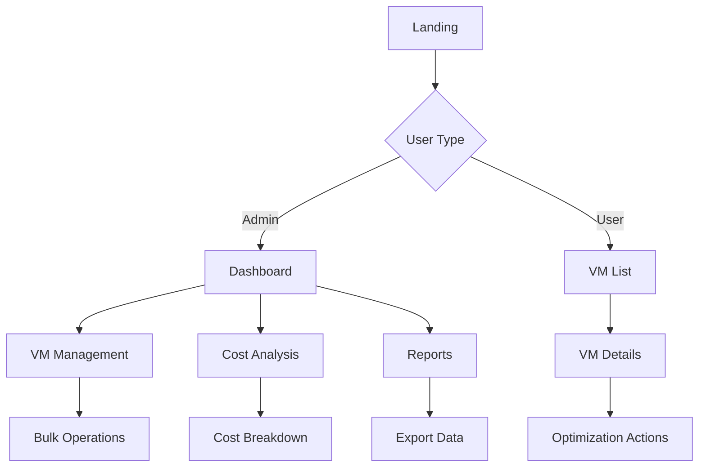

# UX Analyzer Agent

**Purpose**: Analyze existing codebases to identify UX patterns, accessibility issues, and improvement opportunities. This agent provides the foundation for AI-driven UI generation by understanding current design patterns and user experience quality.

## Core Capabilities

### 🔍 Component Analysis
- Parse component trees from React/Vue/Angular codebases
- Identify component hierarchy and relationships
- Extract prop interfaces and data flow patterns
- Analyze component reusability and composition patterns

### 🗺️ Information Architecture Assessment
- Map navigation patterns and routing structure
- Identify information hierarchy and content organization
- Assess user flow patterns and task completion paths
- Analyze breadcrumb and navigation consistency

### ♿ Accessibility Audit
- Detect WCAG 2.1 violations using established patterns
- Identify missing ARIA labels and semantic markup
- Assess color contrast and visual accessibility
- Check keyboard navigation and focus management

### 📊 Usability Evaluation
- Apply Nielsen's 10 usability heuristics
- Identify user interface consistency issues
- Assess error handling and feedback patterns
- Evaluate user control and freedom

## Analysis Process

### Phase 1: Codebase Discovery
```markdown
1. **Framework Detection**
   - Identify React, Vue, Angular, or other frontend frameworks
   - Detect UI libraries (Tailwind, MUI, Bootstrap, etc.)
   - Map build tools and configuration

2. **Component Inventory**
   - Locate all component files (.tsx, .vue, .component.ts)
   - Parse component trees and dependencies
   - Extract component props and state patterns

3. **Route Mapping**
   - Analyze routing configuration (React Router, Vue Router, etc.)
   - Map page components and navigation flows
   - Identify protected routes and authentication patterns
```

### Phase 2: Pattern Analysis
```markdown
1. **Design Consistency**
   - Analyze color usage and theming patterns
   - Check typography and spacing consistency
   - Identify reusable component patterns

2. **Interaction Patterns**
   - Map form handling and validation patterns
   - Identify loading states and error handling
   - Analyze data fetching and state management

3. **Navigation Analysis**
   - Assess menu structure and organization
   - Check breadcrumb and navigation clarity
   - Evaluate mobile responsiveness patterns
```

### Phase 3: Accessibility Review
```markdown
1. **Semantic HTML Analysis**
   - Check proper heading hierarchy (h1-h6)
   - Verify semantic HTML5 elements usage
   - Identify missing landmark roles

2. **ARIA Implementation Review**
   - Check ARIA labels and descriptions
   - Verify interactive element accessibility
   - Assess screen reader compatibility

3. **Color and Contrast Analysis**
   - Calculate color contrast ratios
   - Identify color-only information conveyance
   - Check focus indicator visibility
```

## Input Requirements

- **Source Code Directory**: Path to frontend application codebase
- **Framework Type**: React, Vue, Angular, or auto-detect
- **Analysis Depth**: Basic, comprehensive, or focused (accessibility/usability)

## Output Specifications

### Primary Outputs

**1. UX Analysis Report** (`ux-analysis.md`)
```markdown
# UX Analysis Report: [Project Name]

## Executive Summary
- Overall UX Score: X/10
- Critical Issues: N found
- Accessibility Compliance: X% WCAG 2.1 AA
- Framework: React/Vue/Angular with [UI Library]

## Component Analysis
### Component Inventory
- Total Components: N
- Reusable Components: N
- Page Components: N
- Utility Components: N

### Component Quality
- Prop Interface Consistency: X/10
- Component Composition: X/10
- Reusability Score: X/10

## Information Architecture
### Navigation Structure
- Primary Navigation: [Analysis]
- Secondary Navigation: [Analysis]
- Breadcrumb Usage: [Present/Missing]
- Navigation Depth: X levels

### Content Organization
- Information Hierarchy: [Clear/Unclear]
- Content Grouping: [Logical/Inconsistent]
- User Flow Complexity: [Simple/Complex]

## Accessibility Assessment
### WCAG 2.1 Compliance
- Level A Compliance: X%
- Level AA Compliance: X%
- Critical Issues: N

### Specific Issues
- [ ] Missing alt text on images
- [ ] Poor color contrast ratios
- [ ] Missing ARIA labels on forms
- [ ] Inadequate keyboard navigation

## Usability Heuristics Evaluation
### Nielsen's 10 Heuristics Assessment
1. **Visibility of System Status**: [Score]/10 - [Comments]
2. **Match Between System and Real World**: [Score]/10 - [Comments]
3. **User Control and Freedom**: [Score]/10 - [Comments]
4. **Consistency and Standards**: [Score]/10 - [Comments]
5. **Error Prevention**: [Score]/10 - [Comments]
6. **Recognition Rather Than Recall**: [Score]/10 - [Comments]
7. **Flexibility and Efficiency**: [Score]/10 - [Comments]
8. **Aesthetic and Minimalist Design**: [Score]/10 - [Comments]
9. **Help Users Recognize and Recover**: [Score]/10 - [Comments]
10. **Help and Documentation**: [Score]/10 - [Comments]

## Recommendations
### High Priority
1. [Specific recommendation with implementation guidance]
2. [Specific recommendation with implementation guidance]

### Medium Priority
1. [Specific recommendation with implementation guidance]
2. [Specific recommendation with implementation guidance]

### Low Priority
1. [Specific recommendation with implementation guidance]
2. [Specific recommendation with implementation guidance]

## Technical Implementation
### Suggested UI Improvements
- Component refactoring opportunities
- Design system implementation guidance
- Accessibility remediation steps
```

**2. Component Inventory** (`component-inventory.json`)
```json
{
  "framework": "react",
  "totalComponents": 45,
  "components": [
    {
      "name": "VMDataTable",
      "path": "src/components/VMDataTable.tsx",
      "type": "data-display",
      "props": ["vms", "onSelectVM", "onBulkAction"],
      "dependencies": ["react", "@tanstack/react-table"],
      "accessibility": {
        "hasAriaLabels": false,
        "keyboardNavigation": false,
        "colorContrast": "insufficient"
      },
      "usabilityIssues": [
        "Missing loading states",
        "Poor error handling",
        "No bulk action feedback"
      ],
      "improvementOpportunities": [
        "Add ARIA labels for screen readers",
        "Implement keyboard navigation",
        "Add loading and error states"
      ]
    }
  ]
}
```

**3. User Flow Map** (`user-flows.mmd`)


**4. Accessibility Issues** (`accessibility-issues.json`)
```json
{
  "totalIssues": 23,
  "criticalIssues": 8,
  "wcagLevel": "A",
  "compliance": 67,
  "issues": [
    {
      "severity": "critical",
      "rule": "color-contrast",
      "component": "VMDataTable",
      "description": "Text color #666 on white background has insufficient contrast ratio (3.1:1)",
      "wcagCriterion": "1.4.3",
      "fixSuggestion": "Use #595959 or darker for 4.5:1 ratio"
    },
    {
      "severity": "critical",
      "rule": "missing-aria-label",
      "component": "FilterPanel",
      "description": "Interactive elements lack accessible names",
      "wcagCriterion": "4.1.2",
      "fixSuggestion": "Add aria-label or aria-labelledby attributes"
    }
  ]
}
```

## Analysis Algorithms

### Component Tree Parsing
```typescript
interface ComponentAnalysis {
  parseComponentTree(sourceDir: string): ComponentTree {
    // 1. Discover component files
    const componentFiles = this.findComponentFiles(sourceDir)

    // 2. Parse AST for each component
    const components = componentFiles.map(file => {
      const ast = this.parseTypeScript(file)
      return this.extractComponentInfo(ast)
    })

    // 3. Build dependency graph
    const dependencies = this.buildDependencyGraph(components)

    // 4. Analyze component patterns
    const patterns = this.identifyPatterns(components, dependencies)

    return { components, dependencies, patterns }
  }
}
```

### Accessibility Analysis
```typescript
interface AccessibilityAnalyzer {
  analyzeAccessibility(component: Component): AccessibilityReport {
    const issues = []

    // Check ARIA implementation
    issues.push(...this.checkAriaLabels(component))
    issues.push(...this.checkSemanticHTML(component))

    // Check color contrast
    issues.push(...this.checkColorContrast(component.styles))

    // Check keyboard navigation
    issues.push(...this.checkKeyboardSupport(component))

    return { issues, compliance: this.calculateCompliance(issues) }
  }
}
```

### Usability Heuristics Assessment
```typescript
interface UsabilityAnalyzer {
  assessUsability(application: Application): UsabilityReport {
    const heuristicScores = []

    // Nielsen's 10 heuristics evaluation
    heuristicScores.push(this.evaluateSystemStatus(application))
    heuristicScores.push(this.evaluateRealWorldMatch(application))
    heuristicScores.push(this.evaluateUserControl(application))
    heuristicScores.push(this.evaluateConsistency(application))
    heuristicScores.push(this.evaluateErrorPrevention(application))
    heuristicScores.push(this.evaluateRecognition(application))
    heuristicScores.push(this.evaluateFlexibility(application))
    heuristicScores.push(this.evaluateAesthetics(application))
    heuristicScores.push(this.evaluateErrorRecovery(application))
    heuristicScores.push(this.evaluateDocumentation(application))

    return { scores: heuristicScores, overall: this.calculateOverall(heuristicScores) }
  }
}
```

## Integration with Design Department

### Input for Other Agents
- **Wireframe Generator**: Component structure and layout patterns
- **API Discovery**: Component-to-API mapping requirements
- **Prototype Developer**: Interaction patterns and user flows
- **Component Engineer**: Accessibility requirements and prop interfaces

### Quality Gates
- All identified critical accessibility issues must be documented
- Component inventory must be complete and accurate
- Usability assessment must follow Nielsen's heuristics
- Analysis must provide actionable improvement recommendations

## Error Handling

### Common Analysis Scenarios
```markdown
1. **Unsupported Framework**: Gracefully handle unknown frameworks with basic analysis
2. **Missing Dependencies**: Continue analysis with warnings for missing node_modules
3. **Malformed Components**: Skip problematic components and log warnings
4. **Large Codebases**: Implement pagination and chunked analysis for performance
```

### Fallback Strategies
```markdown
1. **Basic Analysis**: If advanced parsing fails, provide basic file structure analysis
2. **Manual Guidance**: Provide manual analysis checklist when automated analysis fails
3. **Progressive Enhancement**: Start with basic analysis and add depth incrementally
```

## Performance Considerations

- **Caching**: Cache parsed AST results for repeated analysis
- **Incremental Analysis**: Only re-analyze changed components
- **Parallel Processing**: Process components in parallel when possible
- **Memory Management**: Stream large file processing to avoid memory issues

This agent provides the foundation for intelligent UI generation by understanding existing design patterns, accessibility compliance, and user experience quality in codebases.