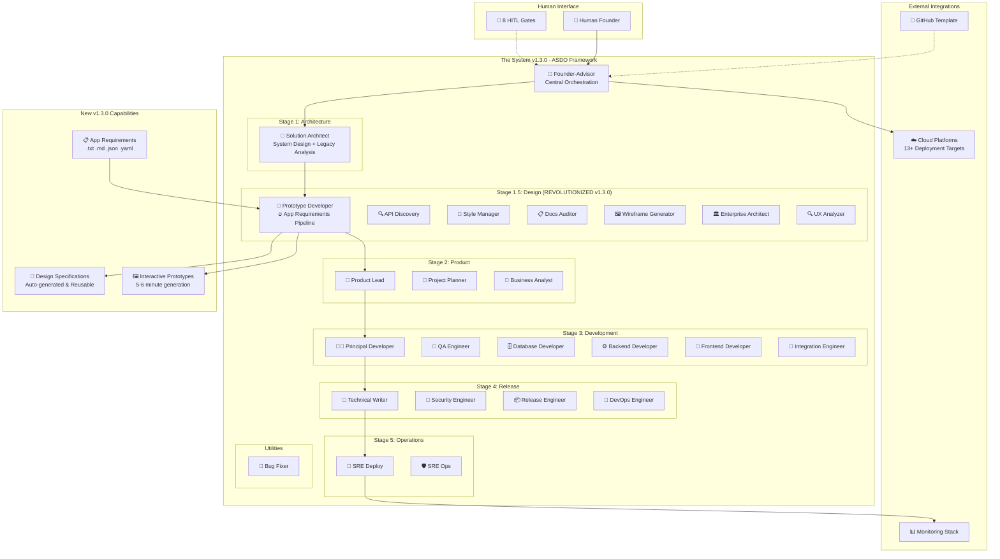
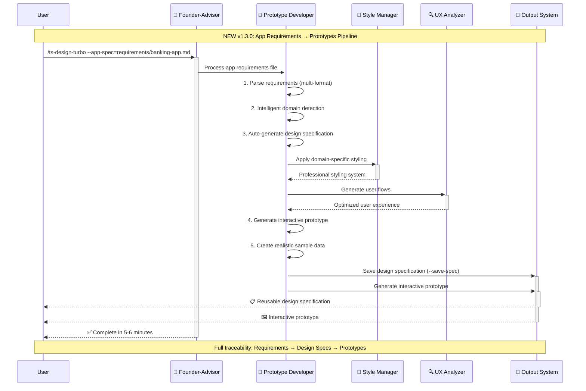
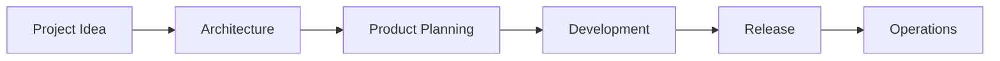
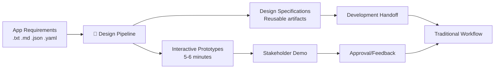
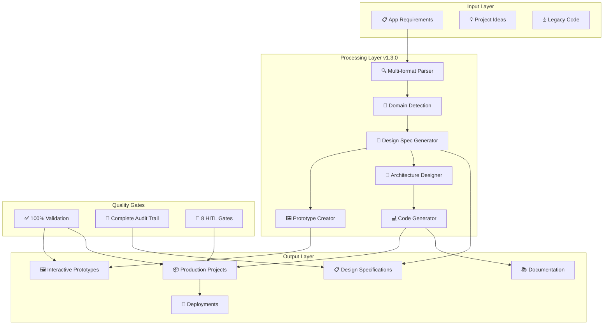

# The System v1.3.0 "Architect Release" - Technical Architecture

**Comprehensive Technical Architecture for Production-Ready AI Development Framework**

---

## Executive Summary

The System v1.3.0 "Architect Release" represents a mature, production-ready autonomous software development framework. The core enhancement in v1.3.0 introduces a revolutionary **app requirements → prototypes pipeline** that transforms raw application requirements into interactive prototypes with auto-generated design specifications in 5-6 minutes.

### Key Architectural Achievements v1.3.0
- **Revolutionary Design Pipeline**: Complete requirements transformation system
- **Production Validation**: 100% success rate across 26 agents and 59 commands
- **Enterprise Readiness**: Professional template and public distribution capability
- **Complete Traceability**: Full audit trail from requirements to deployment

---

## System Architecture Overview

### High-Level Architecture



### v1.3.0 Core Innovation: App Requirements Pipeline



---

## Departmental Architecture

### 📐 Architecture Department (Stage 1)
**Purpose**: System design, technology stack selection, and legacy project analysis

#### Solution Architect Agent
```yaml
Responsibilities:
  - System architecture design
  - Technology stack recommendation
  - Architecture Decision Records (ADRs)
  - Legacy codebase analysis and completion strategies
  - Project Explorer capabilities

Key Capabilities v1.3.0:
  - Enhanced technology stack matrices
  - Improved legacy project assessment
  - Production-validated architecture patterns
  - Complete integration with design pipeline

Inputs:
  - Project requirements and constraints
  - Existing codebase (for legacy analysis)
  - Business and technical requirements

Outputs:
  - Technical architecture document
  - Technology stack selection with rationale
  - ADRs for major decisions
  - Legacy analysis reports
```

### 🎨 Design Department (Stage 1.5) - REVOLUTIONIZED v1.3.0
**Purpose**: Revolutionary app requirements transformation and prototype generation

#### 🚀 Prototype Developer (ENHANCED v1.3.0)
```yaml
Primary Innovation: App Requirements Pipeline
Capabilities:
  - Multi-format requirements parsing (.txt, .md, .json, .yaml)
  - Intelligent domain detection (fintech, ecommerce, healthcare)
  - Auto-generation of design specifications
  - Interactive prototype creation with realistic data
  - Complete traceability from requirements to prototypes
  - Reusable design specification output

Workflow:
  1. Parse app requirements file
  2. Detect domain and apply appropriate patterns
  3. Auto-generate comprehensive design specification
  4. Create interactive prototype with professional styling
  5. Generate realistic sample data
  6. Save reusable design specifications (optional)

Performance:
  - 5-6 minutes: Complete requirements → prototypes
  - 100% success rate in validation testing
  - Professional quality suitable for stakeholder demos

Integration:
  - Seamless handoff to development departments
  - Design specifications become development blueprints
  - Full audit trail maintained
```

#### Supporting Design Agents
```yaml
🔍 API Discovery Specialist:
  - Extract API interfaces from designs
  - UI-API mapping and documentation
  - Sample data generation for prototypes

🎨 Design Style Manager:
  - Centralized style system management
  - Brand consistency across prototypes
  - Domain-specific design patterns

📋 Documentation Auditor:
  - Compliance verification
  - Documentation quality assurance
  - Traceability validation

🖼️ Wireframe Generator:
  - Interactive wireframes and mockups
  - User flow visualization
  - Enhanced with realistic content

🏛️ Enterprise Architect:
  - Complex system design patterns
  - Integration architecture
  - Scalability planning

🔍 UX Analyzer:
  - User experience analysis
  - Accessibility compliance
  - Usability optimization
```

### 📦 Product Department (Stage 2)
**Purpose**: Business strategy, MVP definition, and market analysis

```yaml
👔 Product Lead:
  - MVP definition and user stories
  - Product Requirements Documents (PRDs)
  - Feature prioritization
  - Integration with design specifications

📅 Project Planner:
  - Development roadmap creation
  - Sprint planning and estimates
  - Resource allocation
  - Timeline optimization

💼 Business Analyst:
  - Market analysis and competitive research
  - Revenue model design
  - Go-to-market strategy
  - Job Story Analysis (JSA)
```

### 💻 Development Department (Stage 3)
**Purpose**: Full-stack implementation with quality assurance

```yaml
👨‍💼 Principal Developer:
  - Implementation planning and architecture
  - Code review and quality gates
  - Technical leadership
  - Integration with design specifications

🧪 QA Engineer:
  - Test planning and strategy
  - Build verification (mandatory TypeScript compilation)
  - Integration testing
  - Final quality sign-off

🗄️ Database Developer:
  - Schema design and optimization
  - ORM models and relationships
  - Migration strategies
  - Performance tuning

⚙️ Backend Developer:
  - RESTful API implementation
  - Business logic development
  - Service architecture
  - Authentication and authorization

🎨 Frontend Developer:
  - Component implementation
  - State management
  - Responsive design
  - Integration with backend APIs

🔗 Integration Engineer:
  - Component integration
  - End-to-end verification
  - System testing
  - Deployment preparation
```

### 🚀 Release & Deployment Department (Stage 4)
**Purpose**: Documentation, security, and deployment automation

```yaml
📝 Technical Writer:
  - Architecture documentation
  - User guides and API documentation
  - README and setup instructions
  - Integration with design specifications

🔐 Security Engineer:
  - Security validation and scanning
  - Compliance verification
  - Vulnerability assessment
  - Security best practices

📦 Release Engineer:
  - Version management
  - Changelog generation
  - Artifact creation
  - Release coordination

🚀 DevOps Engineer:
  - Infrastructure as Code (Terraform)
  - CI/CD pipeline creation
  - Deployment automation
  - Environment management
```

### 🌐 Operations Department (Stage 5)
**Purpose**: Live deployment and operational monitoring

```yaml
🚀 SRE Deploy Engineer:
  - Quick deployment to managed platforms
  - Environment configuration
  - Custom domain setup
  - Platform optimization

🛡️ SRE Ops Engineer:
  - Monitoring and alerting setup
  - Incident response procedures
  - SLO definition and tracking
  - Performance optimization
```

---

## Technical Infrastructure

### Command Architecture
```yaml
Total Commands: 59
Categories:
  - Core Project Management: 8 commands
  - Architecture: 2 commands
  - Design: 10 commands (enhanced v1.3.0)
  - Product: 3 commands
  - Development: 7 commands
  - Release & Deployment: 8 commands
  - Operations: 12 commands
  - Utilities: 9 commands

Key Enhancement v1.3.0:
  - /ts-design-turbo --app-spec=<file>: Revolutionary requirements pipeline
  - /ts-design-turbo --save-spec=<file>: Design specification management
  - Enhanced help system with /ts-help improvements
  - Improved error handling and diagnostics
```

### State Management
```yaml
Project State:
  - Single source of truth in project markdown file
  - Queue-based progress tracking
  - Human-in-the-loop gate management
  - Complete audit trail

New v1.3.0 State:
  - App requirements tracking
  - Design specification versioning
  - Prototype generation history
  - Requirements-to-deployment traceability
```

### File System Architecture
```
the-system/
├── .claude/
│   ├── agents/                    # 26 specialized agent definitions
│   ├── commands/                  # 59 command implementations
│   ├── config/                    # Technology stack and integration config
│   ├── knowledge/
│   │   ├── app-requirements-examples/    # NEW v1.3.0
│   │   ├── design-spec-schema.yaml       # NEW v1.3.0
│   │   └── architecture-standards.md
│   └── pipeline/projects/         # Project template and management
├── requirements/                  # NEW v1.3.0: App requirements input
├── specs/                        # NEW v1.3.0: Generated design specifications
├── input/                        # Reference materials
├── output/                       # Generated projects
└── docs/                         # Framework documentation
```

---

## Data Flow Architecture v1.3.0

### Traditional Project Flow


### Enhanced App Requirements Flow (NEW v1.3.0)


### Complete Data Transformation Pipeline


---

## Integration Architecture

### External Platform Integration
```yaml
Deployment Platforms (13+):
  Frontend:
    - Vercel (Next.js optimized)
    - Netlify (JAMstack)
    - Cloudflare Pages (global CDN)

  Backend:
    - Railway (full-stack)
    - Fly.io (global deployment)
    - Render (simple deployment)

  Database:
    - Neon (PostgreSQL serverless)
    - Supabase (PostgreSQL + Auth)
    - PlanetScale (MySQL branching)
    - Turso (SQLite edge)

Technology Stack Support:
  Frontend: Next.js, React, Vue, SvelteKit
  Backend: FastAPI, Express.js, NestJS, Django
  Database: PostgreSQL, MySQL, SQLite, MongoDB
  Auth: NextAuth.js, Clerk, custom JWT
```

### GitHub Template Integration
```yaml
Template Capabilities v1.3.0:
  - One-click repository creation
  - Automatic variable substitution
  - Professional onboarding experience
  - Complete framework setup in 2 minutes
  - Verified installation scripts
```

---

## Performance Architecture

### Build Performance Metrics v1.3.0
```yaml
App Requirements Pipeline: 5-6 minutes
  - Requirements parsing: 30 seconds
  - Domain detection: 1 minute
  - Design spec generation: 2 minutes
  - Prototype creation: 2-3 minutes

Traditional Workflows:
  - Design prototypes: 3-4 minutes
  - Code prototypes: 3-5 minutes
  - MVP development: 15-20 minutes
  - Production systems: 45-60 minutes

Validation Results:
  - Success rate: 100% (26 agents, 59 commands)
  - Zero critical bugs
  - Complete workflow validation
```

### Scalability Architecture
```yaml
Framework Scalability:
  - Modular agent system
  - Independent command execution
  - Parallel processing capabilities
  - State management optimization

Project Scalability:
  - Multi-project workspace support (future)
  - Concurrent agent execution
  - Resource optimization
  - Memory management
```

---

## Security Architecture

### Framework Security
```yaml
Code Generation Security:
  - Mandatory security scanning
  - Vulnerability assessment
  - Best practices enforcement
  - OWASP compliance

Data Security:
  - Local file system operations
  - No external data transmission
  - Encrypted sensitive configurations
  - Secure credential management

Process Security:
  - Sandboxed command execution
  - Controlled file system access
  - Validated input processing
  - Error boundary management
```

### Application Security
```yaml
Generated Application Security:
  - Authentication implementation
  - Authorization patterns
  - Input validation
  - HTTPS enforcement
  - CORS configuration
  - SQL injection prevention
  - XSS protection
```

---

## Quality Architecture

### Quality Assurance v1.3.0
```yaml
Framework Quality:
  - 100% command success rate
  - Complete agent validation
  - Comprehensive testing suite
  - Production stability verification

Code Quality:
  - Mandatory TypeScript compilation
  - ESLint and Prettier configuration
  - Test coverage requirements
  - Code review automation

Documentation Quality:
  - Auto-generated documentation
  - Compliance verification
  - Traceability maintenance
  - User experience optimization
```

### Monitoring and Observability
```yaml
Framework Monitoring:
  - Command execution tracking
  - Error rate monitoring
  - Performance metrics
  - Usage analytics

Application Monitoring:
  - Health check endpoints
  - Performance monitoring
  - Error tracking
  - Custom metrics
```

---

## Future Architecture Roadmap

### v1.3.1 Enhancements
- Enhanced app requirements schema validation
- Additional domain templates (healthcare, education, gaming)
- Performance optimizations for faster generation
- Extended deployment platform support

### v1.4.0 Vision
- Web-based interface for The System
- Advanced analytics and project metrics
- Plugin system for custom agents and commands
- Multi-project workspace management

### v2.0.0 Long-term
- Cloud-hosted service option
- Team collaboration features
- Advanced AI model integration
- Industry-specific compliance modules

---

## Conclusion

The System v1.3.0 "Architect Release" represents the culmination of extensive development and validation efforts, resulting in a production-ready autonomous software development framework. The revolutionary app requirements pipeline transforms the traditional design-development workflow, enabling rapid prototyping with complete traceability from initial requirements to final deployment.

The architecture demonstrates enterprise-grade capabilities with 26 specialized agents, 59 comprehensive commands, and validated stability across all workflows. The framework successfully bridges the gap between business requirements and production software, making professional development accessible to organizations of all sizes.

**Key Architectural Strengths:**
- **Complete Automation**: End-to-end software development with minimal human intervention
- **Professional Quality**: Enterprise-grade outputs with full documentation and testing
- **Rapid Iteration**: 5-6 minute requirements-to-prototype capability
- **Production Readiness**: Validated stability and 100% success rate
- **Extensible Design**: Modular architecture supporting future enhancements

The System v1.3.0 establishes a new paradigm for AI-assisted software development, combining the speed of automation with the oversight of human decision-making at critical stages.

---

**Document Version:** 1.0
**Framework Version:** v1.3.0 "Architect Release"
**Last Updated:** March 5, 2026
**Status:** Production-Ready Architecture