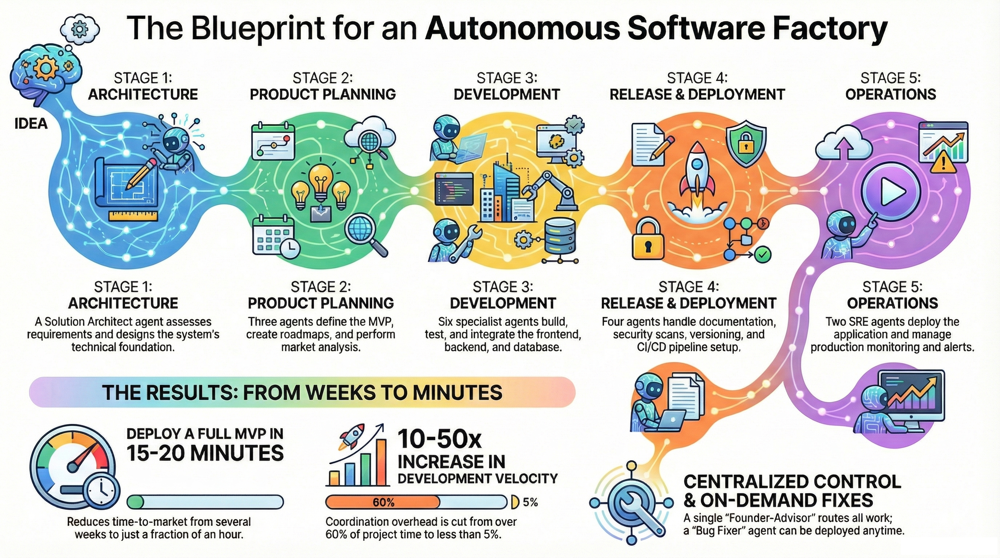

# The System
**ASDO — Autonomous Software Development Organization**

> *Build production-ready software with 23 AI agents working as your complete development team*

**→ [🚀 Get started in 2 minutes](#-quick-start) | Build your first app today**

The System simulates a complete software development organization with **23 specialized AI agents** across **5 departments**, taking your ideas from concept to production while you focus on strategic decisions.

<p align="center">
  
</p>

---

<p align="center">
  
  
  
  
  
  
</p>

---

## 🚀 What is The System?

**Think of it as your AI development team.** Instead of context-switching between architecture, coding, testing, and deployment, you make strategic decisions while specialized agents handle execution.

```
💡 Your Idea
     ↓
🏢 The System (Your AI Development Organization)
     ├── 📐 Architecture Team    → System design & technical decisions
     ├── 🎨 Design Team         → Interactive prototypes in 3-4 minutes
     ├── 📦 Product Team        → MVP definition & business strategy
     ├── 💻 Development Team    → Full-stack implementation & testing
     ├── 🚀 Release Team        → Documentation, security & deployment
     └── 🌐 Operations Team     → Live monitoring & maintenance
     ↓
🚀 Production-Ready Software
```

### Why Choose The System?

| **Traditional Development** | **The System** |
|----------------------------|----------------|
| You write all the code | AI agents write code, you review and approve |
| Context switching between tasks | Specialized agents handle each domain |
| Manual deployment setup | Automated Infrastructure as Code |
| Greenfield projects only | **Analyze & complete existing/legacy projects** |
| Forgetting architectural decisions | Everything documented in ADRs |

---

## ⚡ Quick Start

### 🎯 Use GitHub Template (Recommended)

**Get a complete AI development team in 2 minutes:**

1. **Click "Use this template"** at the top of this repository
2. **Clone your new repo:**
   ```bash
   git clone https://github.com/YOUR_USERNAME/YOUR_REPO.git
   cd YOUR_REPO

   # Verify installation
   ./scripts/verify-the-system.sh
   ```

3. **Start building:**
   ```bash
   # Launch Claude Code
   claude

   # Create your first project
   /ts-new-project my-blog
   "Blog website with posts and user comments"

   # Build it autonomously (15-20 minutes)
   /ts-turbo my-blog "blog with posts, comments, and admin panel" --build=mvp
   ```

**🎉 Result:** Complete production app with frontend, backend, database, tests, and documentation!

<details>
<summary><strong>🔧 Alternative: Submodule Installation</strong></summary>

```bash
# Create project directory
mkdir my-project && cd my-project
git init

# Add The System as a submodule
git submodule add https://github.com/vedanta/the-system.git .the-system
git submodule update --init --recursive

# Create symbolic links
ln -s .the-system/.claude .claude
ln -s .the-system/CLAUDE.md CLAUDE.md
mkdir -p input output

# Verify and start
.the-system/scripts/verify-the-system.sh
claude
/ts-new-project my-app
```

</details>

---

## 🎯 What You Can Build

### ⚡ Rapid Prototypes (3-5 minutes)
```bash
# Interactive design prototypes
/ts-design-turbo input/fintech-app --domain=fintech --fidelity=high

# Working code prototypes
/ts-turbo todo-demo "task management app" --build=prototype
/ts-turbo blog-demo "personal blog" --build=prototype
```

### 📦 Production MVPs (15-20 minutes)
```bash
/ts-turbo recipe-site "recipe sharing website with user ratings" --build=mvp
/ts-turbo photo-gallery "photo gallery with uploads and albums" --build=mvp
/ts-turbo inventory-tracker "inventory management for small business" --build=mvp
```

### 🏢 Enterprise Applications (45-60 minutes)
```bash
/ts-turbo employee-directory "company staff directory with advanced search" --build=production
/ts-turbo conference-manager "event booking system with payments" --build=production
/ts-turbo project-tracker "project management with team collaboration" --build=production
```

### 🗺️ Existing Project Completion
```bash
# Analyze and complete legacy codebases
/ts-assess --existing my-legacy-app
/ts-assess --existing old-project --gaps        # Find missing components
/ts-assess --existing inherited-code --security # Security audit
```

---

## ✨ Key Features

### 🎨 Design Department: Prototype-First Pipeline
**Get interactive demos in 3-4 minutes** with professional styling and realistic data.

```bash
# Default: Fast stakeholder demo (3-4 min)
/ts-design-turbo input/my-app

# High-fidelity investor presentation
/ts-design-turbo input/startup-app --domain=fintech --fidelity=high --review-server

# Complete development handoff
/ts-design-turbo input/production-app --handoff=detailed --api-discovery
```

**Key capabilities:**
- **Domain optimization** for fintech, ecommerce, healthcare, Azure/AWS
- **Mobile-responsive** design across all devices
- **Development handoff** with TypeScript interfaces and component specs

👉 **[Complete Design Guide →](README_DESIGN_DEPT.md)**

### 🗺️ Project Explorer: Beyond Greenfield
**First AI development tool for existing project analysis.** Analyze inherited, legacy, or abandoned codebases.

```bash
/ts-assess --existing legacy-app           # Full analysis
/ts-assess --existing my-app --health      # Code quality assessment
/ts-assess --existing my-app --completion  # Completion strategies
```

### ⚡ Build Presets: Configure Speed vs Quality
Control the trade-off between speed and completeness:

- **🚀 Prototype (3-5 min):** Fast demos, proof-of-concepts
- **📦 MVP (15-20 min):** Production-ready apps with professional quality
- **🏢 Production (45-60 min):** Enterprise-grade with full compliance

### 🚦 Human-in-the-Loop Control
You make **strategic decisions** at 8 key gates while agents handle execution:
1. Architecture Start → 2. Architecture Lock → 3. **🚦 Green Light** → 4. Development → 5. Release → 6. Staging → 7. Production → 8. **🚀 Launch**

---

## 🎮 Essential Commands

### Project Lifecycle
```bash
/ts-new-project <name>                    # Start new project
/ts-new-project <name> --idea=file        # Start from idea file
/ts-status                                # Check project status
/ts-brief                                 # Get executive summary
```

### Rapid Development
```bash
/ts-turbo <name> "<idea>" --build=prototype     # Fast prototyping (3-5 min)
/ts-turbo <name> --idea=file --build=mvp        # Production-ready (15-20 min)
/ts-design-turbo <path> --domain=<type>         # Interactive prototypes (3-4 min)
```

### Stage Commands
```bash
/ts-architect                             # Design system architecture
/ts-product → /ts-plan → /ts-analyze      # Business planning
/ts-build database|backend|frontend      # Build application layers
/ts-deploy staging|production             # Deploy to environments
/ts-push vercel|railway|neon             # Quick deploy to managed platforms
```

### Utilities
```bash
/ts-fix                                   # Auto-fix common issues
/ts-validate                              # Build verification
/ts-docs-compliance                       # Check documentation compliance
/ts-help [command]                        # Interactive help
/ts-ask "question"                        # Ask the Founder-Advisor
```

👉 **[All 56 Commands →](docs/user/commands.md)**

---

## 📚 Learn More

### Quick Guides
- **[QUICKSTART.md](QUICKSTART.md)** → 5-minute tutorial with first project
- **[USER-GUIDE.md](USER-GUIDE.md)** → Complete reference and workflows
- **[README_DESIGN_DEPT.md](README_DESIGN_DEPT.md)** → Design Department guide

### Advanced Topics
- **[Architecture Tutorial](docs/user/architecture-tutorial.md)** → Hands-on system design
- **[Build Presets Guide](docs/user/build-presets-practical.md)** → Speed optimization
- **[Workflow Guide](docs/user/workflow.md)** → Step-by-step processes

### References
- **[All 23 Agents](docs/user/agents.md)** → Agent capabilities and roles
- **[All 56 Commands](docs/user/commands.md)** → Complete command reference
- **[Configuration](docs/user/configuration.md)** → Customization options

### Generate Fresh Documentation
```bash
/ts-self-document  # Creates up-to-date documentation from framework
```

---

## 🤝 Community

### Getting Help
```bash
# Within The System
/ts-help                     # Browse all commands
/ts-help <command>           # Detailed command help
/ts-ask "How do I add authentication?"  # Ask the advisor
/ts-quickref                 # Quick reference

# Self-diagnostics
./scripts/verify-the-system.sh    # Health check
/ts-validate                      # Build verification
/ts-health                        # Live services check
```

### Contributing
We welcome contributions!

**Quick contribution flow:**
```bash
git checkout main && git pull
git checkout -b feat/your-feature    # Use descriptive branch names
# Make your changes
git push -u origin feat/your-feature
# Create PR
```

**Branch naming:** `feat/auth`, `fix/bugs`, `docs/api`, `chore/cleanup` (max 20 chars)

**Before submitting:**
- ✅ Run `./scripts/verify-the-system.sh`
- ✅ Test thoroughly
- ✅ Update docs if needed

📋 **[Complete Guidelines →](CONTRIBUTING.md)**

### Support
- 📚 **Documentation:** [USER-GUIDE.md](USER-GUIDE.md)
- 🐛 **Issues:** [GitHub Issues](https://github.com/vedanta/the-system/issues)
- 💬 **Questions:** Use `/ts-ask` within The System

---

## 📄 License

**LGPL-3.0** - Use commercially, modify freely, keep improvements open source.

📄 **[Full License](LICENSE)** | 🔗 **[Contributing](CONTRIBUTING.md)** | 📋 **[CLA](CLA.md)**

---

<details>
<summary><strong>🛠️ Technology Stack & Architecture</strong></summary>

### Architecture Patterns
<p align="center">
  
  
  
  
  
  
</p>

### Supported Technologies
- **Frontend:** Next.js, React, Vue, SvelteKit (TypeScript, Tailwind CSS)
- **Backend:** FastAPI, Express.js, NestJS, Django (RESTful APIs)
- **Database:** PostgreSQL, MySQL, SQLite, MongoDB (With ORMs)
- **Auth:** NextAuth.js, Clerk, Lucia, Firebase Auth
- **Deploy:** Vercel, Railway, Fly.io, Netlify, Cloudflare Pages
- **DevOps:** Terraform, GitHub Actions, Docker, Monitoring

### Build Performance
<p align="center">
  
  
  
  
</p>

</details>

<details>
<summary><strong>🏗️ Complete Workflow</strong></summary>

### Five-Stage Development Process

| Stage | Department | Duration | Key Output |
|-------|------------|----------|------------|
| **1** | 📐 Architecture | 2-5 min | Tech stack & system design |
| **1.5** | 🎨 Design | 3-4 min | Interactive prototypes |
| **2** | 📦 Product | 3-8 min | MVP definition & user stories |
| **3** | 💻 Development | 10-30 min | Database, backend, frontend |
| **4** | 🚀 Release | 5-15 min | Docs, security, deployment |
| **5** | 🌐 Operations | 5-10 min | Live monitoring & alerts |

### Standard Workflow (Supervised)
```bash
# 1. Architecture
/ts-new-project my-app
/ts-architect → /ts-approve architecture-lock

# 1.5. Design (Optional)
/ts-design-turbo output/my-app --domain=fintech

# 2. Product
/ts-product → /ts-plan → /ts-analyze
/ts-approve green-light 🚦

# 3. Development
/ts-build database → /ts-build backend → /ts-build frontend
/ts-integrate → /ts-signoff → /ts-approve development

# 4. Release
/ts-docs → /ts-security → /ts-deploy staging
/ts-approve production → /ts-deploy production

# 5. Operations
/ts-push vercel|railway|neon → /ts-monitor → /ts-alerts
```

### Turbo Mode (Autonomous)
```bash
# Runs Stages 1-4 automatically
/ts-turbo my-app "description" --build=prototype|mvp|production
/ts-turbo-quick my-app --idea=ideas/app.json
```

</details>

<details>
<summary><strong>🌐 Quick Deploy Targets</strong></summary>

### Popular Platform Combinations
```bash
# Full-stack deployment
/ts-push vercel     # Frontend → Vercel
/ts-push railway    # Backend → Railway
/ts-push neon       # Database → Neon
/ts-domain vercel myapp.com  # Custom domain

# Alternative combinations
/ts-push netlify    # Frontend alternative
/ts-push fly        # Backend alternative
/ts-push supabase   # Database with built-in auth
```

### Supported Platforms
- **Frontend:** Vercel, Netlify, Cloudflare Pages
- **Backend:** Railway, Fly.io, Render
- **Database:** Neon, Supabase, PlanetScale, Turso
- **Full-stack:** Railway (complete), Render (complete)

**🎉 Production ready in under 10 minutes!**

</details>

---

<p align="center">
  <strong>Ready to build production software with AI?</strong><br/>
  <br/>
  <a href="QUICKSTART.md">🚀 Quick Start</a> •
  <a href="USER-GUIDE.md">📚 User Guide</a> •
  <a href="https://github.com/vedanta/the-system/issues">🐛 Issues</a> •
  <a href="CHANGELOG.md">📋 Changelog</a>
</p>