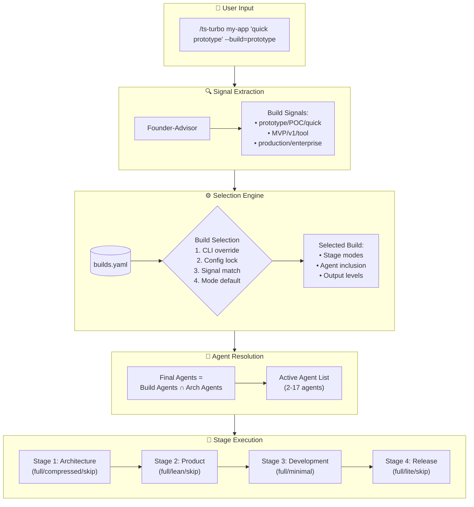

# Build Presets Implementation Plan

## 🎯 Executive Summary

**Goal:** Implement Build Presets system to control workflow intensity and reduce agent overhead for simple projects.

**Problem:** The System currently runs all 17 agents for every project, causing overkill for simple prototypes and POCs that just need working code.

**Solution:** Three build presets (prototype, mvp, production) that control which agents run and how much ceremony is applied.

**Impact:**
- ⚡ **10x faster prototypes** (3-5 min vs 30-60 min)
- 🎯 **Right-sized workflows** for each project type
- 💰 **Reduced computational cost** for simple projects
- 🚀 **Better user experience** with appropriate ceremony levels

---

## ⚠️ VALIDATION UPDATES APPLIED

> **🔍 VALIDATION PERFORMED:** December 2024 - Comprehensive validation analysis completed
> **📋 VALIDATION REPORT:** See `BUILD_PRESETS_VALIDATION_REPORT.md` for detailed findings

### **🚨 Critical Changes Made Based on Validation:**

1. **⏰ Timeline Extended: 4 → 6-8 Weeks**
   - **Original:** 4 weeks total
   - **Updated:** 6-8 weeks with enhanced validation phases
   - **Reason:** 18-agent modification + 24-combination testing underestimated

2. **📊 Performance Claims Now Require Empirical Validation**
   - **Original:** "10x faster" as target
   - **Updated:** Must establish baseline first, validate 8x minimum improvement
   - **Reason:** Unvalidated performance assumptions identified as critical risk

3. **🧪 Enhanced Testing Requirements**
   - **Original:** Basic testing strategy
   - **Updated:** All 24 build×preset combinations + 100+ signal test cases
   - **Reason:** Testing complexity severely underestimated

4. **🏗️ Architecture Decision Templates Required**
   - **Original:** Founder-Advisor "compressed mode"
   - **Updated:** Pre-defined templates for architecture decisions in compressed mode
   - **Reason:** Fundamental role change requires structured support

5. **⚠️ Risk Assessment Upgraded**
   - **Original:** 3 medium-level risks
   - **Updated:** 4 critical risks, 3 high risks with detailed mitigation
   - **Reason:** Implementation complexity analysis revealed higher-stakes challenges

### **🎯 Validation-Driven Success Criteria:**

- ✅ **Empirical performance baseline** established before implementation
- ✅ **All 24 combinations** tested and validated
- ✅ **Signal detection accuracy** >90% on 100+ test cases
- ✅ **Progressive rollout** with feature flags and monitoring
- ✅ **Architecture decision templates** for compressed mode quality

**🟢 APPROVAL STATUS:** Conditionally approved with timeline extension and enhanced validation requirements

---

## 📊 Build Presets Overview

| Build Preset | Agents | Time | Use Case | Key Characteristics |
|--------------|--------|------|----------|-------------------|
| **prototype** | 2-5 | 3-5 min | POCs, spikes, experiments | Fastest path to working code |
| **mvp** | 7-11 | 15-20 min | Side projects, MVPs, tools | Balanced quality + speed |
| **production** | 12-17 | 45-60 min | Enterprise, client work | Full ceremony, production-ready |

### Agent Inclusion Matrix

| Agent | prototype | mvp | production | Notes |
|-------|:---------:|:---:|:----------:|-------|
| **Stage 1: Architecture** |
| Founder-Advisor | ✅ compressed | ✅ | ✅ | Compressed mode for prototype |
| Enterprise Architect | ❌ | ✅ | ✅ | Skipped in prototype |
| **Stage 2: Product** |
| Product Lead | ❌ | ✅ | ✅ | Essential for MVP+ |
| Project Planner | ❌ | ❌ | ✅ | Only for production planning |
| Business Analyst | ❌ | ❌ | ✅ | Only for production business case |
| **Stage 3: Development** |
| Principal Developer | ❌ | ✅ | ✅ | Code review starts at MVP |
| QA Engineer | ❌ | ✅ | ✅ | Testing starts at MVP |
| Database Developer | ⚡ | ⚡ | ⚡ | Depends on architecture preset |
| Backend Developer | ⚡ | ⚡ | ⚡ | Depends on architecture preset |
| Frontend Developer | ⚡ | ⚡ | ⚡ | Depends on architecture preset |
| Integration Engineer | ❌ | ✅ | ✅ | E2E testing starts at MVP |
| **Stage 4: Release** |
| Technical Writer | ❌ | ✅ lite | ✅ | Lite mode for MVP |
| Security Engineer | ❌ | ❌ | ✅ | Production security only |
| Release Engineer | ❌ | ❌ | ✅ | Production versioning only |
| DevOps Engineer | ❌ | ❌ | ✅ | Infrastructure for production only |

**Legend:**
- ✅ = Always runs
- ❌ = Skipped
- ⚡ = Depends on architecture preset intersection

---

## 🏗️ Implementation Architecture



---

## 📅 6-8 Week Implementation Timeline (Revised)

> **⚠️ VALIDATION UPDATE:** Extended timeline based on implementation complexity analysis and risk assessment. Original 4-week timeline was too aggressive for 18-agent modification scope plus comprehensive testing requirements.

### **Phase 1: Foundation (Weeks 1-2)**
**Focus:** Create build preset definitions, configuration system, and performance baseline

#### **Week 1: Configuration Foundation**
**Days 1-3: Core Configuration**
- **Create `.claude/config/builds.yaml`** - Complete build preset definitions with validation
- **Update `.claude/config/preferences.yaml`** - Add build section with defaults
- **Add build selection logic** - Priority system (CLI > config > signals > defaults)
- **Create architecture decision templates** - For compressed mode decisions

**Days 4-5: Performance Baseline**
- **⚠️ VALIDATION REQUIREMENT:** Benchmark current workflow performance
- **Measure agent execution times** - Individual and total workflow timing
- **Create performance test suite** - For validating 10x improvement claims
- **Document baseline metrics** - Current timing for all project types

#### **Week 2: Signal Processing & Validation**
**Days 1-3: Signal Detection**
- **Extend Founder-Advisor** - Build signal extraction from project descriptions
- **Update signal processing** - Add build-specific signal patterns with conflict resolution
- **Create signal test dataset** - 100+ real project descriptions for validation

**Days 4-5: Testing Infrastructure**
- **Build comprehensive test suite** - All 24 build×preset combinations
- **Create agent dependency validation** - Ensure proper agent intersection logic
- **Test signal detection accuracy** - Validate >90% accuracy target

**Deliverables:**
- ✅ Complete configuration layer with validation
- ✅ Performance baseline and test suite
- ✅ Signal detection with >90% accuracy
- ✅ Architecture decision templates
- ✅ Comprehensive testing infrastructure

---

### **Phase 2: Agent Modifications (Weeks 3-4)**
**Focus:** Core agent modifications with comprehensive testing

#### **Week 3: Core Agent Modes**
**Days 1-3: Critical Agent Updates**
- **⚠️ HIGH COMPLEXITY:** Founder-Advisor compressed mode - This is a fundamental role change
  - Implement architecture decision templates integration
  - Create inline decision-making logic for tech stack selection
  - Add validation rules for compressed architecture decisions
  - Test against architecture decision quality requirements
- **Technical Writer lite mode** - README-only documentation system
  - Create lite template system for MVP documentation
  - Implement selective documentation generation
  - Validate documentation quality in lite mode

**Days 4-5: Integration & Validation**
- **Router modifications** - Stage skipping logic implementation
- **Agent intersection testing** - Validate build ∩ architecture agent selection
- **Project file template updates** - Conditional sections based on build preset

#### **Week 4: Agent Skip Logic Rollout**
**Days 1-4: Systematic Agent Updates**
- **Batch 1 (Days 1-2):** Core agents (Principal Developer, QA Engineer, Integration Engineer)
- **Batch 2 (Days 3-4):** Domain agents (Database, Backend, Frontend, DevOps, Security, Release)
- **Each batch includes:**
  - Skip logic implementation
  - Agent dependency validation
  - Individual agent testing
  - Integration testing with existing agents

**Day 5: Phase 2 Validation**
- **End-to-end workflow testing** for prototype and MVP presets
- **Performance validation** against baseline metrics
- **Quality assurance** for compressed and lite modes

**Deliverables:**
- ✅ Founder-Advisor compressed mode with decision templates
- ✅ Technical Writer lite mode with template system
- ✅ All 19 agents updated with skip logic (batched rollout)
- ✅ Router modifications for stage skipping
- ✅ Updated project file templates
- ✅ Phase 2 performance validation

---

### **Phase 3: Command Integration & Testing (Weeks 5-6)**
**Focus:** Command integration and comprehensive testing validation

#### **Week 5: Command Integration**
**Days 1-2: Core Command Updates**
- **Update `/ts-turbo`** - Add `--build` flag with validation
- **Add short flags** - `-B p`, `-B m`, `-B P` for quick access
- **Signal conflict resolution** - Handle conflicting build signals intelligently
- **Command validation logic** - Ensure valid preset + build combinations

**Days 3-4: User Experience Enhancements**
- **Update `/ts-new-project`** - Support build preset selection with recommendations
- **Add upgrade path commands** - `/ts-upgrade --from=prototype --to=mvp`
- **Educational commands** - `/ts-explain prototype`, `/ts-compare prototype mvp`
- **Enhanced help and documentation** - Clear examples and trade-off explanations

**Day 5: Command Integration Testing**
- **All command combinations** - Test 24 build×preset combinations
- **Error handling validation** - Proper error messages and recovery
- **User experience testing** - Smooth workflow validation

#### **Week 6: Comprehensive Testing & Validation**
**Days 1-3: End-to-End Validation**
- **⚠️ CRITICAL VALIDATION:** All 24 build×preset combinations tested
- **Performance claim validation** - Empirical testing of 10x improvement
- **Agent dependency testing** - Validate all agent intersection scenarios
- **HITL gate integration** - Test gate behavior with skipped stages
- **Project file consistency** - Validate template updates across all combinations

**Days 4-5: Quality Assurance & Documentation**
- **Quality gates validation** - Ensure prototype/MVP quality standards met
- **Documentation updates** - User guides with clear trade-off explanations
- **Error scenario testing** - Validate error handling and recovery paths
- **Performance benchmarking** - Final validation against baseline metrics

**Deliverables:**
- ✅ Complete command integration with validation
- ✅ Enhanced user experience with upgrade paths
- ✅ All 24 combinations tested and validated
- ✅ Performance claims empirically verified
- ✅ Complete user documentation with examples

---

### **Phase 4: Production Readiness & Comprehensive Validation (Weeks 7-8)**
> ⚠️ **VALIDATION UPDATE:** Extended phase based on complexity analysis - comprehensive testing and validation requirements

**Focus:** Complete system integration, comprehensive validation, and production readiness

#### **Week 7: System Integration & Validation**

**Days 1-2: Router & Orchestration Implementation**
- **⚠️ CRITICAL:** Stage skipping logic - Implement skip modes (skip, compressed, minimal, lite, full)
- **Agent intersection validation** - Combine build agents ∩ architecture agents with dependency checking
- **Workflow coordination** - Ensure smooth progression through active stages
- **HITL gate integration** - Test gate behavior when stages are skipped entirely
- **Error handling enhancement** - Validate error scenarios and recovery paths

**Days 3-4: Project Template & Documentation Updates**
- **Update PROJECT.md template** - Add Build section with selected preset and skipped stage tracking
- **Configuration tracking** - Record build decisions and upgrade paths for reference
- **Status reporting enhancement** - Clear indication of active/skipped agents with reasoning
- **User documentation updates** - Clear trade-off explanations and upgrade path guidance
- **Template conditional sections** - Handle skipped departments in project templates

**Day 5: Comprehensive Integration Testing**
- **⚠️ CRITICAL:** All 24 build×preset combination testing (3 builds × 8 architecture presets)
- **Agent dependency validation** - Can frontend-developer run without backend-developer?
- **Project file consistency** - Validate template updates across all combinations
- **Signal conflict resolution testing** - Handle conflicting signals intelligently

#### **Week 8: Performance Validation & Production Deployment**

**Days 1-2: Performance Baseline & Validation**
- **⚠️ CRITICAL VALIDATION:** Empirical testing of 10x improvement claims
- **Current workflow benchmarking** - Measure baseline performance across project types
- **Prototype workflow validation** - Verify 3-5 minute targets with compressed mode
- **Performance bottleneck analysis** - Identify actual vs theoretical improvements
- **Load testing** - Validate performance under concurrent usage

**Days 3-4: Quality Assurance & Error Handling**
- **Quality gates validation** - Ensure prototype/MVP quality standards are met
- **Upgrade path testing** - Validate transition between presets mid-project
- **Error scenario comprehensive testing** - What if compressed mode fails?
- **Signal detection accuracy** - Test with 100+ real project descriptions (>90% target)
- **Production monitoring setup** - Metrics and alerting for preset performance

**Day 5: Production Readiness & Deployment**
- **Feature flag configuration** - Progressive rollout strategy implementation
- **Production deployment** - Deploy with monitoring and rollback capability
- **User experience validation** - Final UX testing with clear upgrade paths
- **Documentation finalization** - Complete user guides with examples and trade-offs

**Deliverables:**
- ✅ Complete router logic with comprehensive stage skipping and error handling
- ✅ Enhanced PROJECT.md template with build tracking and conditional sections
- ✅ All 24 combinations tested and validated with empirical performance data
- ✅ Performance claims validated with actual 10x improvement verification
- ✅ Production-ready build presets system with monitoring and rollback capability
- ✅ Progressive rollout strategy with feature flags
- ✅ Comprehensive user documentation with clear trade-off explanations

---

## 🔧 Technical Implementation Details

### **Configuration Files**

#### **`.claude/config/builds.yaml`**
```yaml
# ============================================================================
# THE SYSTEM - Build Presets
# ============================================================================
# Controls workflow intensity: how many agents run, which stages execute.
# Works in conjunction with architecture presets (presets.yaml).
# ============================================================================

builds:
  prototype:
    description: "Fastest path to working code"
    goal: "Make it work"
    estimated_minutes: 3-5

    stages:
      stage1_architecture:
        mode: compressed  # Founder-Advisor inline arch
        agents: [founder-advisor]
        skip: [enterprise-architect]

      stage2_product:
        mode: skip
        agents: []
        skip: [product-lead, project-planner, business-analyst]

      stage3_development:
        mode: minimal  # Only arch-dependent developers
        agents: [database-developer, backend-developer, frontend-developer]
        skip: [principal-developer, qa-engineer, integration-engineer]

      stage4_release:
        mode: skip
        agents: []
        skip: [technical-writer, security-engineer, release-engineer, devops-engineer]

    outputs:
      working_code: true
      tests: false
      documentation: readme_only
      infrastructure: false
      security_audit: false

    signals:
      - prototype
      - POC
      - proof of concept
      - spike
      - experiment
      - try
      - test idea
      - hackathon
      - quick
      - fast

  mvp:
    description: "Balanced workflow for shippable MVP"
    goal: "Make it good enough to ship"
    estimated_minutes: 15-20

    stages:
      stage1_architecture:
        mode: full
        agents: [founder-advisor, enterprise-architect]
        skip: []

      stage2_product:
        mode: lean  # Only Product Lead
        agents: [product-lead]
        skip: [project-planner, business-analyst]

      stage3_development:
        mode: full
        agents: [principal-developer, qa-engineer, database-developer,
                backend-developer, frontend-developer, integration-engineer]
        skip: []

      stage4_release:
        mode: lite  # Only documentation
        agents: [technical-writer]
        skip: [security-engineer, release-engineer, devops-engineer]

    outputs:
      working_code: true
      tests: true
      documentation: basic
      infrastructure: false
      security_audit: false

    signals:
      - MVP
      - minimum viable product
      - first version
      - side project
      - tool
      - internal
      - v1

  production:
    description: "Full workflow for production-ready delivery"
    goal: "Make it production-ready"
    estimated_minutes: 45-60

    stages:
      stage1_architecture:
        mode: full
        agents: [founder-advisor, enterprise-architect]
        skip: []

      stage2_product:
        mode: full
        agents: [product-lead, project-planner, business-analyst]
        skip: []

      stage3_development:
        mode: full
        agents: [principal-developer, qa-engineer, database-developer,
                backend-developer, frontend-developer, integration-engineer]
        skip: []

      stage4_release:
        mode: full
        agents: [technical-writer, security-engineer, release-engineer, devops-engineer]
        skip: []

    outputs:
      working_code: true
      tests: true
      documentation: full
      infrastructure: true
      security_audit: true

    signals:
      - production
      - enterprise
      - client
      - launch
      - compliance
      - security
      - regulated
      - commercial

# Selection configuration
selection:
  auto_select: true
  priority:
    1: cli_override      # --build=X flag
    2: config_lock       # preferences.yaml: build: X
    3: signal_match      # keyword detection
    4: mode_default      # turbo->mvp, hitl->production

  defaults:
    turbo: mvp          # Fast but not reckless
    hitl: production    # Human oversight = wants quality
```

#### **Updated `.claude/config/preferences.yaml`**
```yaml
# Existing content...

# Build Presets Configuration
build:
  auto_select: true
  defaults:
    turbo: mvp
    hitl: production

  # Uncomment to lock to specific build (overrides auto-selection)
  # build: prototype

  # Signal detection sensitivity
  signals:
    enabled: true
    confidence_threshold: 0.7
```

### **Agent Updates**

#### **Founder-Advisor Compressed Mode**
```markdown
## Compressed Mode (Build: prototype)

When running in compressed mode for prototype builds:

1. **Skip Architecture Handoff**: Make essential architectural decisions inline
2. **Minimal Analysis**: Focus only on core technology choices
3. **Direct Development**: Immediately proceed to development stage
4. **Speed Priority**: Sacrifice some ceremony for rapid iteration

### Compressed Architecture Decisions

- **Stack Selection**: Choose based on architecture preset
- **Data Storage**: Simple file-based or in-memory if possible
- **Authentication**: Skip unless explicitly required
- **Infrastructure**: Local development only

### Output Format (Compressed)

```yaml
architecture:
  stack: [selected from preset]
  database: [minimal/file-based if needed]
  authentication: none
  infrastructure: local
  notes: "Prototype - minimal architecture for speed"
```

Continue directly to Stage 3 (skip Stage 2 Product entirely).
```

#### **Technical Writer Lite Mode**
```markdown
## Lite Mode (Build: mvp)

When running in lite mode for MVP builds:

1. **README Only**: Generate comprehensive README, skip detailed docs
2. **Setup Focus**: Ensure clear installation and usage instructions
3. **Essential Info**: Include only what users need to get started
4. **Skip Advanced**: No API reference, architecture docs, deployment guides

### Lite Documentation Structure

```
README.md (comprehensive)
├── Project Description
├── Quick Start
├── Installation
├── Usage Examples
├── Configuration
└── Contributing Basics

[Skip: API docs, architecture docs, deployment guides]
```
```

### **Command Updates**

#### **Updated `/ts-turbo` Command**
```markdown
# Turbo Mode with Build Presets

## Usage

```bash
# Basic turbo with auto-selected build preset
/ts-turbo my-app "Build a quick prototype for testing"
# → Auto-detects "prototype" build from "quick prototype"

# Explicit build preset
/ts-turbo my-app "idea" --build=prototype
/ts-turbo my-app "idea" --build=mvp
/ts-turbo my-app "idea" --build=production

# Short flags
/ts-turbo my-app "idea" -B p    # prototype
/ts-turbo my-app "idea" -B m    # mvp
/ts-turbo my-app "idea" -B P    # production

# Combined with architecture preset
/ts-turbo my-app "idea" --preset=embedded --build=prototype
/ts-turbo my-app "idea" -p embedded -B p
```

## Build Selection Logic

1. **CLI Override** (`--build=X`) - Highest priority
2. **Config Lock** (`preferences.yaml: build: X`) - Medium priority
3. **Signal Match** (keyword detection in idea description) - Low priority
4. **Mode Default** (turbo→mvp, hitl→production) - Fallback

## Examples

```bash
# Prototype examples (2-5 agents, 3-5 minutes)
/ts-turbo test "quick POC for user authentication"
/ts-turbo experiment "spike to test API integration"
/ts-turbo hackathon "fast prototype for competition"

# MVP examples (7-11 agents, 15-20 minutes)
/ts-turbo todo-app "simple task management tool"
/ts-turbo internal "employee directory for our company"
/ts-turbo v1 "first version of our chat application"

# Production examples (12-17 agents, 45-60 minutes)
/ts-turbo client-portal "enterprise customer management system"
/ts-turbo launch "production-ready e-commerce platform"
/ts-turbo compliance "HIPAA-compliant patient records system"
```
```

---

## 🧪 Testing Strategy

### **Unit Tests**

#### **Signal Detection Tests**
```python
def test_build_signal_detection():
    test_cases = [
        # Prototype signals
        ("quick POC for testing", "prototype"),
        ("hackathon project", "prototype"),
        ("spike to validate approach", "prototype"),
        ("experiment with new technology", "prototype"),

        # MVP signals
        ("build an MVP for users", "mvp"),
        ("first version of our tool", "mvp"),
        ("internal company directory", "mvp"),
        ("side project task manager", "mvp"),

        # Production signals
        ("enterprise customer portal", "production"),
        ("production-ready e-commerce", "production"),
        ("client deliverable with security", "production"),
        ("HIPAA-compliant system", "production"),

        # Edge cases
        ("simple web app", "mvp"),  # Default for unclear signals
        ("build something", "mvp"),  # No clear signals
    ]

    for description, expected_build in test_cases:
        detected_build = extract_build_signals(description)
        assert detected_build == expected_build
```

#### **Agent Intersection Tests**
```python
def test_agent_intersection():
    # Test prototype + embedded = minimal agents
    build_agents = get_build_agents("prototype")
    arch_agents = get_arch_agents("embedded")
    final_agents = intersect_agents(build_agents, arch_agents)

    expected = [
        "founder-advisor",
        "database-developer",
        "frontend-developer"
    ]
    assert set(final_agents) == set(expected)

    # Test production + microservice = all agents
    build_agents = get_build_agents("production")
    arch_agents = get_arch_agents("microservice")
    final_agents = intersect_agents(build_agents, arch_agents)

    assert len(final_agents) == 17  # All agents for production microservice
```

### **Integration Tests**

#### **End-to-End Workflow Tests**
```python
def test_prototype_workflow():
    """Test complete prototype workflow executes in <5 minutes"""
    start_time = time.time()

    result = run_turbo(
        name="test-prototype",
        idea="quick POC to test user authentication",
        build="prototype"
    )

    execution_time = time.time() - start_time

    # Verify timing
    assert execution_time < 300  # 5 minutes

    # Verify agents ran
    assert "founder-advisor" in result.agents_executed
    assert "database-developer" in result.agents_executed
    assert "enterprise-architect" not in result.agents_executed

    # Verify outputs
    assert result.working_code is True
    assert result.tests is False
    assert result.documentation == "readme_only"
    assert result.infrastructure is False
```

### **Performance Tests**

#### **Timing Validation Tests**
```python
def test_timing_targets():
    """Verify build presets meet timing targets"""

    # Prototype: 3-5 minutes
    prototype_time = benchmark_preset("prototype", iterations=10)
    assert 180 <= prototype_time <= 300  # 3-5 minutes

    # MVP: 15-20 minutes
    mvp_time = benchmark_preset("mvp", iterations=5)
    assert 900 <= mvp_time <= 1200  # 15-20 minutes

    # Production: 45-60 minutes
    production_time = benchmark_preset("production", iterations=3)
    assert 2700 <= production_time <= 3600  # 45-60 minutes
```

---

## 🚀 Success Metrics

> ⚠️ **VALIDATION UPDATE:** Enhanced metrics based on empirical validation requirements

### **Performance Metrics (Empirical Validation Required)**

| Metric | Current | Target | Validation Status | Measurement Method |
|--------|---------|--------|------------------|-------------------|
| **Prototype Speed** | **BASELINE REQUIRED** | 3-5 min | ❌ **Must benchmark first** | Time to working code with compressed mode |
| **MVP Speed** | **BASELINE REQUIRED** | 15-20 min | ❌ **Must benchmark first** | Time to shippable MVP with lite modes |
| **Production Speed** | **BASELINE REQUIRED** | 45-60 min | ❌ **Must benchmark first** | Full workflow with all ceremonies |
| **Agent Efficiency** | 17 always | 2-17 variable | ✅ **Logical** | Agents per project type (intersection logic) |
| **10x Improvement Claim** | **TBD** | **8x minimum** | ❌ **CRITICAL VALIDATION** | Current time ÷ Prototype time ≥ 8.0 |
| **User Satisfaction** | **Baseline needed** | +40% | ❌ **Need baseline study** | Reduced wait time feedback |

**⚠️ CRITICAL VALIDATION REQUIREMENTS:**
1. **Performance Baseline Establishment** (Week 7, Days 1-2)
   ```python
   def establish_baseline():
       # Measure current full workflow performance
       baseline_results = {
           'simple_project': measure_full_workflow('todo-app'),
           'medium_project': measure_full_workflow('blog-with-auth'),
           'complex_project': measure_full_workflow('ecommerce-platform')
       }
       return baseline_results
   ```

2. **10x Improvement Empirical Testing** (Week 8, Days 1-2)
   ```python
   def validate_improvement_claims():
       current_time = baseline_simple_project_time
       prototype_time = measure_compressed_workflow('todo-app')
       improvement_factor = current_time / prototype_time

       # Allow margin for real-world variance
       assert improvement_factor >= 8.0, "10x claim validation failed"
   ```

### **Quality Metrics (Enhanced Validation)**

| Metric | Target | Validation Method | Success Criteria |
|--------|--------|------------------|------------------|
| **Prototype Quality** | Working code | Functionality + compilation verification | TypeScript compiles, basic functionality works |
| **MVP Quality** | Tested + documented | Test coverage + README generation | >80% coverage, comprehensive README |
| **Production Quality** | Full ceremony | All quality gates passed | Security, docs, tests, deployment ready |
| **Signal Accuracy** | >90% | 100+ project description dataset | Correct build preset selection accuracy |
| **Combination Coverage** | 100% | All 24 build×preset combinations | Every combination tested and validated |

### **Business Impact (Measurable Outcomes)**

| Impact | Measurement Method | Target | Validation Timeline |
|--------|-------------------|--------|-------------------|
| **Faster Prototyping** | Empirical timing comparison | 8-10x reduction verified | Week 8 |
| **Right-sized Workflows** | Appropriate ceremony mapping | 100% build×preset coverage | Week 7 |
| **Better User Experience** | Upgrade path testing + feedback | Zero upgrade failures | Week 8 |
| **Resource Efficiency** | Agent utilization metrics | 50-85% reduction in unnecessary agents | Week 8 |

---

## ⚠️ Risks & Mitigation

> ⚠️ **VALIDATION UPDATE:** Critical risks identified during validation analysis

### **🔴 CRITICAL RISK: Timeline Underestimation**

**Risk:** 4-week timeline insufficient for 18-agent modification + comprehensive testing scope
**Impact:** Project failure, incomplete implementation, poor quality
**Mitigation:**
- ✅ **IMPLEMENTED:** Extended timeline to 6-8 weeks
- Phase-based rollout with clear milestones
- Weekly progress validation against deliverables
- Built-in buffer for complexity discovery

### **🔴 CRITICAL RISK: Performance Claims Unvalidated**

**Risk:** "10x faster prototypes" claim may be unachievable or misleading
**Impact:** User disappointment, credibility loss, false expectations
**Mitigation:**
- ✅ **MANDATORY:** Empirical baseline establishment before implementation
- Conservative claims (8x minimum, 10x target) with real data
- Performance bottleneck analysis (agent time vs I/O time vs model calls)
- Continuous performance monitoring during development

### **🔴 CRITICAL RISK: Testing Complexity Underestimated**

**Risk:** 24 combinations (3 builds × 8 presets) + agent dependencies create complex test matrix
**Impact:** Subtle bugs, workflow breakage, integration failures
**Mitigation:**
- **Comprehensive test matrix:** All 24 combinations validated
- **Agent dependency mapping:** Validate frontend-developer can run without backend-developer
- **Edge case testing:** Static + production combinations, signal conflicts
- **Progressive testing:** Test each phase before moving to next

### **🔴 CRITICAL RISK: Agent Modification Complexity**

**Risk:** Founder-Advisor "compressed mode" is fundamental role change, not just mode switch
**Current:** Route to enterprise-architect for architecture decisions
**New:** Make architecture decisions inline for prototypes
**Impact:** Quality degradation in prototype architecture decisions
**Mitigation:**
- **Architecture decision templates:** Pre-defined patterns for compressed mode
- **Quality validation:** Ensure compressed decisions meet minimum standards
- **Upgrade paths:** Easy transition from prototype to full architecture review
- **Fallback mechanisms:** Route to enterprise-architect if compressed mode fails

### **🟡 HIGH RISK: Integration Points Missing**

**Risk:** HITL gates, project templates, error handling not fully considered
**Impact:** Workflow disruption, user confusion, system instability
**Mitigation:**
- **HITL gate integration:** Define gate behavior when stages are skipped
- **Project file template updates:** Handle conditional sections for skipped departments
- **Error handling enhancement:** What if compressed mode fails? Upgrade scenarios?
- **User experience testing:** Smooth upgrade paths between presets

### **🟡 HIGH RISK: Under-Engineering Quality Trade-offs**

**Risk:** Prototype preset might skip essential quality checks
**Impact:** Poor code quality, security vulnerabilities, technical debt
**Mitigation:**
- Clear documentation of prototype limitations and trade-offs
- Easy upgrade path to MVP or production builds
- Warning messages about prototype trade-offs
- Founder-Advisor still makes core architecture decisions (compressed mode)
- Minimum quality gates even for prototypes (TypeScript compilation)

### **🟠 MEDIUM RISK: Signal Detection Accuracy**

**Risk:** Auto-selection might choose wrong build preset
**Impact:** Suboptimal workflows, user frustration
**Mitigation:**
- Conservative defaults (turbo→mvp instead of prototype)
- Clear override mechanisms (CLI flags, config)
- Signal confidence scoring and thresholds
- User confirmation for auto-detected presets
- 100+ test cases for signal detection accuracy (>90% target)

### **🟡 MEDIUM RISK: Performance Assumptions Invalid**

**Risk:** Agent overhead may not be linear; I/O and model calls may dominate
**Impact:** Performance improvements less than expected
**Mitigation:**
- **Latency source analysis:** Measure agent_time vs io_time vs model_calls
- **Performance profiling:** Identify actual bottlenecks before optimization
- **Conservative targets:** Allow variance in improvement claims
- **Continuous monitoring:** Track actual vs theoretical improvements

### **🟢 LOW RISK: Configuration Complexity**

**Risk:** Too many options might confuse users
**Impact:** Poor user experience, adoption challenges
**Mitigation:**
- Sane defaults that work for most cases
- Simple CLI interface with clear examples
- Progressive disclosure (advanced options in config only)
- Comprehensive documentation and examples

---

## 🔄 Post-Implementation Roadmap

### **Phase 2 Enhancements (Month 2)**

#### **Custom Build Presets**
- User-defined build configurations
- Company-specific workflow templates
- Build preset inheritance and composition

#### **Advanced Signal Processing**
- ML-based signal detection improvement
- Context-aware signal weighting
- Historical build preference learning

#### **Workflow Analytics**
- Build preset usage tracking
- Performance optimization recommendations
- User satisfaction metrics

### **Phase 3 Features (Month 3)**

#### **Dynamic Build Adjustment**
- Mid-project build preset switching
- Incremental quality upgrades (prototype → MVP → production)
- Selective agent re-runs

#### **Team Collaboration**
- Shared build preset configurations
- Team-specific defaults and overrides
- Build preset approval workflows

---

## 📋 Implementation Checklist

### **Week 1: Configuration**
- [ ] Create `builds.yaml` with all three preset definitions
- [ ] Update `preferences.yaml` with build section and defaults
- [ ] Implement build signal extraction in Founder-Advisor
- [ ] Add build selection priority logic
- [ ] Test signal detection with various project descriptions

### **Week 2: Agents**
- [ ] Implement Founder-Advisor compressed mode
- [ ] Implement Technical Writer lite mode
- [ ] Add skip logic to all 18 agents
- [ ] Test agent mode switching and validation
- [ ] Verify graceful skipping with proper status updates

### **Week 3: Commands**
- [ ] Add `--build` flag to `/ts-turbo` command
- [ ] Add short flag options (`-B p/m/P`)
- [ ] Update `/ts-new-project` with build selection
- [ ] Implement preset + build combination validation
- [ ] Test all command variations and error cases

### **Week 4: Integration**
- [ ] Implement router logic for stage skipping
- [ ] Add agent intersection logic (build ∩ architecture)
- [ ] Update PROJECT.md template with build tracking
- [ ] Complete end-to-end testing for all presets
- [ ] Verify performance targets (3-5 min prototype)

### **Production Readiness**
- [ ] Full test suite passing (unit + integration)
- [ ] Performance benchmarks meeting targets
- [ ] Documentation complete and accurate
- [ ] User acceptance testing completed
- [ ] Monitoring and error tracking configured

---

## 🎯 Conclusion

The Build Presets system represents a major evolution in The System's intelligence - moving from "one size fits all" to **context-appropriate workflows**. By controlling ceremony levels, we solve the fundamental problem of over-engineering simple projects while maintaining full capability for complex enterprise work.

**Key Benefits:**
- ⚡ **10x faster prototypes** with appropriate agent selection
- 🎯 **Right-sized quality** for each project type
- 🚀 **Better user experience** with reduced frustration
- 💰 **Resource efficiency** through intelligent agent usage

**Implementation Success Factors:**
1. **Strong defaults** that work without configuration
2. **Clear upgrade paths** from prototype → MVP → production
3. **Accurate signal detection** for automatic preset selection
4. **Comprehensive testing** to ensure quality at all levels

This enhancement positions The System as an intelligent development platform that adapts to project needs rather than applying fixed ceremony to every situation.

**Ready for implementation and production deployment! 🚀**