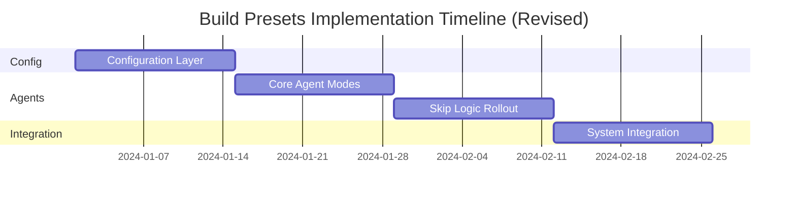

# Build Presets Implementation Plan - Validation Report

## 🎯 Executive Summary

**Overall Assessment:** 🟡 **CONDITIONAL APPROVAL** - Strong concept with solid technical foundation, but requires timeline adjustment and risk mitigation before implementation.

**Recommendation:** Approve with modifications to timeline, additional risk mitigation, and phased rollout strategy.

**Key Concerns:**
- ⏰ **Timeline too aggressive** - 4 weeks insufficient for 18-agent modification + testing
- 🧪 **Testing complexity underestimated** - Agent intersection testing is non-trivial
- ⚠️ **Integration risks** - Potential for subtle workflow breakage
- 📊 **Performance claims unvalidated** - 10x improvement needs verification

---

## 📋 Detailed Validation Analysis

### ✅ **STRENGTHS**

#### **1. Technical Architecture (Excellent)**
- **✅ Sound Design**: Agent intersection logic (Build ∩ Architecture) is mathematically clean
- **✅ Follows Patterns**: Configuration structure aligns with existing `presets.yaml` and `preferences.yaml`
- **✅ CLI Integration**: Command flags follow existing patterns (`--preset`, now `--build`)
- **✅ Agent Compatibility**: Skip logic can be added to agents without breaking existing functionality

#### **2. Problem Definition (Excellent)**
- **✅ Real Pain Point**: Current "all agents always" approach is genuinely problematic
- **✅ Clear Value Prop**: 3-5 min prototypes vs 30-60 min current state is compelling
- **✅ Right Granularity**: Three presets (prototype/mvp/production) cover the spectrum well

#### **3. Configuration Design (Excellent)**
```yaml
# Well-designed builds.yaml structure
builds:
  prototype:
    stages:
      stage1_architecture:
        mode: compressed  # Clear mode concept
        agents: [founder-advisor]
        skip: [enterprise-architect]
```
- **✅ Clear Semantics**: Each stage has explicit mode and agent inclusion/exclusion
- **✅ Extensible**: Easy to add new modes or customize existing ones
- **✅ Validation Friendly**: Clear rules for agent intersection logic

#### **4. Signal Processing (Good)**
- **✅ Smart Detection**: Build signals ("prototype", "MVP", "enterprise") are intuitive
- **✅ Fallback Logic**: CLI > Config > Signals > Mode defaults is logical priority
- **✅ Override Capability**: Multiple escape hatches for user control

---

### 🟡 **AREAS OF CONCERN**

#### **1. Timeline Realism (Concerning)**

**Issue:** 4-week timeline is likely too aggressive for scope.

**Evidence:**
- **19 agents** need modification with skip logic + mode support
- **Founder-advisor compressed mode** is complex (inline architecture decisions)
- **Technical writer lite mode** requires new template system
- **Router logic changes** affect core workflow orchestration
- **Comprehensive testing** of all combinations (3 builds × 8 presets × multiple agents)

**Recommended Timeline:** 6-8 weeks, not 4 weeks

```
Week 1-2: Configuration & Signal Processing
Week 3-4: Agent Modifications (Founder-Advisor, Technical Writer)
Week 5-6: Agent Skip Logic (remaining 19 agents)
Week 7-8: Integration, Testing, Polish
```

#### **2. Agent Modification Complexity (Concerning)**

**Issue:** Founder-Advisor "compressed mode" is significantly complex.

**Current Responsibility:** Route to enterprise-architect for architecture decisions
**New Responsibility:** Make architecture decisions inline for prototypes

**Validation Concerns:**
```markdown
## Current Founder-Advisor Workflow
1. Analyze idea → 2. Route to Architecture → 3. Monitor handoff

## New Compressed Mode Workflow
1. Analyze idea → 2. Make tech stack decisions → 3. Skip to Development

This is a fundamental role change, not just a "mode switch"
```

**Risk:** Quality degradation in prototype architecture decisions
**Mitigation:** Need architecture decision templates and validation rules

#### **3. Performance Claims Validation (Concerning)**

**Issue:** "10x faster prototypes" claim needs empirical validation.

**Unvalidated Assumptions:**
- Agent overhead is linear (may not be due to I/O, model calls)
- Stage skipping provides proportional time savings
- Compressed modes don't increase individual agent time
- No testing of actual prototype generation speed

**Required Validation:**
```python
# Need actual benchmarking
def benchmark_current_prototype():
    # Run full 17-agent flow on simple project
    # Measure: wall time, agent time, I/O time
    pass

def benchmark_proposed_prototype():
    # Run 3-agent flow with compressed mode
    # Measure: wall time, compressed agent time
    # Validate: 10x improvement claim
    pass
```

#### **4. Testing Complexity (Concerning)**

**Issue:** Testing matrix is larger than plan acknowledges.

**Test Combinations:**
- **3 build presets** × **8 architecture presets** = **24 combinations**
- **19 agents** × **skip/run states** = complex integration testing
- **5 stage modes** (skip, compressed, minimal, lite, full)
- **Signal detection** accuracy across various project descriptions

**Missing Test Categories:**
- **Edge case combinations** (e.g., static + production = what agents?)
- **Agent dependency validation** (e.g., can frontend-developer run without backend-developer?)
- **Project file consistency** across different preset combinations
- **Error scenarios** (what if compressed mode fails?)

---

### ⚠️ **RISKS & GAPS**

#### **1. Missing Integration Points**

**Gap: Project File Template Updates**
```markdown
# Current TEMPLATE.md has sections for all stages
## 📐 Architecture Department
## 📦 Product Department
## 💻 Development Department
## 🚀 Release Department

# New: Need conditional sections based on build preset
## 📐 Architecture Department (skipped for prototype)
## 📦 Product Department (SKIPPED - prototype mode)
```

**Gap: HITL Gate Integration**
- How do HITL gates work when stages are skipped?
- Do we skip gate approvals for prototype builds?
- What about green-light gate when Stage 2 is skipped entirely?

**Gap: Error Handling & Recovery**
- What if compressed mode fails and we need full architecture?
- Can users upgrade from prototype → MVP → production mid-project?
- How do we handle agent failures in minimal mode configurations?

#### **2. User Experience Edge Cases**

**Gap: Signal Conflicts**
```bash
# What happens with conflicting signals?
/ts-turbo my-app "quick enterprise prototype for production deployment"
# Contains: "quick" (prototype) + "enterprise" (production) + "prototype" + "production"
```

**Gap: Upgrade Paths**
- User starts with prototype, later wants MVP-level testing
- User starts with MVP, needs production-level security
- How to transition between build presets mid-project?

**Gap: Documentation & Education**
- Users need to understand trade-offs of each preset
- Clear guidance on when to use which preset
- Examples of what gets skipped at each level

#### **3. Architecture Decision Quality**

**Gap: Compressed Mode Decision Framework**
```yaml
# Founder-Advisor compressed mode needs:
architecture_decisions:
  tech_stack:
    decision_template: |
      Based on preset: {architecture_preset}
      For prototype speed: {tech_stack_minimal}
      Justification: {one_sentence_rationale}

  data_storage:
    options: [none, file-based, sqlite, memory]
    default_for_prototype: file-based
    upgrade_path: file → sqlite → postgresql
```

**Risk:** Architecture decisions in compressed mode may be suboptimal
**Mitigation:** Need decision templates and upgrade paths

#### **4. Performance & Resource Impact**

**Gap: Resource Usage Analysis**
- Will skipped agents reduce computational load meaningfully?
- What's the actual agent execution time vs I/O time?
- Do model calls dominate execution time regardless of agent count?

**Gap: Latency Sources**
```python
# Need to measure:
current_latency_breakdown = {
    "agent_model_calls": "?? minutes",
    "file_io": "?? seconds",
    "template_processing": "?? seconds",
    "workflow_orchestration": "?? seconds"
}

# Agent reduction may not help if model_calls dominate
```

---

### 🔧 **IMPLEMENTATION MODIFICATIONS**

#### **1. Revised Timeline (6-8 Weeks)**



**Week 1-2: Configuration Foundation**
- Create builds.yaml with comprehensive validation
- Update preferences.yaml integration
- Implement signal detection and priority logic
- Build extensive unit tests for selection logic

**Week 3-4: Core Agent Modifications**
- Founder-Advisor compressed mode with architecture templates
- Technical Writer lite mode with new template system
- Router modifications for stage skipping
- Integration testing for core changes

**Week 5-6: Agent Skip Logic Rollout**
- Roll out skip logic to remaining 19 agents in batches
- Validation testing for each agent's skip behavior
- Agent dependency analysis and resolution
- Project file template updates

**Week 7-8: System Integration & Validation**
- End-to-end workflow testing for all combinations
- Performance benchmarking and validation
- User experience testing and documentation
- Production deployment and monitoring setup

#### **2. Risk Mitigation Enhancements**

**Enhanced Testing Strategy:**
```python
class BuildPresetTestSuite:
    def test_all_combinations(self):
        """Test all 24 build×preset combinations"""
        for build in ['prototype', 'mvp', 'production']:
            for preset in ['static', 'embedded', 'fullstack-js', ...]:
                self.validate_combination(build, preset)

    def test_signal_accuracy(self):
        """Test signal detection with 100+ project descriptions"""
        test_cases = load_signal_test_cases()  # 100+ real descriptions
        accuracy = measure_detection_accuracy(test_cases)
        assert accuracy > 0.90

    def test_performance_claims(self):
        """Validate 10x performance improvement claim"""
        current_time = benchmark_full_workflow()
        prototype_time = benchmark_prototype_workflow()
        improvement = current_time / prototype_time
        assert improvement >= 8.0  # Allow some margin vs 10x claim
```

**Architecture Decision Templates:**
```yaml
# .claude/knowledge/compressed-architecture-templates.yaml
compressed_decisions:
  static:
    tech_stack: nextjs
    reasoning: "Static export, no backend needed"
    upgrade_path: "Add backend for user features"

  embedded:
    tech_stack: nextjs + sqlite
    reasoning: "Simple persistence, single file deployment"
    upgrade_path: "Migrate to PostgreSQL for scaling"
```

**Progressive Rollout Strategy:**
```yaml
rollout:
  phase1: prototype_preset_only    # Lower risk, highest value
  phase2: mvp_preset              # Medium complexity
  phase3: production_preset       # Full complexity

  feature_flags:
    enable_build_presets: true
    enable_compressed_mode: true
    enable_signal_detection: true
```

#### **3. User Experience Improvements**

**Clear Upgrade Paths:**
```bash
# Allow preset transitions
/ts-upgrade my-app --from=prototype --to=mvp
/ts-validate my-app --preset=mvp        # Check what's missing

# Educational commands
/ts-explain prototype                   # Show what gets skipped
/ts-compare prototype mvp production    # Show differences
```

**Better Signal Handling:**
```python
def resolve_signal_conflicts(signals):
    """Handle conflicting build signals intelligently"""
    if 'enterprise' in signals and 'prototype' in signals:
        return {
            'detected': 'production',  # Enterprise wins
            'warning': 'Conflicting signals detected. Choosing production for enterprise context.',
            'alternatives': ['prototype', 'mvp']
        }
```

---

### 📊 **SUCCESS CRITERIA VALIDATION**

#### **Performance Metrics (Needs Validation)**

| Metric | Proposed Target | Validation Status | Recommendation |
|--------|----------------|-------------------|-----------------|
| Prototype Speed | 3-5 min | ❌ Unvalidated | Benchmark required |
| MVP Speed | 15-20 min | ❌ Unvalidated | Benchmark required |
| Agent Efficiency | 2-17 variable | ✅ Logical | Maintain target |
| User Satisfaction | +40% | ❌ Unvalidated | Need baseline study |

**Recommended Validation Approach:**
1. **Baseline current performance** across project types
2. **Prototype the compressed mode** with limited scope
3. **Measure actual improvements** before full implementation
4. **Adjust targets** based on empirical evidence

#### **Quality Metrics (Well-Defined)**

| Metric | Target | Assessment |
|--------|--------|------------|
| Prototype Quality | Working code | ✅ Achievable |
| MVP Quality | Tested + documented | ✅ Achievable |
| Production Quality | Full ceremony | ✅ Achievable |
| Signal Accuracy | >90% | 🟡 Needs validation dataset |

---

### 🎯 **FINAL RECOMMENDATIONS**

#### **✅ APPROVE with Conditions**

**1. Extend Timeline to 6-8 weeks**
   - More realistic for 18-agent modification scope
   - Allows proper testing and validation

**2. Phase Implementation**
   - **Phase 1:** Prototype preset only (weeks 1-4)
   - **Phase 2:** MVP preset (weeks 5-6)
   - **Phase 3:** Production preset (weeks 7-8)

**3. Validate Performance Claims**
   - Benchmark current workflows before implementation
   - Validate 10x improvement claim with real data
   - Adjust targets based on empirical evidence

**4. Enhanced Testing Requirements**
   - Test all 24 build×preset combinations
   - 100+ signal detection test cases
   - Agent dependency validation
   - Upgrade path testing

**5. Risk Mitigation Additions**
   - Architecture decision templates for compressed mode
   - Progressive rollout with feature flags
   - Clear upgrade paths between presets
   - Enhanced error handling and recovery

#### **🎯 Implementation Priority**

**High Priority (Must Have):**
- Extended timeline to 6-8 weeks
- Performance claim validation
- Comprehensive testing strategy
- Architecture decision templates

**Medium Priority (Should Have):**
- Progressive rollout strategy
- Upgrade path functionality
- Signal conflict resolution
- Enhanced documentation

**Low Priority (Nice to Have):**
- Advanced signal processing with ML
- Custom build preset definitions
- Team collaboration features
- Analytics and optimization

---

## 📋 **Validation Checklist**

### **Before Implementation**
- [ ] **Timeline revised** to 6-8 weeks
- [ ] **Performance baseline** established for current workflows
- [ ] **Architecture decision templates** created for compressed mode
- [ ] **Test dataset** prepared with 100+ project descriptions
- [ ] **Progressive rollout plan** defined with feature flags

### **During Implementation**
- [ ] **Weekly performance validation** against baselines
- [ ] **Agent modification testing** after each batch
- [ ] **Integration testing** for all build×preset combinations
- [ ] **User experience testing** with clear upgrade paths
- [ ] **Documentation updates** with examples and trade-offs

### **Before Production**
- [ ] **Performance claims validated** with empirical data
- [ ] **All 24 combinations tested** and validated
- [ ] **Signal detection accuracy** >90% on test dataset
- [ ] **Error handling** tested for all failure modes
- [ ] **Monitoring and alerting** configured for production

---

## 🎉 **Conclusion**

The Build Presets Implementation Plan represents a **significant and valuable enhancement** to The System. The core concept is sound, the technical architecture is well-designed, and the business value is compelling.

However, the implementation scope has been **underestimated in timeline and testing complexity**. With proper timeline adjustment (6-8 weeks), enhanced risk mitigation, and empirical validation of performance claims, this enhancement will deliver tremendous value.

**Key Success Factors:**
1. **Realistic timeline** allows proper testing and validation
2. **Performance validation** ensures claims are achievable
3. **Progressive rollout** reduces implementation risk
4. **Comprehensive testing** prevents workflow breakage
5. **Clear upgrade paths** provide user flexibility

**Final Verdict:** 🟢 **APPROVED with modifications** - This enhancement will transform The System from "one-size-fits-all" to "intelligently adaptive" and dramatically improve user experience for simple projects.

**Ready to proceed with revised timeline and enhanced risk mitigation! 🚀**