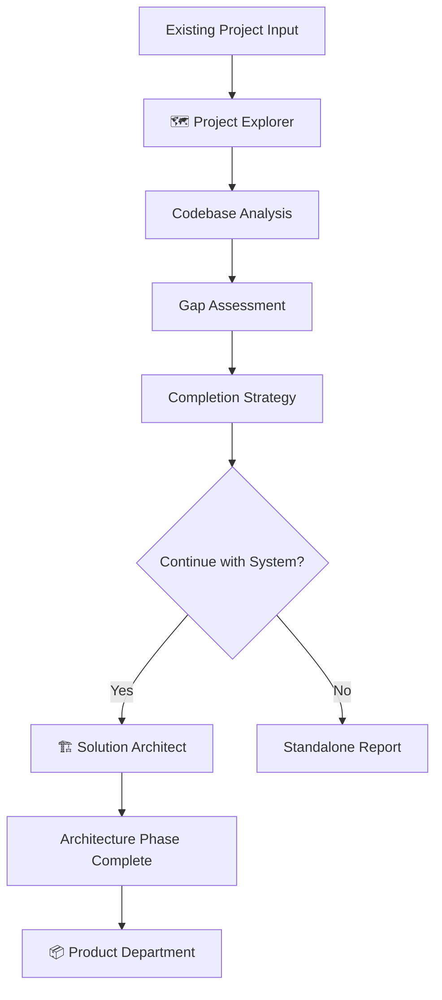

# Project Explorer Agent - Implementation Plan

**Date:** January 8, 2026
**Version:** v1.0.0
**Status:** Design Phase
**Priority:** High (Extends framework to legacy projects)

---

## 🎯 **Project Overview**

### **Objective**
Implement a **Project Explorer** agent in the Architecture Department that analyzes half-developed/incomplete codebases and provides comprehensive completion strategies, architectural assessments, and technical roadmaps.

### **Business Value**
- **Extends The System** beyond greenfield projects to legacy modernization
- **Project rescue capability** for abandoned/incomplete developments
- **Technical debt analysis** and prioritization
- **Legacy project assessment** for acquisition/inheritance scenarios
- **Modernization pathway guidance** for existing applications

### **Success Criteria**
- ✅ Analyzes existing codebases accurately (90%+ component detection)
- ✅ Provides actionable completion roadmaps with effort estimates
- ✅ Integrates seamlessly with Architecture Department workflow
- ✅ Generates comprehensive technical assessment reports
- ✅ Recommends optimal refactor vs complete strategies

---

## 🏗️ **Technical Specification**

### **Agent Definition**

```markdown
## 🗺️ Project Explorer
**Department:** Architecture (Stage 1)
**Type:** Analysis Agent
**Position:** Works alongside Solution Architect
**Workflow:** Pre-architecture for existing projects

### **Core Capabilities:**
- Codebase structure analysis and mapping
- Architectural pattern recognition and assessment
- Feature completeness evaluation
- Technical debt identification and quantification
- Dependency analysis and health assessment
- Completion strategy and effort estimation

### **Technology Support:**
- Frontend: React, Vue, Angular, Next.js, static sites
- Backend: Node.js, Python, PHP, Java, .NET, Go
- Databases: SQL, NoSQL, file-based storage
- Infrastructure: Docker, cloud configurations
- Build systems: npm, pip, composer, gradle, maven
```

### **Input Requirements**

#### **Primary Inputs:**
- **Project path** - Local directory or git repository
- **Analysis scope** - Full project vs specific modules
- **Assessment type** - Completion, modernization, or acquisition
- **Target goals** - Performance, maintainability, features

#### **Optional Context:**
- **Original requirements** - If available from documentation
- **Previous team notes** - README, comments, issues
- **Timeline constraints** - Deadlines for completion
- **Resource limitations** - Team size, budget, expertise

### **Analysis Capabilities**

#### **🔍 Codebase Discovery:**
```typescript
interface CodebaseAnalysis {
  structure: {
    files: FileInventory[];
    modules: ModuleMap;
    dependencies: DependencyGraph;
    configuration: ConfigFiles[];
  };
  patterns: {
    architecture: ArchitecturalPatterns;
    designPatterns: DesignPatterns[];
    conventions: CodingConventions;
  };
  health: {
    coverage: TestCoverage;
    quality: CodeQualityMetrics;
    security: SecurityAssessment;
    performance: PerformanceIndicators;
  };
}
```

#### **🎯 Gap Analysis:**
```typescript
interface GapAnalysis {
  missing: {
    components: MissingComponents[];
    features: IncompleteFeatures[];
    infrastructure: MissingInfrastructure[];
    documentation: DocumentationGaps[];
  };
  broken: {
    dependencies: BrokenDependencies[];
    imports: MissingImports[];
    references: DeadReferences[];
    configurations: InvalidConfigs[];
  };
  incomplete: {
    functions: PartialImplementations[];
    tests: UncoveredCode[];
    documentation: PartialDocs[];
  };
}
```

#### **📊 Completion Strategy:**
```typescript
interface CompletionStrategy {
  approach: 'complete' | 'refactor' | 'modernize' | 'hybrid';
  phases: CompletionPhase[];
  priorities: Priority[];
  estimates: {
    effort: EffortEstimate;
    timeline: TimelineEstimate;
    resources: ResourceRequirements;
    risks: RiskAssessment[];
  };
  recommendations: {
    immediate: Action[];
    shortTerm: Action[];
    longTerm: Action[];
  };
}
```

---

## 📋 **Implementation Phases**

### **Phase 1: Core Analysis Engine (2 weeks)**

#### **Week 1: Foundation**
- **File System Analysis**
  - Recursive directory scanning
  - File type identification
  - Dependency extraction
  - Configuration detection

```typescript
class ProjectExplorer {
  async analyzeProject(projectPath: string): Promise<ProjectAnalysis> {
    const scanner = new CodebaseScanner();
    const structure = await scanner.scanDirectory(projectPath);
    const dependencies = await scanner.analyzeDependencies(structure);
    const patterns = await scanner.detectPatterns(structure);

    return {
      structure,
      dependencies,
      patterns,
      health: await this.assessHealth(structure),
      gaps: await this.identifyGaps(structure, dependencies)
    };
  }
}
```

#### **Week 2: Pattern Recognition**
- **Technology Stack Detection**
  - Framework identification (React, Vue, Express, Django, etc.)
  - Build system recognition (webpack, vite, rollup, etc.)
  - Database type detection (SQL, NoSQL, file-based)
  - Deployment pattern identification

- **Architecture Pattern Analysis**
  - MVC, MVVM, Component-based patterns
  - Microservices vs monolith
  - Client-server vs JAMstack
  - Data flow patterns (Redux, Context, etc.)

### **Phase 2: Gap Analysis & Assessment (2 weeks)**

#### **Week 3: Missing Component Detection**
- **Static Code Analysis**
  - Import/require statement validation
  - Function call resolution
  - Reference checking
  - Type definition validation (TypeScript)

```typescript
class GapAnalyzer {
  async analyzeGaps(codebase: CodebaseStructure): Promise<GapAnalysis> {
    const missing = await this.findMissingComponents(codebase);
    const broken = await this.findBrokenReferences(codebase);
    const incomplete = await this.findIncompleteImplementations(codebase);

    return { missing, broken, incomplete };
  }

  private async findMissingComponents(codebase: CodebaseStructure) {
    // Analyze imports that don't resolve to files
    // Check for referenced but non-existent modules
    // Identify missing configuration files
    // Detect incomplete directory structures
  }
}
```

#### **Week 4: Quality Assessment**
- **Code Quality Metrics**
  - Complexity analysis
  - Test coverage assessment
  - Documentation completeness
  - Security vulnerability scanning

- **Technical Debt Quantification**
  - Code duplication detection
  - Outdated dependency identification
  - Performance bottleneck analysis
  - Maintainability scoring

### **Phase 3: Completion Strategy Engine (2 weeks)**

#### **Week 5: Strategy Generation**
- **Decision Matrix Implementation**
  - Refactor vs complete analysis
  - Technology modernization recommendations
  - Migration pathway planning
  - Risk vs reward calculations

```typescript
class StrategyEngine {
  generateCompletionStrategy(
    analysis: ProjectAnalysis,
    goals: ProjectGoals
  ): CompletionStrategy {
    const complexity = this.assessComplexity(analysis);
    const viability = this.assessViability(analysis);
    const modernization = this.assessModernizationNeeds(analysis);

    return this.synthesizeStrategy({
      complexity,
      viability,
      modernization,
      goals
    });
  }
}
```

#### **Week 6: Effort Estimation**
- **Work Breakdown Structure**
  - Component-level effort estimates
  - Dependency resolution time
  - Testing and validation effort
  - Documentation requirements

- **Timeline Projection**
  - Critical path analysis
  - Resource allocation optimization
  - Risk buffer calculations
  - Milestone definition

### **Phase 4: Integration & Commands (1 week)**

#### **Week 7: Command Implementation**
- **Command Structure**
  ```typescript
  // Core exploration command
  /ts-explore <project-path> [--scope=full|partial] [--type=completion|modernization]

  // Detailed analysis commands
  /ts-map-architecture [--format=visual|json|markdown]
  /ts-assess-completeness [--include-estimates]
  /ts-chart-completion [--phases] [--timeline]
  /ts-discovery-report [--detailed] [--format=markdown|json]

  // Utility commands
  /ts-explore-health [--security] [--performance]
  /ts-explore-dependencies [--outdated] [--vulnerabilities]
  /ts-modernization-plan [--target-stack] [--migration-strategy]
  ```

#### **Integration Points**
- **Architecture Department Workflow**
  - Replace or augment `/ts-assess` for existing projects
  - Feed analysis into Solution Architect for completion planning
  - Generate Architecture Decision Records (ADRs) for modernization

- **Project File Integration**
  ```markdown
  ## Project Explorer Analysis

  ### Codebase Assessment
  - **Technology Stack:** [Detected stack]
  - **Architecture Pattern:** [Pattern analysis]
  - **Completion Status:** [X% complete]
  - **Technical Debt Score:** [Score/10]

  ### Missing Components
  [Detailed gap analysis]

  ### Completion Strategy
  [Recommended approach and timeline]
  ```

---

## 🧪 **Testing Strategy**

### **Test Project Repository**
Create comprehensive test cases with various project states:

#### **Test Case Categories:**
1. **Complete Projects** - Verify accurate "100% complete" detection
2. **Minimal Projects** - Basic structure with missing implementation
3. **Abandoned Projects** - Partially built with broken dependencies
4. **Legacy Projects** - Older technology stacks requiring modernization
5. **Multi-framework Projects** - Complex projects with multiple technologies

#### **Sample Test Projects:**
```
test-projects/
├── react-todo-incomplete/          # Missing backend, broken imports
├── vue-dashboard-abandoned/         # Partial components, outdated deps
├── express-api-minimal/             # Basic structure, no implementation
├── nextjs-blog-legacy/              # Old Next.js version, deprecated patterns
├── fullstack-broken/                # Frontend/backend with broken connections
└── microservices-partial/           # Some services built, others missing
```

### **Validation Criteria**
- **Accuracy:** 90%+ correct component identification
- **Completeness:** Detects all major missing pieces
- **Precision:** Minimal false positives in gap detection
- **Performance:** Analysis completes in under 60 seconds for typical projects
- **Actionability:** Recommendations are specific and implementable

---

## 🔄 **Workflow Integration**

### **New Project Flow (Existing Projects)**


### **Command Sequence Example**
```bash
# 1. Initial exploration
/ts-explore ~/my-abandoned-project --type=completion

# 2. Detailed architectural mapping
/ts-map-architecture --format=visual

# 3. Generate completion strategy
/ts-chart-completion --phases --timeline

# 4. Create comprehensive report
/ts-discovery-report --detailed

# 5. If proceeding with completion
/ts-approve architecture-start

# 6. Continue with normal Solution Architect flow
/ts-architect
```

### **Output Integration**
- **Project File Updates:** Seamlessly integrates analysis into existing project structure
- **Architecture Input:** Feeds analysis to Solution Architect for informed decisions
- **Product Planning:** Provides feature gap analysis to Product Department

---

## 📊 **Implementation Timeline**

### **7-Week Implementation Schedule**

| Week | Phase | Deliverables | Success Metrics |
|------|-------|--------------|-----------------|
| **1** | Foundation | File scanning, basic analysis | Scans 95% of common project types |
| **2** | Pattern Recognition | Technology detection, architecture patterns | 90% accuracy on framework detection |
| **3** | Gap Analysis | Missing component detection | Identifies all major gaps |
| **4** | Quality Assessment | Code quality, technical debt | Accurate complexity scoring |
| **5** | Strategy Engine | Completion strategy generation | Actionable recommendations |
| **6** | Effort Estimation | Timeline and resource estimates | Within 20% of actual effort |
| **7** | Integration | Commands and workflow integration | Seamless Architecture Dept integration |

### **Milestones**
- **Week 2:** ✅ Basic codebase analysis working
- **Week 4:** ✅ Complete gap identification system
- **Week 6:** ✅ Completion strategy generation
- **Week 7:** ✅ Full integration with The System

### **Dependencies**
- **Architecture Department** - Integration with existing agent workflow
- **Project File Format** - Updates to support exploration analysis
- **Command Parser** - New command category registration
- **Testing Infrastructure** - Test project repository creation

---

## 🚀 **Launch Strategy**

### **Beta Testing Phase (Week 8)**
- **Internal Testing** - Test with The System's own codebase
- **Community Testing** - Select users test with their abandoned projects
- **Feedback Integration** - Refine analysis accuracy based on real-world usage

### **Documentation Requirements**
- **User Guide** - How to use Project Explorer for existing projects
- **Technical Reference** - Analysis capabilities and limitations
- **Best Practices** - When to use exploration vs starting fresh
- **Example Projects** - Showcase successful project resurrections

### **Marketing Positioning**
- **"Project Resurrection"** - Bring abandoned projects back to life
- **"Legacy Modernization"** - Upgrade old projects to modern standards
- **"Technical Archaeology"** - Discover what you inherited
- **"Completion Catalyst"** - Finish what you started

---

## 🎯 **Success Metrics**

### **Technical Metrics**
- **Analysis Accuracy:** >90% correct component identification
- **Performance:** <60 seconds analysis time for typical projects
- **Coverage:** Supports 95% of common technology stacks
- **Actionability:** 85% of recommendations are implementable

### **Business Metrics**
- **User Adoption:** 40% of new projects use exploration features
- **Project Success Rate:** 70% of explored projects reach completion
- **Time to Value:** 50% faster completion of analyzed projects
- **User Satisfaction:** 4.5/5.0 rating for exploration accuracy

### **Framework Impact**
- **Market Expansion** - Extends beyond greenfield to legacy projects
- **User Retention** - Increases stickiness for inherited projects
- **Professional Credibility** - Demonstrates technical depth and analysis
- **Competitive Advantage** - Unique capability in AI development tools

---

## 🔧 **Technical Implementation Details**

### **Core Dependencies**
```json
{
  "dependencies": {
    "@typescript-eslint/parser": "^6.0.0",
    "acorn": "^8.10.0",
    "glob": "^10.3.0",
    "ignore": "^5.2.4",
    "semver": "^7.5.4",
    "yaml": "^2.3.2"
  }
}
```

### **Analysis Engine Architecture**
```typescript
interface AnalysisEngine {
  scanners: {
    fileSystem: FileSystemScanner;
    dependencies: DependencyScanner;
    patterns: PatternScanner;
    quality: QualityScanner;
  };
  analyzers: {
    gaps: GapAnalyzer;
    architecture: ArchitectureAnalyzer;
    completeness: CompletenessAnalyzer;
    modernization: ModernizationAnalyzer;
  };
  generators: {
    strategy: StrategyGenerator;
    estimates: EstimationEngine;
    reports: ReportGenerator;
  };
}
```

### **Configuration Schema**
```yaml
# .claude/config/project-explorer.yaml
analysis:
  depth: "deep"           # surface | standard | deep
  performance: true       # Enable performance analysis
  security: true          # Enable security scanning
  modernization: true     # Enable modernization recommendations

outputs:
  format: "markdown"      # markdown | json | html
  detail: "comprehensive" # summary | standard | comprehensive
  visualizations: true    # Generate visual diagrams

thresholds:
  complexity_warning: 7   # Complexity score threshold
  debt_critical: 8        # Technical debt score threshold
  coverage_minimum: 60    # Test coverage minimum %
```

---

## 📋 **Risk Assessment & Mitigation**

### **Technical Risks**
| Risk | Probability | Impact | Mitigation |
|------|-------------|--------|------------|
| **Inaccurate Analysis** | Medium | High | Extensive testing with diverse codebases |
| **Performance Issues** | Low | Medium | Optimize scanning algorithms, async processing |
| **Technology Coverage Gaps** | Medium | Medium | Phased rollout, priority technology focus |
| **Complex Integration** | Low | High | Careful Architecture Dept workflow design |

### **Business Risks**
| Risk | Probability | Impact | Mitigation |
|------|-------------|--------|------------|
| **Low User Adoption** | Medium | High | Strong documentation, compelling use cases |
| **Analysis Overconfidence** | Medium | High | Clear accuracy disclaimers, validation steps |
| **Scope Creep** | High | Medium | Strict phase boundaries, MVP focus |

---

## ✅ **Definition of Done**

### **Technical Completion**
- [ ] All analysis engines implemented and tested
- [ ] Integration with Architecture Department complete
- [ ] Command structure implemented and documented
- [ ] Performance benchmarks met (<60s analysis)
- [ ] Test coverage >90% for core analysis functions

### **User Experience Completion**
- [ ] Commands intuitive and follow The System patterns
- [ ] Error messages helpful and actionable
- [ ] Output reports clear and comprehensive
- [ ] Documentation complete and user-tested

### **Quality Assurance**
- [ ] Tested with 20+ diverse real-world projects
- [ ] Accuracy validation >90% on test suite
- [ ] Security and performance review passed
- [ ] Integration testing with full System workflow

### **Launch Readiness**
- [ ] User documentation complete
- [ ] Beta testing feedback incorporated
- [ ] Marketing materials prepared
- [ ] Support processes established

---

**Implementation Team:** Framework Core Team
**Project Manager:** Principal Developer
**Timeline:** 7 weeks development + 1 week beta
**Budget Estimate:** 280 development hours
**Launch Target:** March 2026

---

*This implementation plan provides the foundation for extending The System's capabilities to existing and legacy projects, significantly expanding the addressable market and user value proposition.*