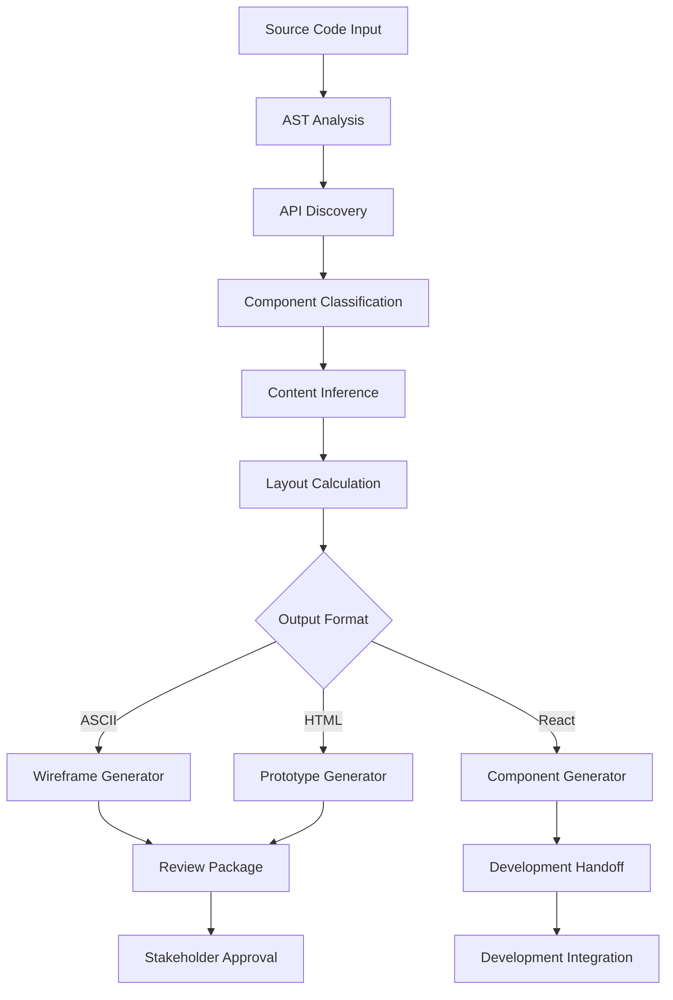

# 🎨 Design Department Implementation Roadmap

**The System Framework Enhancement: From Code Analysis to Production-Ready UI**

---

## 📋 Executive Summary

### **Vision Statement**
Create the first AI development framework capable of automatically analyzing existing codebases and generating professional, accessible, production-ready UI components using established design best practices.

### **Strategic Goals**
- **Reduce UI development time by 60-80%** through automated component generation
- **Improve accessibility compliance** from typical 40% to 95%+ WCAG 2.1 AA
- **Eliminate design-development handoff friction** with working prototypes
- **Establish competitive moat** as the only AI framework with professional UI generation

### **Business Impact**
- **Time to Market**: 3-5x faster UI development cycles
- **Quality**: Professional design patterns and accessibility built-in
- **Cost**: Reduced design and frontend development effort
- **Differentiation**: Unique capability in AI development tools market

---

## 🏗️ Technical Architecture

### **Core Engine Components**

```yaml
Design Engine Architecture:
├── Analysis Layer
│   ├── AST Parser (TypeScript, JavaScript, Vue, Angular)
│   ├── API Discovery Engine (OpenAPI, GraphQL, REST)
│   ├── Component Tree Analyzer
│   └── Content Inference Engine
├── Generation Layer
│   ├── ASCII Wireframe Renderer
│   ├── HTML Prototype Generator
│   ├── React Component Generator
│   └── Design System Extractor
├── Integration Layer
│   ├── Development Handoff Generator
│   ├── Quality Assurance Bridge
│   └── Stakeholder Review Packages
└── Storage Layer
    ├── Analysis Cache
    ├── Generated Assets
    └── Template Library
```

### **Data Flow Architecture**


### **Technology Stack**

**Core Analysis Engine**
```yaml
Languages: TypeScript, Python
Parsing: TypeScript Compiler API, Babel AST, Vue Template Compiler
UI Generation: React 18+, Next.js 14+, Tailwind CSS 3+
Accessibility: axe-core, ARIA patterns, WCAG 2.1 guidelines
Testing: Jest, React Testing Library, Storybook
```

**Output Generation**
```yaml
Wireframes: Unicode box drawing, SVG generation
Prototypes: Alpine.js for lightweight interactions, Tailwind for styling
Components: React with TypeScript, proper prop interfaces
Design Systems: Design tokens (JSON), CSS custom properties
Documentation: Markdown generation, Storybook integration
```

---

## 👥 Agent Specifications

### **Agent 1: UX Analyzer**
```yaml
Name: ux-analyzer
Purpose: Analyze existing UX patterns and identify improvement opportunities
Tools: [Read, Grep, Glob, WebFetch]
Model: sonnet

Capabilities:
  - Parse component trees from React/Vue/Angular codebases
  - Identify navigation patterns and information architecture
  - Detect accessibility violations using axe-core rules
  - Map user flows from routing configurations
  - Assess usability against Nielsen's 10 heuristics

Inputs:
  - Source code directory
  - API documentation (OpenAPI specs)
  - Existing design assets

Outputs:
  - ux-analysis.md (comprehensive UX audit)
  - user-flows.mmd (Mermaid flow diagrams)
  - accessibility-issues.json (structured issue list)
  - navigation-map.md (information architecture analysis)
```

### **Agent 2: API Discovery Specialist**
```yaml
Name: api-discovery-specialist
Purpose: Discover and analyze APIs to inform UI generation
Tools: [Read, Grep, Glob, Bash]
Model: sonnet

Capabilities:
  - Parse OpenAPI/Swagger specifications
  - Extract API routes from framework code (FastAPI, Express, Django)
  - Infer data schemas from TypeScript interfaces
  - Generate realistic sample data for prototypes
  - Map API patterns to UI component patterns

Inputs:
  - Backend source code
  - API documentation files
  - Database schema files
  - Example API responses

Outputs:
  - api-inventory.json (all discovered endpoints)
  - schema-analysis.json (data structure mappings)
  - sample-data.json (realistic content for prototypes)
  - ui-requirements.md (derived UI component needs)
```

### **Agent 3: Wireframe Generator**
```yaml
Name: wireframe-generator
Purpose: Generate ASCII and SVG wireframes from analysis
Tools: [Write, Read]
Model: haiku (for speed)

Capabilities:
  - Render ASCII wireframes using Unicode box drawing
  - Generate SVG wireframes for scalable layouts
  - Calculate optimal layout dimensions
  - Apply responsive design patterns
  - Include realistic content in wireframes

Inputs:
  - Component analysis from UX Analyzer
  - API schemas from API Discovery
  - Layout preferences and constraints

Outputs:
  - wireframes-ascii/ (text-based wireframes)
  - wireframes-svg/ (scalable vector graphics)
  - layout-specs.json (dimension and spacing specifications)
```

### **Agent 4: Prototype Developer**
```yaml
Name: prototype-developer
Purpose: Create interactive HTML prototypes
Tools: [Write, Read, Bash]
Model: sonnet

Capabilities:
  - Generate fully interactive HTML prototypes
  - Implement realistic state management with Alpine.js
  - Apply professional styling with Tailwind CSS
  - Include accessibility features (ARIA, keyboard navigation)
  - Add interaction analytics for stakeholder feedback

Inputs:
  - Wireframes from Wireframe Generator
  - Sample data from API Discovery
  - Interaction patterns from UX analysis

Outputs:
  - prototypes/low-fi/ (basic interactive wireframes)
  - prototypes/high-fi/ (polished interactive prototypes)
  - interaction-map.json (documented user interactions)
```

### **Agent 5: Component Engineer**
```yaml
Name: component-engineer
Purpose: Generate production-ready React components
Tools: [Write, Read]
Model: sonnet

Capabilities:
  - Generate TypeScript React components with proper interfaces
  - Implement accessibility patterns (WCAG 2.1 AA compliance)
  - Include comprehensive error handling and loading states
  - Generate corresponding test files and Storybook stories
  - Create integration documentation for Development Department

Inputs:
  - High-fidelity prototypes
  - API schemas and endpoints
  - Design system specifications

Outputs:
  - components/ (React .tsx files with TypeScript)
  - tests/ (Jest test files)
  - stories/ (Storybook story files)
  - hooks/ (custom React hooks for data fetching)
  - types/ (TypeScript interface definitions)
```

---

## 📅 Implementation Phases

### **Phase 1: Foundation (Months 1-2)**
**Goal**: Core analysis and basic wireframe generation

**Deliverables**:
- UX Analyzer agent implementation
- ASCII wireframe generation engine
- Basic component tree parsing for React
- `/ts-design-analyze` command with UX audit output
- `/ts-design-wireframe` command with ASCII output

**Technical Milestones**:
- TypeScript AST parsing working for React components
- Unicode box drawing wireframe renderer
- Basic accessibility rule checking (10 core WCAG rules)
- Integration with existing System command structure

**Success Criteria**:
- Can analyze simple React apps (5-10 components)
- Generates readable ASCII wireframes
- Identifies basic accessibility issues
- Integrates cleanly with existing `/ts-*` command pattern

### **Phase 2: API Integration (Months 2-3)**
**Goal**: API discovery and content-aware generation

**Deliverables**:
- API Discovery Specialist agent
- OpenAPI/Swagger parsing capabilities
- Realistic sample data generation
- `/ts-design-api-discover` command
- Content-aware wireframe generation

**Technical Milestones**:
- FastAPI/Express/Django route extraction
- OpenAPI 3.0 specification parsing
- TypeScript interface to UI component mapping
- Realistic data generation based on field names and types

**Success Criteria**:
- Can discover APIs in common frameworks
- Generates realistic sample data for 20+ field types
- Maps API endpoints to appropriate UI patterns
- Wireframes include realistic content instead of placeholders

### **Phase 3: Interactive Prototypes (Months 3-4)**
**Goal**: Browsable HTML prototypes for stakeholder review

**Deliverables**:
- Prototype Developer agent
- Interactive HTML prototype generation
- Multi-fidelity output (low/medium/high)
- `/ts-design-prototype` command
- Stakeholder review packages

**Technical Milestones**:
- Alpine.js integration for lightweight interactions
- Tailwind CSS system for professional styling
- Responsive design pattern implementation
- Click tracking and interaction analytics

**Success Criteria**:
- Generates clickable prototypes that stakeholders can navigate
- Includes realistic interactions (form submission, table sorting)
- Works across desktop and mobile breakpoints
- Provides usage analytics for design validation

### **Phase 4: Production Components (Months 4-6)**
**Goal**: React component generation for Development handoff

**Deliverables**:
- Component Engineer agent
- Production-ready React component generation
- TypeScript interfaces and prop definitions
- Test file and Storybook story generation
- `/ts-design-implement` command

**Technical Milestones**:
- React 18+ component generation with hooks
- Comprehensive TypeScript prop interface generation
- Jest test file generation with accessibility tests
- Storybook story generation with multiple states
- Integration hook templates for Development Department

**Success Criteria**:
- Generates components that pass TypeScript compilation
- All generated components meet WCAG 2.1 AA standards
- Test coverage above 90% for generated components
- Development Department can integrate with minimal modification

### **Phase 5: Design Systems (Months 5-7)**
**Goal**: Complete design system extraction and generation

**Deliverables**:
- Design system extraction from existing codebases
- Design token generation (colors, typography, spacing)
- Component library packaging
- `/ts-design-system` command suite
- NPM package generation for reusable design systems

**Technical Milestones**:
- CSS/SCSS parsing for design token extraction
- Design token standardization (JSON format)
- Component library bundling and documentation
- Semantic versioning for design system updates

**Success Criteria**:
- Can extract design tokens from existing Tailwind/CSS systems
- Generates publishable NPM packages for design systems
- Components use consistent design tokens across all outputs
- Design system documentation is comprehensive and usable

### **Phase 6: Advanced Features (Months 6-8)**
**Goal**: Advanced capabilities and optimization

**Deliverables**:
- Multi-framework support (Vue, Angular)
- Advanced accessibility testing and remediation
- Performance optimization analysis
- A/B testing prototype generation
- Integration with external design tools (Figma)

**Technical Milestones**:
- Vue.js single-file component parsing
- Angular component and template analysis
- Lighthouse performance analysis integration
- Figma API integration for design asset import

**Success Criteria**:
- Supports React, Vue, and Angular equally well
- Achieves 95%+ WCAG 2.1 AA compliance on generated components
- Generates performance-optimized components (Core Web Vitals)
- Can import existing Figma designs for analysis

---

## 🚀 Enhanced Design Department Features

### **ts-design-turbo: Autonomous Design Pipeline**

**Purpose**: Run complete design analysis and generation autonomously, similar to `/ts-turbo` for development

**Command Syntax**:
```bash
/ts-design-turbo [project-path] [--fidelity=low/medium/high]
/ts-design-turbo [project-path] --existing-codebase [--redesign]
/ts-design-turbo [project-path] --api-driven [--admin-interface]
/ts-design-turbo [project-path] --mobile-first [--pwa]
```

**Autonomous Workflow**:
```yaml
Stage 1: Analysis (Auto-approved)
  ✅ UX Analyzer: Complete codebase analysis
  ✅ API Discovery: Extract all endpoints and schemas
  ✅ Accessibility Audit: WCAG 2.1 compliance scan
  ✅ Performance Analysis: UI performance assessment

Stage 2: Generation (Auto-approved)
  ✅ Wireframe Generator: ASCII + SVG wireframes for all components
  ✅ Prototype Developer: Interactive HTML prototypes
  ✅ Component Engineer: Production React components
  ✅ Design System: Extract/generate design tokens

Stage 3: Documentation (Auto-approved)
  ✅ Technical Writer: Component documentation
  ✅ Integration Guide: Development handoff docs
  ✅ Accessibility Report: Compliance documentation
  ✅ Design Rationale: Design decision documentation

Stage 4: Packaging (Auto-approved)
  ✅ Asset Organization: Structured output directory
  ✅ Review Server: Local web server for browsing
  ✅ Handoff Package: ZIP file for distribution
  ✅ Integration Instructions: Step-by-step implementation guide
```

### **Comprehensive Documentation System**

**Documentation Architecture**:
```yaml
Generated Documentation Structure:
├── design-overview.md          # Executive summary and design decisions
├── component-library/
│   ├── README.md              # Library overview and usage
│   ├── VMDataTable.md         # Individual component docs
│   ├── MetricCard.md
│   └── FilterPanel.md
├── design-system/
│   ├── tokens.md              # Design token documentation
│   ├── colors.md              # Color system and usage
│   ├── typography.md          # Typography scale and usage
│   └── spacing.md             # Spacing system and grid
├── integration/
│   ├── development-guide.md   # Step-by-step integration
│   ├── api-requirements.md    # Backend API specifications
│   ├── testing-guide.md       # Testing and validation
│   └── deployment.md          # Production deployment
├── accessibility/
│   ├── compliance-report.md   # WCAG 2.1 AA compliance status
│   ├── testing-checklist.md   # Manual testing procedures
│   └── known-issues.md        # Outstanding accessibility issues
└── stakeholder/
    ├── executive-summary.md   # Business impact and ROI
    ├── user-impact.md         # User experience improvements
    └── implementation-plan.md # Timeline and resource requirements
```

### **Asset Display & Review System**

**Local Review Server**: `/ts-design-serve [port] [--open]`
```bash
/ts-design-serve 3001 --open

🌐 Design Review Server Starting...

╔══════════════════════════════════════════════════════════════════╗
║  🎨 Design Review Server                                         ║
╠══════════════════════════════════════════════════════════════════╣
║  URL: http://localhost:3001                                      ║
║  Project: dfo-gui-design                                         ║
║  Assets: 47 files generated                                      ║
║                                                                  ║
║  📱 Mobile Preview: http://localhost:3001/mobile                 ║
║  🖥️ Desktop Preview: http://localhost:3001/desktop              ║
║  📊 Analytics: http://localhost:3001/analytics                  ║
║                                                                  ║
╚══════════════════════════════════════════════════════════════════╝
```

**Asset Display Commands**: `/ts-design-show [asset-type] [name]`
```bash
# Show specific wireframes
/ts-design-show wireframes dashboard
/ts-design-show wireframes --all

# Show prototypes
/ts-design-show prototypes dashboard --mobile
/ts-design-show prototypes vms --interactive

# Show generated components
/ts-design-show components VMDataTable
/ts-design-show components --all --with-code

# Show documentation
/ts-design-show docs integration-guide
/ts-design-show docs design-system --open

# Show design tokens
/ts-design-show tokens colors
/ts-design-show tokens --all --format=css
```

---

## 🔗 Integration Strategy

### **System Framework Integration**

**Command Integration**
```yaml
New Commands Added to The System:
├── /ts-design-turbo [project-path] [options]
├── /ts-design-analyze [project-path]
├── /ts-design-wireframe [scope] [--format]
├── /ts-design-prototype [--fidelity]
├── /ts-design-api-discover [endpoint]
├── /ts-design-implement [component]
├── /ts-design-system [action]
├── /ts-design-handoff [department]
├── /ts-design-review [stage]
├── /ts-design-optimize [target]
├── /ts-design-validate [criteria]
├── /ts-design-serve [port] [--open]
├── /ts-design-show [asset-type] [name]
└── /ts-design-integrate [component-name]
```

**Workflow Integration Points**
```yaml
Stage 1 (Architecture):
  - Post solution-architect: /ts-design-analyze existing-codebase

Stage 2 (Product):
  - Post product-lead: /ts-design-wireframe user-stories
  - Pre green-light gate: /ts-design-prototype --stakeholder-review

Stage 3 (Development):
  - Pre frontend-developer: /ts-design-implement components
  - Integration with frontend-developer handoff packages

Stage 4 (Release):
  - Design system packaging and documentation
  - Component library versioning and publishing
```

### **Development Department Handoff**

**Frontend Developer Enhancement**
```markdown
# Updated Frontend Developer Agent

## Additional Inputs from Design Department
- Generated React components with TypeScript interfaces
- Integration hooks templates (useVMData, useFilters, etc.)
- Accessibility test suites and validation checklist
- Design system tokens and styling specifications

## Modified Workflow
1. Receive component specifications from Design Department
2. Implement business logic in provided hook templates
3. Add API integration to generated components
4. Enhance with performance optimizations and caching
5. Add error boundaries and production monitoring
6. Integrate with existing state management systems

## Quality Gates
- Generated components must pass TypeScript compilation
- Accessibility tests must achieve 95%+ WCAG 2.1 AA compliance
- Component integration must maintain design system consistency
```

**QA Engineer Integration**
```markdown
# Updated QA Engineer Agent

## Additional Testing Responsibilities
- Visual regression testing of generated prototypes vs implementations
- Accessibility compliance verification using generated test suites
- Cross-browser compatibility testing of generated components
- Performance testing of generated code against Core Web Vitals

## New Testing Artifacts
- Automated accessibility test suites (generated)
- Visual regression test baselines (from prototypes)
- Component integration test matrices
- Design system compliance validation scripts
```

---

## 🚧 Technical Challenges & Solutions

### **Challenge 1: AST Parsing Complexity**
**Problem**: Parsing different frontend frameworks (React, Vue, Angular) with varying syntax patterns
**Solution**:
- Use framework-specific parsers (TypeScript Compiler API, Vue Template Compiler)
- Create abstraction layer for common component patterns
- Implement incremental parsing with fallback strategies

### **Challenge 2: Realistic Content Generation**
**Problem**: Generating meaningful sample data that reflects actual use cases
**Solution**:
- Build domain-specific content libraries (financial data, user profiles, etc.)
- Use AI language models to generate contextually appropriate content
- Implement schema-aware data generation based on API specifications

### **Challenge 3: Layout Algorithm Complexity**
**Problem**: Calculating optimal layout dimensions for different screen sizes and content lengths
**Solution**:
- Implement CSS Grid and Flexbox layout algorithms
- Use responsive design breakpoint calculations
- Create layout pattern templates based on common UI frameworks

### **Challenge 4: Accessibility Compliance**
**Problem**: Ensuring generated components meet WCAG 2.1 AA standards consistently
**Solution**:
- Integrate axe-core accessibility checking into generation pipeline
- Build accessibility pattern library with proven ARIA implementations
- Include accessibility testing in all generated component test suites

### **Challenge 5: Framework Version Compatibility**
**Problem**: Supporting multiple versions of React, Vue, Angular as they evolve
**Solution**:
- Implement version detection and feature flagging
- Maintain component generation templates for major framework versions
- Use feature detection rather than version detection where possible

---

## 📊 Success Metrics & KPIs

### **Technical Metrics**
```yaml
Code Quality:
  - Generated component TypeScript compilation success rate: >95%
  - Accessibility compliance score (WCAG 2.1 AA): >95%
  - Component test coverage: >90%
  - Performance score (Lighthouse): >90

Generation Accuracy:
  - API discovery success rate: >90% for supported frameworks
  - Component pattern recognition accuracy: >85%
  - Layout calculation correctness: >90% stakeholder approval
  - Content inference relevance: >80% realistic content score

Integration Success:
  - Development Department integration friction: <10% modification needed
  - Generated component reusability: >80% components used in production
  - Design system compliance: >95% token usage consistency
```

### **Business Impact Metrics**
```yaml
Time Savings:
  - UI development time reduction: 60-80%
  - Design-to-development handoff time: 70% reduction
  - Stakeholder review cycle time: 50% reduction

Quality Improvements:
  - Accessibility compliance improvement: 40% → 95%
  - Cross-browser compatibility issues: 80% reduction
  - Design consistency scores: 60% improvement

Developer Experience:
  - Developer satisfaction with generated components: >8/10
  - Component modification effort: <20% of total development time
  - Learning curve for new developers: 50% reduction
```

### **Competitive Metrics**
```yaml
Market Position:
  - Unique capability vs competitors: Only AI framework with UI generation
  - User adoption rate: Target 40% of existing System users
  - Customer retention impact: +20% due to design capabilities

Framework Usage:
  - Projects using Design Department: Target 60% within 6 months
  - Generated components in production: Target 1000+ within 1 year
  - Design system packages published: Target 100+ within 1 year
```

---

## ⚠️ Risk Mitigation

### **Technical Risks**

**High Risk: Generated Code Quality**
- *Risk*: Generated components may have bugs or performance issues
- *Mitigation*: Comprehensive automated testing, staged rollout, manual review gates
- *Contingency*: Fallback to manual component development, incremental feature rollback

**Medium Risk: Framework Evolution**
- *Risk*: React/Vue/Angular updates may break generation logic
- *Mitigation*: Automated compatibility testing, version monitoring, feature flags
- *Contingency*: Maintain multiple generation templates, gradual migration strategies

**Medium Risk: Accessibility Compliance**
- *Risk*: Generated components may not meet legal accessibility requirements
- *Mitigation*: Automated axe-core testing, manual accessibility review, legal consultation
- *Contingency*: Accessibility-first generation mode, manual remediation workflows

### **Business Risks**

**Medium Risk: User Adoption**
- *Risk*: Developers may resist using generated components
- *Mitigation*: Extensive documentation, training materials, gradual introduction
- *Contingency*: Optional usage model, traditional development path available

**Low Risk: Competitive Response**
- *Risk*: Competitors may copy the approach
- *Mitigation*: Rapid feature development, patent protection where applicable
- *Contingency*: Focus on execution quality and ecosystem integration

---

## 🚀 Rollout Strategy

### **Phase 1: Internal Alpha (Month 2)**
**Audience**: The System core development team
**Scope**: Basic analysis and ASCII wireframe generation
**Success Criteria**:
- Can analyze dfo-gui project successfully
- Generates readable wireframes for 5+ components
- No critical bugs in basic workflow

### **Phase 2: Closed Beta (Month 4)**
**Audience**: 10 selected The System power users
**Scope**: Full analysis + interactive prototypes
**Success Criteria**:
- 80% user satisfaction score
- Generated prototypes approved by stakeholders
- Less than 5 critical bugs reported

### **Phase 3: Open Beta (Month 6)**
**Audience**: All The System users (opt-in)
**Scope**: Full Design Department capabilities
**Success Criteria**:
- 100+ projects using Design Department
- Generated components used in production
- Positive community feedback

### **Phase 4: General Availability (Month 8)**
**Audience**: All The System users (default enabled)
**Scope**: Complete feature set with documentation
**Success Criteria**:
- 40% adoption rate among active users
- Sub-5% critical bug rate
- Comprehensive documentation and tutorials

---

## 📚 Documentation Strategy

### **User Documentation**
```yaml
Getting Started Guide:
  - "Your First Design Analysis" tutorial
  - "From Wireframe to Production Component" walkthrough
  - Common patterns and best practices

Command Reference:
  - Detailed documentation for all design commands
  - Parameter options and usage examples
  - Integration with existing System workflow

Advanced Topics:
  - Custom design system creation
  - Multi-framework project support
  - Accessibility compliance workflows
  - Performance optimization techniques
```

### **Developer Documentation**
```yaml
Architecture Documentation:
  - System design and component architecture
  - Extension points for custom generators
  - Integration patterns with other agents

API Documentation:
  - Generated component prop interfaces
  - Hook templates and customization
  - Design token specifications

Contributing Guide:
  - How to add new component patterns
  - Framework support extension process
  - Accessibility pattern contributions
```

---

## 🎯 Success Definition

### **6-Month Success Criteria**
- **Technical**: All 5 agents implemented and working with React projects
- **User Experience**: 80% user satisfaction with generated prototypes
- **Business Impact**: 60% reduction in UI development time for projects using Design Department
- **Quality**: Generated components achieve 95% WCAG 2.1 AA compliance
- **Adoption**: 40% of active System users trying Design Department features

### **12-Month Success Criteria**
- **Market Position**: The System is recognized as the leading AI framework with UI generation
- **Feature Completeness**: Support for React, Vue, and Angular with full design system generation
- **Scale**: 1000+ production components generated and deployed
- **Ecosystem**: 100+ published design system packages from generated components
- **Revenue Impact**: Design Department contributes to 25% increase in The System adoption

### **Long-Term Vision (18+ months)**
- **Industry Standard**: Design Department approach becomes industry best practice
- **Platform Expansion**: Mobile app UI generation (React Native, Flutter)
- **AI Integration**: Advanced AI-driven design optimization and A/B testing
- **Enterprise Features**: Design governance, component versioning, team collaboration
- **Global Impact**: 10,000+ developers using AI-generated UI components in production

---

## 🗂️ Implementation File Structure

```yaml
Design Department Implementation Files:
├── .claude/agents/
│   ├── ux-analyzer.md
│   ├── api-discovery-specialist.md
│   ├── wireframe-generator.md
│   ├── prototype-developer.md
│   └── component-engineer.md
├── .claude/commands/
│   ├── ts-design-turbo.md
│   ├── ts-design-analyze.md
│   ├── ts-design-wireframe.md
│   ├── ts-design-prototype.md
│   ├── ts-design-api-discover.md
│   ├── ts-design-implement.md
│   ├── ts-design-system.md
│   ├── ts-design-handoff.md
│   ├── ts-design-review.md
│   ├── ts-design-optimize.md
│   ├── ts-design-validate.md
│   ├── ts-design-serve.md
│   ├── ts-design-show.md
│   └── ts-design-integrate.md
├── .claude/knowledge/
│   ├── design-patterns.md
│   ├── accessibility-standards.md
│   ├── component-templates.md
│   └── ui-frameworks.md
└── .claude/config/
    ├── design-preferences.yaml
    └── accessibility-config.yaml
```

---

**Implementation Owner**: The System Core Team
**Timeline**: 8 months from Phase 1 start to General Availability
**Budget**: Estimated 2-3 full-time equivalent developers
**Success Measurement**: Monthly KPI reviews with stakeholder feedback loops

This roadmap transforms The System from a development framework into a complete design-to-development platform, establishing a significant competitive moat in the AI development tools market.