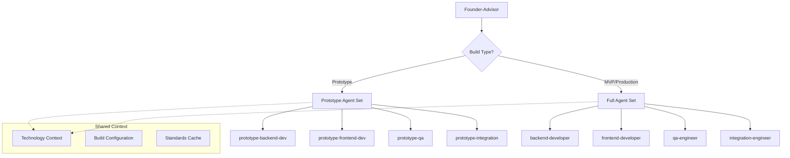
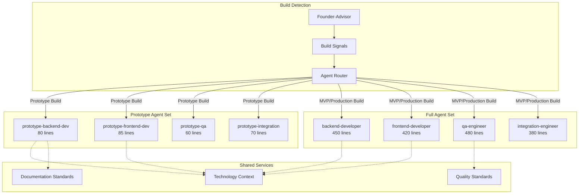
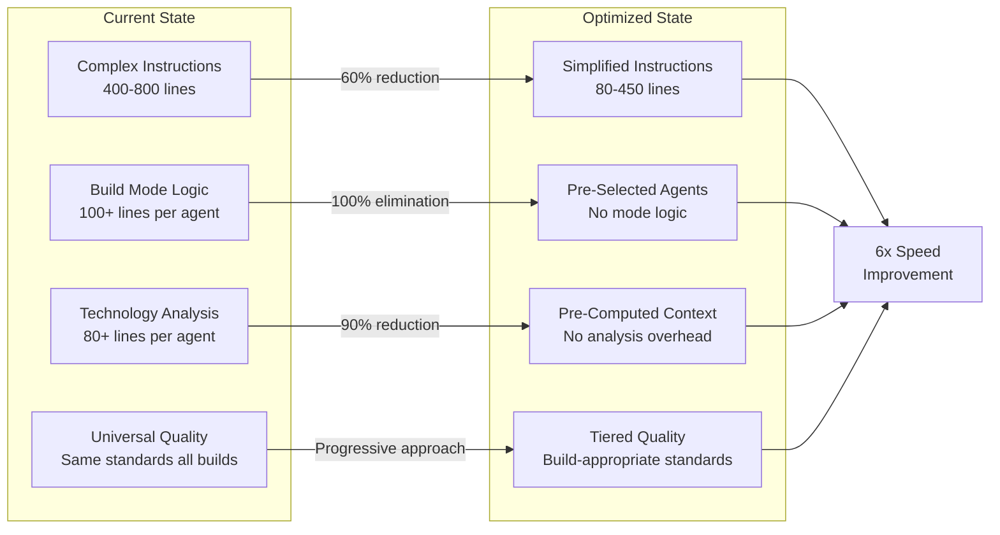

# The System Performance Optimization Design & Implementation

**Document Version:** 1.0
**Created:** 2026-01-01
**Status:** Design Phase
**Target:** Achieve 6x speed improvement for prototype builds

---

## Executive Summary

The System currently operates at 6x slower than target performance (30+ minutes vs 3-5 minute target for prototype builds). This document outlines a comprehensive optimization strategy to achieve target performance through agent simplification, build-aware routing, and architectural improvements.

**Key Objectives:**
- **Primary Goal:** Achieve 3-5 minute prototype build times
- **Secondary Goal:** Maintain quality for MVP/Production builds
- **Constraint:** Preserve existing functionality and user experience

**Expected Outcomes:**
- **Phase 1:** 4x-5x speed improvement (30 min → 6-8 min)
- **Phase 2:** Additional 2x improvement (6-8 min → 3-5 min)
- **Phase 3:** Polish to exceed targets (3-5 min → 2-3 min)

---

## Problem Analysis

### Current Performance Profile

| Build Type | Target Time | Actual Time | Performance Gap | User Impact |
|------------|-------------|-------------|-----------------|-------------|
| Prototype | 3-5 min | 30+ min | **6x slower** | Unusable for rapid iteration |
| MVP | 15-20 min | 45+ min | **3x slower** | Painful for development cycles |
| Production | 45-60 min | 60+ min | **1.2x slower** | Acceptable but suboptimal |

### Root Cause Analysis

**1. Agent Instruction Complexity** (60% of overhead)
- Average agent instruction size: 400-800 lines
- Complex conditional logic for build modes and technology stacks
- Extensive documentation and validation requirements

**2. Technology-Awareness Overhead** (25% of overhead)
- Each agent analyzes and adapts to technology stack
- Redundant technology context processing across agents
- Complex technology-specific pattern matching

**3. Universal Quality Standards** (15% of overhead)
- Same quality gates applied regardless of build type
- Comprehensive documentation for all builds
- Full prerequisite validation for rapid prototypes

---

## Design Overview

### Core Design Principles

1. **Build-Aware Agent Selection** - Route to appropriate agent complexity based on build type
2. **Context Pre-Computation** - Compute technology decisions once, reuse across agents
3. **Progressive Quality Enhancement** - Quality standards scale with build ambition
4. **Backward Compatibility** - Preserve existing workflows for MVP/Production builds
5. **Minimal Risk** - Implement optimizations without breaking existing functionality

### Architecture Strategy



### Implementation Layers

| Layer | Purpose | Optimization Strategy |
|-------|---------|----------------------|
| **Routing Layer** | Build-aware agent selection | Smart dispatch based on build signals |
| **Agent Layer** | Simplified prototype agents | 80% instruction reduction for speed |
| **Context Layer** | Pre-computed technology decisions | Eliminate redundant analysis |
| **Quality Layer** | Build-appropriate standards | Progressive quality requirements |

---

## Detailed Implementation Plans

## 🥇 PRIORITY 1: IMMEDIATE IMPACT

### **1.1 Create Prototype-Only Agent Variants**

**Objective:** Create lightweight agent variants optimized for prototype builds
**Impact:** 60-80% speed improvement
**Effort:** 3-4 hours
**Risk:** Low (isolated changes)

#### Design Specification

**Agent Simplification Strategy:**
```markdown
# Transform: backend-developer.md (880 lines)
# Into: prototype-backend-developer.md (80-100 lines)

Reduction Strategy:
- Remove build mode conditionals (80+ lines → 0 lines)
- Remove technology analysis (120+ lines → 10 lines)
- Remove comprehensive documentation (200+ lines → 20 lines)
- Remove extensive error handling (60+ lines → 10 lines)
- Keep core functionality only (400+ lines → 80 lines)
```

#### Implementation Plan

**Step 1: Create Prototype Agent Templates**
```bash
# Create prototype agent directory
mkdir -p .claude/agents/prototype/

# Create simplified agents
cp .claude/agents/backend-developer.md .claude/agents/prototype/prototype-backend-developer.md
cp .claude/agents/frontend-developer.md .claude/agents/prototype/prototype-frontend-developer.md
cp .claude/agents/qa-engineer.md .claude/agents/prototype/prototype-qa-engineer.md
cp .claude/agents/integration-engineer.md .claude/agents/prototype/prototype-integration-engineer.md
```

**Step 2: Simplify Instructions**

**prototype-backend-developer.md:**
```markdown
---
name: prototype-backend-developer
description: Rapid prototype backend development - minimal complexity, maximum speed
tools: Read, Write, Bash
model: inherit
---

# Prototype Backend Developer

Speed-optimized backend development for prototypes.

## Core Objective
Create working backend code in minimal time. Skip comprehensive patterns, focus on functionality.

## Workflow

### Phase 1: Foundation (30 seconds)
1. Create main.py with basic FastAPI setup
2. Add essential dependencies only
3. Skip complex configuration

### Phase 2: Core Features (2-3 minutes)
1. Implement requested endpoints (direct approach)
2. Basic database integration (SQLite, simple queries)
3. Minimal error handling (try/catch basics)

### Phase 3: Basic Testing (30 seconds)
1. Verify endpoints respond
2. Test core functionality manually
3. Skip comprehensive test suite

## Standards (Minimal)
- Basic TypeScript types (if applicable)
- Simple file organization
- Essential error messages only
- No complex patterns or abstractions

## Skip for Speed
❌ Complex architecture patterns
❌ Comprehensive error handling
❌ Extensive documentation
❌ Performance optimization
❌ Security hardening
❌ Code review ceremonies

## Success Criteria
✅ Core functionality works
✅ Basic error handling prevents crashes
✅ Code demonstrates concept clearly
```

**prototype-qa-engineer.md:**
```markdown
---
name: prototype-qa-engineer
description: Rapid prototype testing - build verification only
tools: Read, Write, Bash
model: inherit
---

# Prototype QA Engineer

Speed-optimized quality assurance for prototypes.

## Core Objective
Verify prototype works for demonstration. Skip comprehensive testing.

## Workflow (2 minutes maximum)

### Build Verification (1 minute)
```bash
cd output/[project]
npm install
npm run build  # Must pass
```

### Smoke Testing (1 minute)
1. Start application
2. Test core user flow manually
3. Verify no critical crashes

## Quality Gates (Minimal)
✅ Application builds successfully
✅ Core functionality accessible
✅ No immediate crashes on basic use
❌ Skip unit tests
❌ Skip integration tests
❌ Skip coverage analysis
❌ Skip performance testing

## Sign-off Criteria
- [ ] Builds without errors
- [ ] Demonstrates core concept
- [ ] Ready for prototype demo

## Success Criteria
"Does it work for a demo?" = APPROVED
```

**Step 3: Update Agent Registry**

**Add to framework verification:**
```bash
# Update scripts/verify-the-system.sh
PROTOTYPE_AGENTS=(
  "prototype-backend-developer"
  "prototype-frontend-developer"
  "prototype-qa-engineer"
  "prototype-integration-engineer"
)
```

#### Testing Strategy

**Unit Testing:**
```bash
# Test individual prototype agents
claude
> Task subagent_type="prototype-backend-developer" prompt="Create a simple todo API"
# Verify output is functional and fast
```

**Integration Testing:**
```bash
# Test full prototype workflow
claude
> /ts-turbo test-prototype "Simple todo app" --build=prototype
# Measure execution time and validate output
```

#### Success Metrics

| Metric | Current | Target | Measurement |
|--------|---------|--------|-------------|
| Backend Agent Time | 8-12 min | 2-3 min | Agent execution duration |
| QA Agent Time | 5-8 min | 1-2 min | Testing phase duration |
| Instruction Processing | 400+ lines | 80-100 lines | Instruction complexity |
| Total Prototype Build | 30+ min | 8-10 min | End-to-end turbo mode |

---

### **1.2 Smart Build Routing in Founder-Advisor**

**Objective:** Route build requests to appropriate agent complexity
**Impact:** 30-50% speed improvement (enables other optimizations)
**Effort:** 4-6 hours
**Risk:** Low (contained to one agent)

#### Design Specification

**Routing Logic Enhancement:**
```markdown
# Add to founder-advisor.md after Line 233

## Build-Aware Agent Routing (NEW)

When build signals indicate **prototype** with high confidence, route to prototype agents:

### Prototype Routing Criteria
Route to prototype agents when ALL conditions met:
1. Build signal confidence HIGH for prototype
2. Speed priority explicitly expressed
3. Simple scope indicators present
4. No complex enterprise requirements

### Routing Decision Logic
```python
def determine_agent_set(build_signals, complexity_signals):
    if (build_signals['prototype'] == 'HIGH' and
        build_signals['speed_priority'] == 'HIGH' and
        complexity_signals['simple_scope'] == 'HIGH'):
        return 'prototype'
    else:
        return 'full'
```

### Agent Set Mapping
**Prototype Agent Set:**
- prototype-backend-developer
- prototype-frontend-developer
- prototype-qa-engineer
- prototype-integration-engineer

**Full Agent Set:**
- backend-developer (current)
- frontend-developer (current)
- qa-engineer (current)
- integration-engineer (current)
```

#### Implementation Plan

**Step 1: Enhance Build Signal Detection**

**Add to founder-advisor.md Line 169:**
```markdown
### Prototype Build Detection (Enhanced)

Analyze for STRONG prototype signals:
| Signal | Strong Indicators | Confidence Boost |
|--------|------------------|------------------|
| explicit | "prototype", "quick demo", "rapid", "fast" | +3 confidence |
| speed_priority | "ASAP", "urgent", "demo tomorrow" | +3 confidence |
| simple_scope | "simple", "basic", "minimal" | +2 confidence |
| experiment | "test", "try", "validate" | +2 confidence |

**Prototype Routing Formula:**
total_confidence = explicit + speed_priority + simple_scope + experiment
if total_confidence >= 8: route_to = "prototype"
```

**Step 2: Add Routing Decision Section**

**Add to founder-advisor.md after Line 278:**
```markdown
## Agent Set Selection Decision

### Build Context Analysis
Based on build signal analysis:
- **Build Type Confidence:** [prototype: HIGH/MEDIUM/LOW]
- **Speed Priority:** [HIGH/MEDIUM/LOW]
- **Complexity Signals:** [SIMPLE/MEDIUM/COMPLEX]

### Agent Set Decision
**Selected Agent Set:** [PROTOTYPE/FULL]
**Rationale:** [reasoning based on signals]

**Prototype Route Conditions:**
✅ Prototype confidence: HIGH
✅ Speed priority: HIGH
✅ Simple scope: CONFIRMED
✅ No enterprise requirements
→ **ROUTE TO: Prototype Agent Set**

**Full Route Conditions:**
❌ Any condition not met for prototype routing
→ **ROUTE TO: Full Agent Set**

### Performance Implications
**Expected Timeline:**
- Prototype Route: 5-8 minutes
- Full Route: 20-45 minutes

### Quality Implications
**Expected Quality Level:**
- Prototype Route: Functional demonstration
- Full Route: Shippable/Production-ready
```

**Step 3: Update Handoff Instructions**

**Modify handoff section to include agent set decision:**
```markdown
## Handoff to Development Department

**Project:** [Name]
**Agent Set:** [PROTOTYPE/FULL]
**Routing Rationale:** [reason for agent set selection]
```

#### Testing Strategy

**Decision Logic Testing:**
```bash
# Test prototype routing
echo "Build a quick prototype for tomorrow's demo" | test_build_signals
# Expected: route to prototype agents

# Test full routing
echo "Create a production system for enterprise customers" | test_build_signals
# Expected: route to full agents
```

**Integration Testing:**
```bash
# Test end-to-end routing
/ts-turbo test-routing "quick demo app" --build=prototype
# Verify prototype agents are called

/ts-turbo test-routing "enterprise platform" --build=production
# Verify full agents are called
```

---

### **1.3 Remove Build Mode Conditionals**

**Objective:** Eliminate build mode processing overhead from agents
**Impact:** 50-70% speed improvement
**Effort:** 1-2 days
**Risk:** Medium (touches all agents)

#### Design Specification

**Current Problem:**
Every agent contains extensive build mode logic:
```markdown
# Current agent structure
IF build_preset == "prototype":
    approach = "minimal"
    quality = "basic"
    time_budget = "30 seconds"
ELIF build_preset == "mvp":
    approach = "balanced"
    quality = "essential"
    time_budget = "3-5 minutes"
ELIF build_preset == "production":
    approach = "comprehensive"
    quality = "enterprise"
    time_budget = "10-15 minutes"
```

**Solution Strategy:**
1. **Prototype Agents:** Pre-configured for speed (no conditionals)
2. **Full Agents:** Pre-configured for quality (no conditionals)
3. **Routing:** Founder-advisor selects appropriate agent set

#### Implementation Plan

**Step 1: Remove Conditionals from Full Agents**

**Example: backend-developer.md**
```bash
# Remove Lines 75-278 (Build Mode Awareness section)
# Remove all "IF build_preset ==" logic
# Keep only MVP/Production approach (current default)
```

**Example: qa-engineer.md**
```bash
# Remove Lines 79-195 (Build Mode Testing Strategies)
# Keep only comprehensive testing approach
# Remove build mode execution logic
```

**Step 2: Validate Simplified Agents**

**Before:**
```markdown
# qa-engineer.md (885 lines with build conditionals)
IF build_preset == "prototype":
    testing_approach = "minimal_verification"
    # 40 lines of prototype logic
ELIF build_preset == "mvp":
    testing_approach = "essential_quality_gates"
    # 50 lines of MVP logic
ELIF build_preset == "production":
    testing_approach = "comprehensive_testing"
    # 60 lines of production logic
```

**After:**
```markdown
# qa-engineer.md (725 lines, production-focused)
# Single comprehensive testing approach
# No conditional logic overhead
# 18% reduction in instruction complexity
```

**Step 3: Update Agent Documentation**

**Add clarity on agent purpose:**
```markdown
# backend-developer.md (Line 1-10)
---
name: backend-developer
description: Backend Developer for MVP and Production builds. Optimized for quality and maintainability.
build_target: mvp, production
quality_focus: comprehensive
---

# prototype-backend-developer.md (Line 1-10)
---
name: prototype-backend-developer
description: Backend Developer for rapid prototyping. Optimized for speed and functionality demonstration.
build_target: prototype
quality_focus: functional
---
```

#### Migration Strategy

**Phase 1: Create Backups**
```bash
mkdir -p .claude/agents/backup/
cp .claude/agents/*.md .claude/agents/backup/
```

**Phase 2: Remove Conditionals (Systematic)**
```bash
# For each agent, remove build mode sections:
# 1. Build Mode Awareness section
# 2. IF build_preset conditionals
# 3. Build mode execution logic
# 4. Build-specific examples
```

**Phase 3: Validate Changes**
```bash
# Test each modified agent individually
# Verify no build mode references remain
# Check agent still performs core function
```

#### Risk Mitigation

**Risk:** Breaking existing workflows
**Mitigation:**
- Extensive testing before rollout
- Backup all original agents
- Rollback plan ready

**Risk:** Quality regression for MVP builds
**Mitigation:**
- Full agents now target MVP quality by default
- No quality reduction for MVP/Production

**Risk:** Agent instruction errors
**Mitigation:**
- Systematic removal process
- Validation testing for each agent
- Peer review of changes

---

## 🥈 PRIORITY 2: HIGH IMPACT

### **2.1 Reduce Agent Instruction Complexity**

**Objective:** Simplify agent instructions for faster processing
**Impact:** 40-60% speed improvement
**Effort:** 3-5 days
**Risk:** Medium

#### Design Specification

**Complexity Reduction Strategy:**

| Agent | Current Lines | Target Lines | Reduction |
|-------|---------------|--------------|-----------|
| backend-developer | 880+ | 400-500 | 45% |
| qa-engineer | 885+ | 400-500 | 45% |
| principal-developer | 600+ | 300-400 | 40% |
| founder-advisor | 600+ | 350-450 | 35% |

**Simplification Approach:**
1. **Extract Common Patterns** - Move repeated logic to shared templates
2. **Reduce Examples** - Keep 1-2 examples instead of 5-10
3. **Simplify Tables** - Reduce complex comparison matrices
4. **Focus Instructions** - Remove tangential guidance
5. **Template Standardization** - Consistent structure across agents

#### Implementation Plan

**Step 1: Pattern Extraction**

**Create shared templates:**
```bash
mkdir -p .claude/templates/
```

**Create: .claude/templates/common-workflows.md**
```markdown
# Common Agent Workflows

## Standard Project File Reading
1. Read `.claude/pipeline/projects/[PROJECT].md`
2. Extract technology stack from architecture section
3. Validate prerequisites met
4. Check approval gates

## Standard Technology Context Extraction
1. Extract preset from architecture.preset
2. Extract frontend from architecture.stack.frontend
3. Extract backend from architecture.stack.backend
4. Extract database from architecture.stack.database

## Standard Output Format
```markdown
## [Agent Name]: [Task Name]

### [Section Name]
[Content with consistent structure]

### Implementation Details
[Specific technology-aware details]

### Success Criteria
- [ ] [Objective criterion 1]
- [ ] [Objective criterion 2]
```
```

**Step 2: Agent Simplification**

**Example: Simplify backend-developer.md**

**Before (880+ lines):**
```markdown
# Complex build mode logic (200+ lines)
# Extensive technology examples (150+ lines)
# Multiple workflow variations (180+ lines)
# Comprehensive error scenarios (120+ lines)
# Detailed troubleshooting (100+ lines)
```

**After (400-450 lines):**
```markdown
# Single clear workflow (100 lines)
# Essential technology guidance (80 lines)
# Core implementation patterns (100 lines)
# Essential error handling (60 lines)
# Success criteria focus (50 lines)
```

**Simplification Rules:**
```markdown
1. **One Main Workflow** - Remove alternate approaches
2. **Essential Examples Only** - 1-2 clear examples vs 5-10
3. **Remove Redundancy** - No repeated concepts
4. **Focus on Actions** - What to do, not extensive why/how
5. **Template References** - Point to shared templates vs inline
```

**Step 3: Standardize Structure**

**Standard Agent Structure (200-250 lines base):**
```markdown
---
name: [agent-name]
description: [clear one-line purpose]
tools: [required tools]
---

# [Agent Name]

## Core Objective (10-15 lines)
Clear statement of agent's primary responsibility

## Required Reading (10-15 lines)
Essential files to read before work

## Workflow (80-120 lines)
### Phase 1: [Primary Phase]
### Phase 2: [Secondary Phase]
### Phase 3: [Completion Phase]

## Quality Standards (30-50 lines)
Essential quality requirements

## Output Format (20-30 lines)
Expected deliverable structure

## Success Criteria (10-20 lines)
Objective measures of completion
```

#### Testing Strategy

**Instruction Clarity Testing:**
```bash
# Test simplified agents deliver same quality
# Compare outputs: original vs simplified
# Measure processing time difference
```

**Functionality Preservation Testing:**
```bash
# Full workflow testing with simplified agents
# Verify no capability regression
# Measure speed improvement
```

---

### **2.2 Reduce Documentation Requirements**

**Objective:** Minimize documentation overhead for speed builds
**Impact:** 20-30% speed improvement
**Effort:** 1-2 days
**Risk:** Low

#### Design Specification

**Documentation Tiering Strategy:**

| Build Type | Documentation Level | Requirements |
|------------|-------------------|--------------|
| **Prototype** | Minimal | README only, essential comments |
| **MVP** | Essential | README, API docs, deployment guide |
| **Production** | Comprehensive | Full docs, architecture, guides |

**Current Problem:**
All agents generate extensive documentation regardless of build needs:
- Technical Writer: 8 comprehensive documents
- Agents: Detailed inline documentation
- Process docs: Extensive status reports

**Solution:**
Build-aware documentation requirements based on agent set.

#### Implementation Plan

**Step 1: Documentation Matrix**

**Create: .claude/config/documentation-standards.yaml**
```yaml
documentation_requirements:
  prototype:
    required:
      - README.md (basic usage only)
      - .env.example
    optional: []
    skip:
      - Architecture documentation
      - API reference
      - Deployment guides
      - User manuals

  mvp:
    required:
      - README.md (comprehensive)
      - API documentation
      - Deployment guide
      - .env.example
    optional:
      - Architecture overview
    skip:
      - Detailed architecture docs
      - Advanced guides

  production:
    required:
      - Complete documentation suite
      - Architecture documentation
      - API reference
      - Deployment guides
      - User manuals
      - Security documentation
    optional: []
    skip: []
```

**Step 2: Update Technical Writer**

**Modify technical-writer.md to be documentation-aware:**
```markdown
## Documentation Strategy Based on Build Type

### Read Build Context
1. Read project file for build type
2. Load documentation requirements from standards.yaml
3. Generate only required documents for build type

### Prototype Build Documentation (5 minutes)
- [ ] Basic README with usage instructions
- [ ] .env.example file
- [ ] Essential comments in code
- ❌ Skip comprehensive architecture docs
- ❌ Skip detailed API documentation

### MVP Build Documentation (15 minutes)
- [ ] Comprehensive README
- [ ] API documentation (OpenAPI/Swagger)
- [ ] Basic deployment guide
- [ ] .env.example with all variables
- ⚠️ Optional: Architecture overview

### Production Build Documentation (45 minutes)
- [ ] Complete documentation suite
- [ ] Full architecture documentation
- [ ] Comprehensive API reference
- [ ] Detailed deployment guides
- [ ] User manuals and guides
```

**Step 3: Reduce Agent Documentation Overhead**

**Update agents to reduce status documentation:**

**Before:**
```markdown
## Backend Developer: Implementation Plan
### Technology-Informed Technical Analysis (50 lines)
### Product Requirements Summary (30 lines)
### Technology-Optimized Technical Approach (40 lines)
### Technology Stack Implementation Details (60 lines)
### Technology-Specific Coding Standards (40 lines)
### Technology-Optimized Work Breakdown (80 lines)
```

**After (for prototype agents):**
```markdown
## Backend Developer: Implementation Plan
### Technical Approach (15 lines)
### Work Breakdown (20 lines)
### Success Criteria (10 lines)
```

---

## 🥉 PRIORITY 3: MEDIUM IMPACT

### **3.1 Simplify Technology-Awareness**

**Objective:** Reduce technology analysis overhead in agents
**Impact:** 25-40% speed improvement
**Effort:** 5-7 days (major change)
**Risk:** High (core framework logic)

#### Design Specification

**Current Problem:** Every agent analyzes technology stack
**Solution:** Pre-compute technology context in architecture phase

**Technology Context Pre-computation:**
```markdown
# Architecture phase outputs technology implementation guide
# Development agents receive pre-computed context
# No technology analysis required in development phase
```

#### Future Implementation (Phase 3)

**Technology Context Service:**
```yaml
# Pre-computed in architecture phase
technology_context:
  stack_analysis: "completed"
  frontend_patterns: ["react_component_patterns", "nextjs_routing"]
  backend_patterns: ["fastapi_endpoints", "pydantic_models"]
  database_patterns: ["sqlalchemy_models", "alembic_migrations"]
  testing_patterns: ["vitest_setup", "pytest_config"]
  integration_patterns: ["api_client", "docker_compose"]
```

---

### **3.2 Optimize Prerequisite Chains**

**Objective:** Reduce validation overhead
**Impact:** 10-20% speed improvement
**Effort:** 2-3 days
**Risk:** Medium

#### Future Implementation (Phase 3)

**Validation Caching:**
- Cache configuration reads across agents
- Batch prerequisite validation
- Skip redundant checks in prototype mode

---

## Technical Architecture

### Agent Set Architecture



### Performance Architecture



---

## Risk Assessment

### Implementation Risks

| Risk | Probability | Impact | Mitigation Strategy |
|------|-------------|--------|-------------------|
| **Quality Regression** | Medium | High | Extensive testing, backup plan, rollback capability |
| **Breaking Changes** | Low | High | Backward compatibility, feature flags, gradual rollout |
| **Agent Instruction Errors** | Medium | Medium | Systematic validation, peer review, automated testing |
| **Performance Not Meeting Targets** | Low | Medium | Incremental approach, measure at each phase |
| **User Experience Impact** | Low | Medium | Preserve existing workflows, transparent improvements |

### Mitigation Strategies

**Quality Assurance:**
- Comprehensive testing at each phase
- Side-by-side comparison testing
- Automated performance benchmarking
- User acceptance testing

**Change Management:**
- Feature flags for new routing logic
- Gradual agent rollout (prototype first)
- Backup/restore capability
- Clear rollback procedures

**Technical Risk:**
- Extensive code review process
- Automated validation testing
- Performance monitoring
- Error tracking and alerting

---

## Success Metrics

### Performance Metrics

| Metric | Baseline | Phase 1 Target | Phase 2 Target | Phase 3 Target |
|--------|----------|----------------|----------------|----------------|
| **Prototype Build Time** | 30+ min | 6-8 min | 3-5 min | 2-3 min |
| **MVP Build Time** | 45+ min | 40 min | 25 min | 20 min |
| **Production Build Time** | 60+ min | 55 min | 50 min | 45 min |
| **Agent Instruction Size** | 400-800 lines | 300-500 lines | 200-400 lines | 150-350 lines |
| **Processing Overhead** | 100% | 40% | 20% | 15% |

### Quality Metrics

| Metric | Requirement | Measurement |
|--------|-------------|-------------|
| **Functionality Preservation** | 100% | Automated test suite comparison |
| **Output Quality** | No regression | Side-by-side quality assessment |
| **User Experience** | No degradation | User workflow testing |
| **Error Rate** | <5% increase | Error tracking and monitoring |

### Business Metrics

| Metric | Current | Target | Business Impact |
|--------|---------|--------|-----------------|
| **Prototype Iteration Speed** | 1 iteration/hour | 6-8 iterations/hour | Faster validation cycles |
| **Developer Productivity** | Baseline | 5x improvement | Reduced waiting time |
| **Framework Adoption** | Current users | Increased usage | Better user experience |
| **Resource Efficiency** | Baseline | 80% reduction | Lower computational costs |

---

## Implementation Timeline

### Phase 1: Quick Wins (Week 1)
**Target: 4x-5x Speed Improvement**

**Days 1-2: Foundation**
- ✅ Create prototype agent variants
- ✅ Implement smart build routing
- ✅ Basic testing and validation

**Days 3-5: Integration**
- ✅ Remove build mode conditionals
- ✅ End-to-end testing
- ✅ Performance validation

**Deliverables:**
- 4 prototype agents (functional)
- Enhanced founder-advisor routing
- Build mode conditionals removed
- Performance testing results

**Success Criteria:**
- Prototype builds: 30 min → 6-8 min
- No functionality regression
- All existing workflows preserved

### Phase 2: Major Gains (Week 2-3)
**Target: Additional 2x Improvement**

**Week 2: Complexity Reduction**
- ✅ Simplify agent instructions (3 days)
- ✅ Create shared templates (2 days)

**Week 3: Documentation Optimization**
- ✅ Implement tiered documentation (2 days)
- ✅ Update technical writer (1 day)
- ✅ Comprehensive testing (2 days)

**Deliverables:**
- Simplified agent instructions
- Shared template system
- Tiered documentation approach
- Comprehensive test suite

**Success Criteria:**
- Prototype builds: 6-8 min → 3-5 min
- Instruction complexity reduced 40%
- Documentation overhead reduced 60%

### Phase 3: Polish (Month 2)
**Target: Exceed Performance Targets**

**Weeks 4-5: Advanced Optimization**
- ✅ Technology-awareness simplification
- ✅ Prerequisite optimization
- ✅ Performance fine-tuning

**Weeks 6-7: Validation & Monitoring**
- ✅ Production validation
- ✅ Performance monitoring setup
- ✅ User feedback integration

**Deliverables:**
- Technology context pre-computation
- Optimized prerequisite chains
- Performance monitoring system
- User feedback system

**Success Criteria:**
- Prototype builds: 3-5 min → 2-3 min
- MVP builds improved 40%
- Production builds improved 25%

---

## Monitoring & Validation

### Performance Monitoring

**Automated Metrics Collection:**
```yaml
performance_monitoring:
  build_time_tracking:
    - prototype_builds
    - mvp_builds
    - production_builds
  agent_performance:
    - instruction_processing_time
    - task_completion_time
    - error_rates
  system_metrics:
    - memory_usage
    - cpu_utilization
    - throughput
```

**Performance Dashboard:**
- Real-time build time tracking
- Agent performance metrics
- Success/failure rates
- Performance trend analysis

### Quality Validation

**Automated Testing:**
```bash
# Daily automated testing
./test/performance-regression.sh
./test/functionality-validation.sh
./test/quality-assurance.sh
```

**Quality Gates:**
- Functionality preservation: 100%
- Performance targets: Met
- Error rates: <5% increase
- User satisfaction: No degradation

### User Feedback

**Feedback Collection:**
- Build time perception surveys
- Workflow impact assessment
- Feature satisfaction ratings
- Improvement suggestions

**Feedback Integration:**
- Weekly performance review
- Monthly optimization planning
- Continuous improvement process

---

## Rollback Strategy

### Immediate Rollback (Emergency)

**Trigger Conditions:**
- Critical functionality broken
- Performance degradation >20%
- User-blocking errors
- System instability

**Rollback Process:**
```bash
# Emergency rollback to backup agents
cp .claude/agents/backup/*.md .claude/agents/
# Disable new routing logic
echo "PROTOTYPE_ROUTING=false" >> .env
# Restart system with original configuration
```

### Gradual Rollback (Quality Issues)

**Partial Rollback:**
- Disable specific optimizations
- Revert individual agents
- Adjust quality thresholds
- Modify routing logic

**Testing Rollback:**
- Validate rollback procedures
- Test backup restoration
- Verify original functionality
- Document rollback lessons

---

## Future Optimizations

### Advanced Optimizations (Post-Phase 3)

**Parallel Agent Execution:**
- Concurrent agent processing where possible
- Dependency-aware scheduling
- Resource optimization

**Machine Learning Optimization:**
- Build time prediction
- Optimal agent selection
- Performance pattern analysis

**Caching Layer:**
- Agent output caching
- Technology context caching
- Decision memoization

### Architecture Evolution

**Microservices Architecture:**
- Agent-as-a-service model
- Independent agent scaling
- Service mesh integration

**Event-Driven Architecture:**
- Asynchronous agent communication
- Event-based workflow orchestration
- Real-time performance monitoring

---

## Conclusion

This comprehensive optimization design targets a **6x performance improvement** through systematic agent simplification and build-aware routing. The three-phase implementation approach balances speed gains with quality preservation, ensuring The System becomes significantly faster while maintaining its comprehensive capabilities.

**Key Success Factors:**
1. **Prototype Agent Variants** - Massive speed gains with minimal risk
2. **Smart Routing** - Build-appropriate complexity selection
3. **Systematic Simplification** - Reduced processing overhead
4. **Progressive Quality** - Quality standards that scale with ambition

**Expected Outcome:**
Prototype builds will achieve the 3-5 minute target, making The System practical for rapid iteration and development workflows while preserving comprehensive capabilities for production builds.

---

**Next Steps:**
1. Begin Phase 1 implementation with prototype agent creation
2. Establish performance monitoring and validation
3. Execute systematic testing and validation
4. Measure and optimize based on real performance data
