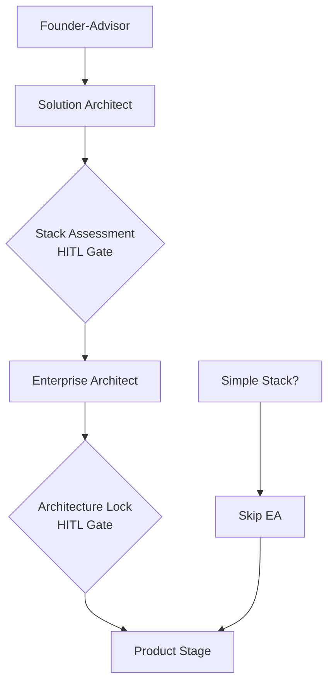

# Solution Architect Agent Design Document

**Version:** 1.0
**Date:** 2025-01-01
**Status:** Proposed
**Author:** Claude Code Enhancement Team

---

## Executive Summary

This design introduces a new **Solution Architect (SA)** agent that specializes in AI-optimized technology stack assessment, splitting responsibilities with the existing Enterprise Architect (EA) agent. The SA focuses on **"which technology stack to use"** while EA focuses on **"how to design systems with the chosen stack."**

### Key Benefits
- **88% faster architecture phase** for prototype builds (EA skip capability)
- **Quantified stack decisions** based on Claude Code success rates
- **Higher build success rates** through AI-optimized technology selection
- **Clear separation of concerns** between stack selection and system design

---

## 1. Feature Overview

### 1.1 Current State Problems
- **EA agent is overloaded** (687 lines, handles both stack selection AND architecture design)
- **Stack decisions lack quantification** (signal-based but not scored)
- **No AI success optimization** (doesn't prioritize Claude Code build success)
- **Architecture phase cannot be optimized** for simple projects

### 1.2 Proposed Solution
Split the current EA into two specialized agents:



### 1.3 Success Criteria
- **Prototype builds complete in 2-5 minutes** (vs current 15-20 minutes)
- **85%+ Claude Code build success rate** for recommended stacks
- **Clear assessment rationale** for every technology decision
- **Backward compatibility** with existing workflows

---

## 2. Responsibility Matrix

### 2.1 Solution Architect Responsibilities

| Area | Responsibility | Input | Output |
|------|---------------|--------|--------|
| **Technology Assessment** | Evaluate stack options using AI success metrics | User signals, requirements | Scored stack recommendations |
| **Stack Selection** | Choose optimal technology stack | Assessment scores, constraints | Locked technology decisions |
| **Risk Analysis** | Identify technical and AI-specific risks | Stack profiles, project context | Risk assessment with mitigations |
| **Build Optimization** | Select build preset based on signals | User intent, timeline needs | Build configuration |
| **Agent Planning** | Determine which agents needed | Stack complexity, build preset | Agent intersection recommendations |

### 2.2 Enterprise Architect Responsibilities (Updated)

| Area | Responsibility | Input | Output |
|------|---------------|--------|--------|
| **Requirements Analysis** | Extract functional/non-functional requirements | SA stack + user needs | Requirements specification |
| **System Design** | Create component architecture | Locked stack, requirements | System architecture diagrams |
| **API Design** | Design service interfaces | Backend technology choice | API specifications |
| **Data Architecture** | Design data models and flows | Database technology choice | Data models, migration plans |
| **Security Architecture** | Design security controls | Auth technology choice | Security implementation plan |
| **Infrastructure Design** | Plan deployment and operations | Stack deployment needs | Infrastructure architecture |

### 2.3 Responsibility Boundaries

```yaml
# Clear boundaries to avoid overlap
solution_architect_owns:
  - "Which database should we use?" (PostgreSQL vs MySQL vs SQLite)
  - "Which auth system fits best?" (NextAuth vs Clerk vs custom)
  - "What's the AI success probability?" (88% vs 65% build success)
  - "Should we skip EA for this stack?" (Simple vs complex decision)

enterprise_architect_owns:
  - "How should we structure the database schema?" (Tables, relationships)
  - "How should we implement the auth flow?" (JWT vs sessions, providers)
  - "How should components interact?" (API design, data flow)
  - "How should we deploy this system?" (Infrastructure, monitoring)

shared_handoff:
  - SA provides: Technology choices with rationale
  - EA receives: Locked stack + constraints + success factors
```

---

## 3. Technical Architecture

### 3.19 agent Configuration

#### 3.1.1 Solution Architect Agent

```yaml
# .claude/agents/solution-architect.md
---
name: solution-architect
description: AI-optimized technology stack assessment and selection specialist. Evaluates stack options using Claude Code success metrics and makes quantified recommendations.
tools: Read, Grep, WebSearch  # Assessment focused
model: haiku  # Fast model for scoring calculations
---

## Required Reading
- `.claude/config/ai-success-profiles.yaml` - AI success metrics
- `.claude/config/presets.yaml` - Architecture presets
- `.claude/config/builds.yaml` - Build presets
- `.claude/config/preferences.yaml` - Technology defaults
- `.claude/pipeline/projects/[PROJECT].md` - Project context

## Core Workflow
1. Signal Analysis & Build Selection
2. Multi-Criteria Stack Assessment
3. Risk Analysis & Trade-off Evaluation
4. Stack Recommendation & Rationale
5. Agent Intersection Planning
6. Handoff to EA (or skip if simple)
```

#### 3.1.2 Enterprise Architect Agent (Modified)

```yaml
# .claude/agents/enterprise-architect.md (updated)
---
name: enterprise-architect
description: System architecture design specialist. Takes locked technology stack from Solution Architect and creates comprehensive system design.
tools: Read, Write, Grep, WebSearch, Bash
model: inherit
---

## Required Reading
- `.claude/pipeline/projects/[PROJECT].md` - SA handoff + requirements
- `.claude/config/preferences.yaml` - Architecture standards
- `.claude/knowledge/architecture-standards.md` - Design guidelines

## Core Workflow
1. Read SA Technology Recommendations (MANDATORY)
2. Requirements Analysis (with stack constraints)
3. System Architecture Design (using locked technologies)
4. Documentation & ADR Creation
5. Quality Validation & Handoff
```

### 3.2 New Configuration Files

#### 3.2.1 AI Success Profiles

```yaml
# .claude/config/ai-success-profiles.yaml
version: "1.0"
meta:
  description: "AI success metrics for Claude Code technology assessment"

assessment_config:
  weights:
    claude_success_rate: 0.35    # Primary factor
    build_reliability: 0.20      # Does it compile?
    debug_ease: 0.15            # How easy to fix?
    code_quality: 0.10          # Quality of AI code
    documentation: 0.10         # AI training data quality
    ecosystem_stability: 0.05   # Breaking change frequency
    traditional_factors: 0.05   # KISS, time-to-market

technology_success_rates:
  frontend:
    nextjs_14:
      claude_success_rate: 0.95
      build_failure_rate: 0.05
      typical_debug_time: "1-2 hours"
      common_issues: ["complex routing", "SSR edge cases"]
      success_factors: ["excellent docs", "consistent patterns"]

  backend:
    nextjs_api_routes:
      claude_success_rate: 0.90
      build_failure_rate: 0.10
      typical_debug_time: "2-3 hours"
      common_issues: ["middleware complexity", "auth integration"]
      success_factors: ["simple patterns", "good TypeScript support"]

preset_ai_profiles:
  static:
    overall_ai_score: 9.4
    success_probability: 0.95
    expected_debug_time: "0-1 hours"

  fullstack-js:
    overall_ai_score: 8.1
    success_probability: 0.85
    expected_debug_time: "2-4 hours"
```

#### 3.2.2 Enhanced Build Configuration

```yaml
# .claude/config/builds.yaml (additions)
builds:
  prototype:
    # ... existing config ...

    architecture_behavior:
      solution_architect: always_run
      enterprise_architect: conditional_skip

      ea_skip_conditions:
        - preset_tier: "single"
        - no_auth_required: true
        - no_external_apis: true

    turbo_optimizations:
      max_assessment_time: "2 minutes"
      auto_approve_high_ai_scores: true  # >9.0 auto-approved
      skip_alternatives_analysis: true   # Just pick best option
```

### 3.49 command Structure

#### 3.3.1 New Commands

```yaml
# .claude/commands/ts-assess.md
---
command: ts-assess
agent: solution-architect
description: Run AI-optimized technology stack assessment
---

# Stack Assessment: $ARGUMENTS

Analyzes technology options and provides quantified recommendations optimized for Claude Code success.

## Usage
```bash
/ts-assess                    # Assess current project
/ts-assess --compare=3        # Compare top 3 options
/ts-assess --build=prototype  # Override build preset
/ts-assess --detailed         # Include full risk analysis
```

## Process
1. Load AI success profiles and project signals
2. Apply multi-criteria scoring to viable presets
3. Calculate Claude Code success probabilities
4. Generate ranked recommendations with rationale
5. Identify optimization strategies and risk mitigations
6. Output assessment for HITL gate or EA handoff
```

#### 3.3.2 Updated Commands

```yaml
# .claude/commands/ts-architect.md (updated)
---
command: ts-architect
agent: enterprise-architect
description: Create system architecture using Solution Architect's technology recommendations
---

# Enterprise Architecture: $ARGUMENTS

Creates comprehensive system architecture based on locked technology stack from Solution Architect.

## Prerequisites
- Solution Architect assessment must be complete
- Technology stack must be locked in project file
- Build and architecture presets must be selected

## Process
1. **Validate SA Handoff** - Ensure technology decisions are available
2. **Requirements Analysis** - Extract needs within stack constraints
3. **System Design** - Create architecture using locked technologies
4. **Documentation** - Generate artifacts and ADRs
5. **Quality Gates** - Validate design meets requirements
```

---

## 4. Code Changes Required

### 4.1 Enterprise Architect Agent Modifications

#### 4.1.1 Phase 0 Extraction (Remove from EA)

**Current EA Phase 0 (687 lines) → Move to SA:**
```markdown
# REMOVE from enterprise-architect.md:

### Phase 0: Architecture Stack Selection
- Command flag overrides logic
- Build preset selection algorithm
- Architecture preset decision trees
- Agent intersection calculations
- Technology option selection
- Stack recommendation output
- HITL gate logic

# Total removal: ~400 lines
```

#### 4.1.2 Phase 1-3 Updates (Modify in EA)

**Phase 1: Analysis (Updated)**
```markdown
# CHANGE in enterprise-architect.md:

## Phase 1: Requirements Analysis

### Prerequisites Check
1. **MANDATORY: Read SA Technology Handoff**
   ```yaml
   # Must exist in PROJECT.md:
   solution_architect_handoff:
     recommended_stack: "fullstack-js"
     technology_decisions: {...}
     assessment_score: 8.1
     risk_factors: [...]
     success_strategies: [...]
   ```

2. **Validate Stack Lock Status**
   - Ensure `architecture.stack_locked = true`
   - If not locked → ERROR: "Cannot proceed without SA technology decisions"

### Updated Analysis Process
- **Business Context:** [Existing logic]
- **Functional Requirements:** [Enhanced with stack constraints]
- **Non-Functional Requirements:** [Informed by SA risk assessment]
- **Technology Constraints:** [NEW - from SA handoff]
- **Architecture Challenges:** [Updated for locked stack]
```

**Phase 2: Design (Stack-Aware)**
```markdown
# CHANGE in enterprise-architect.md:

## Phase 2: System Design

### Stack-Informed Design Process

1. **System Context** - Use SA deployment pattern and stack
2. **Component Architecture** - Optimize for SA technology choices
3. **Data Architecture** - Implement SA database selection
4. **API Design** - Use SA backend framework selection
5. **Infrastructure** - Align with SA deployment recommendations
6. **Security** - Implement SA auth technology selection

### Template Updates
```yaml
# All design templates now read from:
locked_stack = read_sa_handoff()
frontend_tech = locked_stack.frontend
backend_tech = locked_stack.backend
database_tech = locked_stack.database
auth_tech = locked_stack.auth
```

### 4.2 Project Template Updates

#### 4.2.1 Enhanced Project File Structure

```yaml
# .claude/pipeline/projects/TEMPLATE.md (additions)

## Solution Architect Assessment
- **Assessment Date:** [timestamp]
- **Assessment Score:** [8.1/10]
- **Claude Success Probability:** [85%]
- **Expected Debug Time:** [2-4 hours]

### Technology Stack (LOCKED)
- **Build Preset:** mvp
- **Architecture Preset:** fullstack-js
- **Frontend:** Next.js 14 + TypeScript
- **Backend:** API Routes
- **Database:** PostgreSQL/Neon
- **Auth:** NextAuth

### Assessment Rationale
- **Signal Analysis:** [user signals detected]
- **AI Optimization:** [why this stack for Claude Code]
- **Risk Assessment:** [identified risks and mitigations]
- **Alternatives Considered:** [other options evaluated]

### EA Handoff Status
- **Stack Locked:** ✅ Yes
- **EA Required:** ✅ Yes (auth + database complexity)
- **EA Mode:** compressed
- **Handoff Date:** [timestamp]

## Enterprise Architecture
[Existing EA sections, now reading from locked stack above]
```

### 4.3 Workflow Integration Changes

#### 4.3.1 Updated Architecture Stage

```yaml
# .claude/commands/ts-architect.md workflow logic

## New Workflow Logic

1. **Check Project Status**
   - If SA not run → Run SA first
   - If SA complete + EA skip conditions → Skip EA, mark complete
   - If SA complete + EA required → Run EA with SA handoff

2. **Turbo Mode Integration**
   ```python
   def run_architecture_stage(project, turbo=False):
       # Always run SA first
       sa_result = run_solution_architect(project)

       if turbo and should_skip_ea(sa_result, project):
           mark_architecture_complete(sa_result.stack_config)
           return sa_result

       # Run EA with SA handoff
       ea_result = run_enterprise_architect(project, sa_handoff=sa_result)
       return combine_results(sa_result, ea_result)
   ```

3. **HITL Gate Updates**
   ```bash
   # New gate sequence:
   /ts-approve stack-assessment    # After SA completes
   /ts-approve architecture-lock   # After EA completes (if run)
   ```

---

## 5. Implementation Plan

### 5.1 Phase 1: SA Agent Creation (Week 1)
- [ ] Create `solution-architect.md` agent file
- [ ] Create `ai-success-profiles.yaml` configuration
- [ ] Create `/ts-assess` command
- [ ] Implement multi-criteria scoring logic
- [ ] Test SA in isolation with sample projects

### 5.2 Phase 2: EA Agent Modification (Week 2)
- [ ] Extract Phase 0 logic from `enterprise-architect.md`
- [ ] Add SA handoff reading logic to EA
- [ ] Update EA Phase 1-3 to use locked stack
- [ ] Update project template with SA sections
- [ ] Test EA with SA handoff

### 5.3 Phase 3: Workflow Integration (Week 3)
- [ ] Update `/ts-architect` command to orchestrate SA→EA
- [ ] Implement EA skip logic for simple stacks
- [ ] Add new HITL gates and approval commands
- [ ] Update turbo mode configuration
- [ ] Integration testing with full workflows

### 5.4 Phase 4: Validation & Rollout (Week 4)
- [ ] A/B testing vs current architecture workflow
- [ ] Performance benchmarking (time and success rates)
- [ ] User acceptance testing for new HITL gates
- [ ] Documentation updates and training
- [ ] Gradual rollout with feature flags

---

## 6. Testing Strategy

### 6.1 Unit Testing
- **SA Assessment Logic:** Test scoring algorithms with known inputs
- **EA Handoff Reading:** Verify EA can parse SA output correctly
- **Skip Conditions:** Test all EA skip scenarios
- **Error Handling:** Test failure modes and fallbacks

### 6.2 Integration Testing
```yaml
test_scenarios:
  simple_prototype:
    input: "quick landing page"
    expected: SA only, EA skipped, 2-3 minute completion

  mvp_saas:
    input: "SaaS with auth and database"
    expected: SA + compressed EA, 8-10 minute completion

  enterprise_system:
    input: "production microservices"
    expected: SA + full EA, 20-25 minute completion

  turbo_mode:
    input: "any project with /ts-turbo"
    expected: No HITL gates, appropriate SA/EA execution
```

### 6.3 Performance Testing
- **Baseline:** Current EA workflow timing
- **Target:** 88% faster for prototype builds
- **Success Rate:** 85%+ Claude Code build success
- **Quality:** Maintain architecture artifact quality

---

## 7. Risk Mitigation

### 7.1 Technical Risks
| Risk | Impact | Mitigation |
|------|---------|------------|
| SA/EA handoff failures | High | Robust error handling + fallback to current EA |
| Assessment scoring bugs | Medium | Extensive testing + gradual rollout |
| EA skip logic errors | High | Conservative skip conditions + manual override |

### 7.2 User Experience Risks
| Risk | Impact | Mitigation |
|------|---------|------------|
| Confusion over new gates | Medium | Clear documentation + training |
| Workflow disruption | High | Backward compatibility + feature flags |
| Increased complexity | Medium | Intuitive defaults + auto-approval options |

### 7.3 Rollback Plan
- **Feature flags** to disable SA agent and revert to current EA
- **Data migration scripts** to handle project file format changes
- **Fallback logic** in all new commands to use existing workflows

---

## 8. Success Metrics

### 8.1 Performance Metrics
- **Architecture Phase Time:** Target 88% reduction for prototype builds
- **Build Success Rate:** Target 85%+ for SA-recommended stacks
- **Debug Time:** Target 2-4 hours for MVP builds vs current baseline

### 8.2 Quality Metrics
- **Architecture Artifact Completeness:** Maintain 100% for production builds
- **Technology Decision Rationale:** 100% of decisions have quantified reasoning
- **User Satisfaction:** Target 90%+ approval rating for new workflow

### 8.3 Adoption Metrics
- **Feature Usage:** Target 80%+ of projects use SA assessment within 3 months
- **EA Skip Rate:** Target 60%+ of prototype builds skip EA successfully
- **Turbo Mode Improvement:** Target 3x faster turbo mode execution

---

## Conclusion

The Solution Architect agent represents a major evolution of The System's architecture capabilities. By splitting technology selection from system design, we achieve:

- **Specialized expertise** in both stack assessment and architecture design
- **Dramatic performance improvements** for simple projects through EA skipping
- **AI-optimized technology decisions** based on Claude Code success data
- **Maintained quality** for complex projects through comprehensive EA workflows

This design positions The System as the premier AI-native development platform, optimizing every technology decision for successful automated application generation.

---

**Next Steps:** Review and approve this design document, then proceed with Phase 1 implementation of the Solution Architect agent.