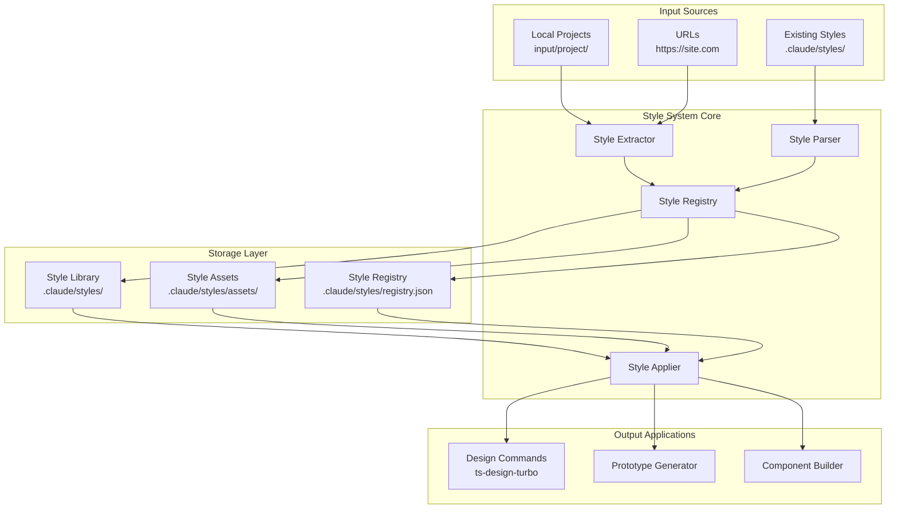

# 🎨 Style System: Design, Architecture & Implementation Plan

## 🏗️ System Architecture

### **Core Components Overview**



### **Data Flow Architecture**

```
┌─────────────────┐    ┌─────────────────┐    ┌─────────────────┐
│   EXTRACTION    │    │    STORAGE      │    │   APPLICATION   │
│                 │    │                 │    │                 │
│ • URL Analysis  │───▶│ • Style Files   │───▶│ • Design Turbo  │
│ • Local Scan    │    │ • Asset Cache   │    │ • Prototyping   │
│ • Pattern Rec.  │    │ • Registry DB   │    │ • Components    │
└─────────────────┘    └─────────────────┘    └─────────────────┘
```

## 📁 File System Architecture

### **Directory Structure**

```
.claude/styles/
├── registry.json                          # Style metadata registry
├── assets/                                # Shared assets
│   ├── screenshots/                       # Visual references
│   ├── color-palettes/                    # Extracted color schemes
│   └── fonts/                             # Typography references
├── modern-professional.md                 # Default style
├── enterprise-console.md                  # Extracted from DFO
├── modern-minimal.md                      # Clean/minimal
├── fintech-professional.md               # Financial services
└── templates/                             # Reusable templates
    ├── navigation/
    │   ├── sidebar-enterprise.html
    │   ├── sidebar-modern.html
    │   └── topbar-minimal.html
    ├── components/
    │   ├── buttons-enterprise.html
    │   ├── buttons-modern.html
    │   ├── cards-minimal.html
    │   └── forms-professional.html
    └── layouts/
        ├── dashboard-enterprise.html
        ├── dashboard-modern.html
        └── content-minimal.html
```

### **Style File Data Model**

```yaml
# .claude/styles/modern-professional.md
---
# Metadata
name: modern-professional
version: 1.0.0
self_reference: true
canonical_name: modern-professional
aliases: [default, professional, balanced]
default_style: true

# Origin tracking
created_from: designed
created_date: 2024-01-24T15:30:00Z
created_by: system-design
extracted_url: null
last_updated: 2024-01-24T15:30:00Z

# Classification
description: Balanced, versatile professional interface suitable for most applications
category: professional
subcategory: balanced
tags: [default, professional, versatile, balanced, modern]
domain_optimized: [saas, admin, dashboard, tools, business]

# Technical specs
css_framework: tailwind
js_framework: alpinejs
icon_library: fontawesome
font_stack: system
base_font_size: 14px
layout_type: flexible
responsive_strategy: mobile-first

# Complexity metrics
information_density: medium
visual_complexity: low
interaction_complexity: medium
component_count: 12
---
```

### **Registry Data Model**

```json
{
  "version": "1.0.0",
  "last_updated": "2024-01-24T15:30:00Z",
  "default_style": "modern-professional",
  "styles": {
    "modern-professional": {
      "name": "modern-professional",
      "version": "1.0.0",
      "file": "modern-professional.md",
      "category": "professional",
      "tags": ["default", "professional", "balanced"],
      "created_date": "2024-01-24T15:30:00Z",
      "usage_count": 0,
      "success_rating": 5.0,
      "is_default": true,
      "domain_scores": {
        "saas": 9.0,
        "admin": 8.5,
        "dashboard": 9.2,
        "tools": 8.8,
        "business": 9.0
      }
    },
    "enterprise-console": {
      "name": "enterprise-console",
      "version": "1.2.0",
      "file": "enterprise-console.md",
      "category": "enterprise",
      "tags": ["enterprise", "dashboard", "dense"],
      "created_date": "2024-01-24T15:30:00Z",
      "usage_count": 5,
      "success_rating": 4.8,
      "domain_scores": {
        "fintech": 9.2,
        "devops": 8.8,
        "admin": 9.0,
        "enterprise": 9.5
      }
    }
  },
  "categories": {
    "professional": ["modern-professional"],
    "enterprise": ["enterprise-console"],
    "modern": ["modern-minimal"],
    "fintech": ["fintech-professional"]
  },
  "domain_defaults": {
    "default": "modern-professional",
    "saas": "modern-professional",
    "admin": "modern-professional",
    "dashboard": "modern-professional",
    "fintech": "enterprise-console",
    "healthcare": "clinical-clean",
    "enterprise": "enterprise-console",
    "startup": "modern-minimal",
    "ecommerce": "product-focused"
  },
  "recommendations": {
    "by_domain": {
      "fintech": ["enterprise-console", "fintech-professional"],
      "healthcare": ["clinical-clean", "medical-secure"],
      "ecommerce": ["modern-minimal", "product-focused"],
      "default": ["modern-professional", "enterprise-console"]
    }
  }
}
```

## 🎨 Default Style Specification: `modern-professional`

### **Design Philosophy**
- **Balanced Information Density** - Not too dense, not too sparse
- **Professional but Approachable** - Clean and trustworthy
- **Domain-Agnostic** - Works for SaaS, admin, dashboards, tools
- **Modern Web Standards** - Current best practices
- **Accessible by Default** - WCAG 2.1 AA compliant

### **Visual Characteristics**

```css
/* Modern Professional Color Palette */
:root {
  /* Primary Colors */
  --primary: #2563eb;        /* Blue-600 - trustworthy, professional */
  --primary-50: #eff6ff;
  --primary-100: #dbeafe;
  --primary-500: #3b82f6;
  --primary-600: #2563eb;
  --primary-700: #1d4ed8;
  --primary-900: #1e3a8a;

  /* Neutral Grays */
  --gray-50: #f8fafc;        /* Background */
  --gray-100: #f1f5f9;       /* Light surfaces */
  --gray-200: #e2e8f0;       /* Borders */
  --gray-300: #cbd5e1;       /* Dividers */
  --gray-400: #94a3b8;       /* Placeholder text */
  --gray-500: #64748b;       /* Secondary text */
  --gray-600: #475569;       /* Body text */
  --gray-700: #334155;       /* Headings */
  --gray-800: #1e293b;       /* Dark headings */
  --gray-900: #0f172a;       /* High contrast */

  /* Semantic Colors */
  --success: #059669;        /* Emerald-600 - confident */
  --success-50: #ecfdf5;
  --success-100: #d1fae5;
  --warning: #d97706;        /* Amber-600 - noticeable */
  --warning-50: #fffbeb;
  --warning-100: #fef3c7;
  --danger: #dc2626;         /* Red-600 - clear */
  --danger-50: #fef2f2;
  --danger-100: #fee2e2;

  /* Surface Colors */
  --background: #f8fafc;     /* Slate-50 - soft */
  --surface: #ffffff;        /* White - clean */
  --surface-elevated: #ffffff; /* Cards, modals */
  --border: #e2e8f0;         /* Slate-200 - subtle */
  --border-focus: #2563eb;   /* Primary color */

  /* Typography */
  --font-family-base: -apple-system, BlinkMacSystemFont, 'Segoe UI', Roboto, 'Helvetica Neue', Arial, sans-serif;
  --font-family-mono: 'SF Mono', Monaco, 'Cascadia Code', 'Roboto Mono', Consolas, monospace;

  /* Font Sizes */
  --font-size-xs: 0.75rem;    /* 12px */
  --font-size-sm: 0.875rem;   /* 14px */
  --font-size-base: 0.875rem; /* 14px - base size */
  --font-size-lg: 1rem;       /* 16px */
  --font-size-xl: 1.125rem;   /* 18px */
  --font-size-2xl: 1.5rem;    /* 24px */
  --font-size-3xl: 1.875rem;  /* 30px */

  /* Line Heights */
  --line-height-tight: 1.25;
  --line-height-normal: 1.5;
  --line-height-relaxed: 1.625;

  /* Font Weights */
  --font-weight-normal: 400;
  --font-weight-medium: 500;
  --font-weight-semibold: 600;
  --font-weight-bold: 700;

  /* Spacing Scale (Tailwind-compatible) */
  --space-1: 0.25rem;   /* 4px */
  --space-2: 0.5rem;    /* 8px */
  --space-3: 0.75rem;   /* 12px */
  --space-4: 1rem;      /* 16px */
  --space-5: 1.25rem;   /* 20px */
  --space-6: 1.5rem;    /* 24px */
  --space-8: 2rem;      /* 32px */
  --space-12: 3rem;     /* 48px */
  --space-16: 4rem;     /* 64px */

  /* Radius */
  --radius-sm: 0.125rem;  /* 2px */
  --radius: 0.25rem;      /* 4px */
  --radius-md: 0.375rem;  /* 6px */
  --radius-lg: 0.5rem;    /* 8px */
  --radius-xl: 0.75rem;   /* 12px */

  /* Shadows */
  --shadow-sm: 0 1px 2px 0 rgb(0 0 0 / 0.05);
  --shadow: 0 1px 3px 0 rgb(0 0 0 / 0.1), 0 1px 2px -1px rgb(0 0 0 / 0.1);
  --shadow-md: 0 4px 6px -1px rgb(0 0 0 / 0.1), 0 2px 4px -2px rgb(0 0 0 / 0.1);
  --shadow-lg: 0 10px 15px -3px rgb(0 0 0 / 0.1), 0 4px 6px -4px rgb(0 0 0 / 0.1);
}
```

### **Typography System**

```css
/* Typography Hierarchy */
.text-xs { font-size: var(--font-size-xs); }      /* 12px - captions, meta */
.text-sm { font-size: var(--font-size-sm); }      /* 14px - body, buttons */
.text-base { font-size: var(--font-size-base); }  /* 14px - primary body */
.text-lg { font-size: var(--font-size-lg); }      /* 16px - large body */
.text-xl { font-size: var(--font-size-xl); }      /* 18px - h4 */
.text-2xl { font-size: var(--font-size-2xl); }    /* 24px - h3 */
.text-3xl { font-size: var(--font-size-3xl); }    /* 30px - h2, h1 */

/* Heading Defaults */
h1 { font-size: var(--font-size-2xl); font-weight: var(--font-weight-semibold); color: var(--gray-800); }
h2 { font-size: var(--font-size-xl); font-weight: var(--font-weight-semibold); color: var(--gray-700); }
h3 { font-size: var(--font-size-lg); font-weight: var(--font-weight-semibold); color: var(--gray-700); }
h4 { font-size: var(--font-size-base); font-weight: var(--font-weight-medium); color: var(--gray-700); }

/* Body Text */
body {
  font-family: var(--font-family-base);
  font-size: var(--font-size-base);
  line-height: var(--line-height-normal);
  color: var(--gray-600);
}

/* Links */
a {
  color: var(--primary);
  text-decoration: none;
  transition: color 150ms ease;
}
a:hover {
  color: var(--primary-700);
  text-decoration: underline;
}
```

### **Component Templates**

#### **Navigation - Flexible Sidebar**
```html
<!-- Modern Professional Sidebar -->
<nav class="w-64 bg-white border-r border-gray-200 flex flex-col">
  <!-- Logo -->
  <div class="px-6 py-4 border-b border-gray-200">
    <div class="flex items-center space-x-3">
      <div class="w-8 h-8 bg-primary rounded-md flex items-center justify-center">
        <i class="fas fa-cube text-white text-sm"></i>
      </div>
      <h1 class="font-semibold text-gray-800">App Name</h1>
    </div>
  </div>

  <!-- Navigation Links -->
  <div class="flex-1 overflow-y-auto py-4">
    <div class="px-3">
      <div class="text-xs font-semibold text-gray-400 uppercase tracking-wide mb-3">
        Main
      </div>
      <a href="#" class="nav-item flex items-center px-3 py-2 text-sm font-medium text-gray-600 rounded-md hover:bg-gray-50 hover:text-gray-900 transition-colors">
        <i class="fas fa-home mr-3 text-gray-400"></i>
        Dashboard
      </a>
      <a href="#" class="nav-item active flex items-center px-3 py-2 text-sm font-medium bg-primary-50 text-primary rounded-md">
        <i class="fas fa-chart-bar mr-3 text-primary"></i>
        Analytics
      </a>
    </div>
  </div>

  <!-- User Profile -->
  <div class="p-4 border-t border-gray-200">
    <div class="flex items-center">
      
      <div class="ml-3">
        <p class="text-sm font-medium text-gray-700">John Doe</p>
        <p class="text-xs text-gray-500">john@example.com</p>
      </div>
    </div>
  </div>
</nav>
```

#### **Cards - Clean and Professional**
```html
<!-- Modern Professional Card -->
<div class="bg-white rounded-lg border border-gray-200 p-6 shadow-sm hover:shadow-md transition-shadow">
  <!-- Card Header -->
  <div class="flex items-center justify-between mb-4">
    <h3 class="text-lg font-semibold text-gray-800">Card Title</h3>
    <button class="text-gray-400 hover:text-gray-600">
      <i class="fas fa-ellipsis-h"></i>
    </button>
  </div>

  <!-- Card Content -->
  <div class="space-y-3">
    <p class="text-gray-600">Card content goes here with readable typography and proper spacing.</p>

    <!-- Metric Display -->
    <div class="flex items-center justify-between pt-3 border-t border-gray-100">
      <span class="text-sm text-gray-500">Total Value</span>
      <span class="text-lg font-semibold text-gray-800">$24,000</span>
    </div>
  </div>
</div>

<!-- Metric Card Variant -->
<div class="bg-white rounded-lg border border-gray-200 p-4 shadow-sm">
  <div class="flex items-center">
    <div class="p-2 bg-primary-50 rounded-md">
      <i class="fas fa-users text-primary text-sm"></i>
    </div>
    <div class="ml-3">
      <p class="text-sm font-medium text-gray-500">Active Users</p>
      <p class="text-2xl font-bold text-gray-800">1,234</p>
    </div>
  </div>
  <div class="mt-4 flex items-center text-sm">
    <span class="text-green-600 font-medium">+12%</span>
    <span class="text-gray-500 ml-1">from last month</span>
  </div>
</div>
```

#### **Buttons - Modern and Accessible**
```html
<!-- Primary Button -->
<button class="inline-flex items-center px-4 py-2 bg-primary text-white text-sm font-medium rounded-md hover:bg-primary-700 focus:outline-none focus:ring-2 focus:ring-primary-500 focus:ring-offset-2 transition-colors">
  <i class="fas fa-plus mr-2"></i>
  Create New
</button>

<!-- Secondary Button -->
<button class="inline-flex items-center px-4 py-2 bg-white border border-gray-300 text-gray-700 text-sm font-medium rounded-md hover:bg-gray-50 focus:outline-none focus:ring-2 focus:ring-primary-500 focus:ring-offset-2 transition-colors">
  Cancel
</button>

<!-- Danger Button -->
<button class="inline-flex items-center px-4 py-2 bg-red-600 text-white text-sm font-medium rounded-md hover:bg-red-700 focus:outline-none focus:ring-2 focus:ring-red-500 focus:ring-offset-2 transition-colors">
  <i class="fas fa-trash mr-2"></i>
  Delete
</button>

<!-- Icon Button -->
<button class="inline-flex items-center justify-center w-8 h-8 text-gray-400 hover:text-gray-600 hover:bg-gray-50 rounded-md transition-colors">
  <i class="fas fa-pencil text-sm"></i>
</button>
```

#### **Forms - Clean and Accessible**
```html
<!-- Modern Professional Form -->
<form class="space-y-6">
  <!-- Input Group -->
  <div>
    <label for="email" class="block text-sm font-medium text-gray-700 mb-2">
      Email Address
    </label>
    <input
      type="email"
      id="email"
      class="block w-full px-3 py-2 border border-gray-300 rounded-md shadow-sm placeholder-gray-400 focus:outline-none focus:ring-primary focus:border-primary text-sm"
      placeholder="you@example.com"
    >
  </div>

  <!-- Select -->
  <div>
    <label for="category" class="block text-sm font-medium text-gray-700 mb-2">
      Category
    </label>
    <select
      id="category"
      class="block w-full px-3 py-2 border border-gray-300 rounded-md shadow-sm focus:outline-none focus:ring-primary focus:border-primary text-sm"
    >
      <option>Choose a category</option>
      <option>Option 1</option>
      <option>Option 2</option>
    </select>
  </div>

  <!-- Checkbox -->
  <div class="flex items-center">
    <input
      type="checkbox"
      id="terms"
      class="h-4 w-4 text-primary focus:ring-primary border-gray-300 rounded"
    >
    <label for="terms" class="ml-2 text-sm text-gray-600">
      I agree to the <a href="#" class="text-primary hover:text-primary-700">terms and conditions</a>
    </label>
  </div>
</form>
```

#### **Tables - Clean and Scannable**
```html
<!-- Modern Professional Table -->
<div class="overflow-hidden shadow ring-1 ring-black ring-opacity-5 rounded-lg">
  <table class="min-w-full divide-y divide-gray-300">
    <thead class="bg-gray-50">
      <tr>
        <th class="px-6 py-3 text-left text-xs font-medium text-gray-500 uppercase tracking-wide">
          Name
        </th>
        <th class="px-6 py-3 text-left text-xs font-medium text-gray-500 uppercase tracking-wide">
          Status
        </th>
        <th class="px-6 py-3 text-left text-xs font-medium text-gray-500 uppercase tracking-wide">
          Amount
        </th>
        <th class="relative px-6 py-3"><span class="sr-only">Actions</span></th>
      </tr>
    </thead>
    <tbody class="bg-white divide-y divide-gray-200">
      <tr class="hover:bg-gray-50">
        <td class="px-6 py-4 whitespace-nowrap">
          <div class="flex items-center">
            <div class="w-8 h-8 bg-gray-200 rounded-full flex items-center justify-center">
              <span class="text-sm font-medium text-gray-600">JD</span>
            </div>
            <div class="ml-3">
              <p class="text-sm font-medium text-gray-900">John Doe</p>
              <p class="text-sm text-gray-500">john@example.com</p>
            </div>
          </div>
        </td>
        <td class="px-6 py-4 whitespace-nowrap">
          <span class="inline-flex px-2 py-1 text-xs font-medium bg-green-100 text-green-800 rounded-full">
            Active
          </span>
        </td>
        <td class="px-6 py-4 whitespace-nowrap text-sm text-gray-900">
          $120.00
        </td>
        <td class="px-6 py-4 whitespace-nowrap text-right text-sm font-medium">
          <button class="text-primary hover:text-primary-700">Edit</button>
        </td>
      </tr>
    </tbody>
  </table>
</div>
```

## 🔧 Component Specifications

### **1. Style Extractor Agent**

```markdown
---
name: style-extractor
description: Extracts design patterns from projects and URLs
tools: Read, Write, Glob, Grep, WebFetch
model: sonnet
---

# Style Extractor Agent

## Responsibilities
- Analyze local projects and extract design patterns
- Fetch and analyze web pages for style extraction
- Identify color palettes, typography, layout patterns
- Generate comprehensive style definitions
- Create reusable component templates

## Analysis Capabilities
- **Color Extraction**: CSS custom properties, computed styles, hex/rgb values
- **Typography Analysis**: Font families, sizes, weights, scales, line heights
- **Layout Detection**: Grid systems, flexbox patterns, spacing scales
- **Component Cataloging**: Buttons, forms, cards, navigation, tables
- **Responsive Patterns**: Breakpoints, mobile adaptations, fluid layouts

## Input Processing
- **Local Projects**: Scan HTML/CSS/JS files in specified directory
- **URLs**: Fetch web content, analyze live styles with WebFetch
- **Multi-page Analysis**: Extract patterns across multiple URLs
- **Component-focused**: Target specific UI elements for analysis

## Output Generation
- **Style Definition Files**: Comprehensive .md files with metadata
- **Component Templates**: Reusable HTML/CSS snippets
- **Asset Extraction**: Screenshots, color palettes, fonts
- **Registry Updates**: Maintain central style registry
```

### **2. Style Registry Manager**

```markdown
---
name: style-registry-manager
description: Manages style library, registry, and recommendations
tools: Read, Write, Glob
model: haiku
---

# Style Registry Manager

## Responsibilities
- Maintain central style registry (registry.json)
- Provide style recommendations based on domain/context
- Handle style versioning and updates
- Manage style categories and tagging
- Track style usage and success metrics

## Registry Operations
- **Add Style**: Register new style with metadata
- **Update Style**: Version management and change tracking
- **Delete Style**: Remove style and clean up references
- **Search Styles**: Find styles by tags, category, domain
- **Recommend Styles**: Suggest best styles for given context

## Recommendation Engine
- **Domain Matching**: Match styles to project domains (fintech → enterprise-console)
- **Success Metrics**: Track style usage and outcomes
- **Similarity Analysis**: Find related styles based on characteristics
- **Context Awareness**: Consider project type, complexity, target audience
```

### **3. Style Applier**

```markdown
---
name: style-applier
description: Applies saved styles to new projects during generation
tools: Read, Write
model: haiku
---

# Style Applier

## Responsibilities
- Load style definitions from style library
- Apply styles during design generation process
- Ensure consistency with style specifications
- Adapt styles to project-specific requirements
- Maintain style integrity across components

## Application Process
- **Load Style**: Parse style definition and templates from .claude/styles/
- **Apply Framework**: Set up CSS/JS framework requirements (Tailwind + Alpine)
- **Apply Palette**: Use style's color system and CSS custom properties
- **Apply Typography**: Implement font and text styling hierarchy
- **Apply Layout**: Use style's layout patterns and navigation templates
- **Apply Components**: Style buttons, forms, cards per style definition

## Customization Handling
- **Parameter Override**: Allow project-specific customizations
- **Responsive Adaptation**: Apply mobile/desktop variants automatically
- **Domain Optimization**: Apply domain-specific enhancements
- **Component Variants**: Handle style variations and interaction states
```

## 📋 Command Specifications

### **1. `/ts-style-extract` Command**

```markdown
# Style Extract: $ARGUMENTS

Extract design patterns from projects or websites and save as reusable style definitions.

## Usage

```bash
# Extract from local project
/ts-style-extract input/project-name --name="style-name"

# Extract from URL
/ts-style-extract https://example.com --name="style-name"

# Extract with options
/ts-style-extract input/project --name="enterprise-console" --description="Dense management interface" --category="enterprise" --tags="dashboard,admin"

# Multi-page URL extraction
/ts-style-extract https://site.com --pages="/dashboard,/settings" --name="multi-page-style"

# Deep analysis mode
/ts-style-extract https://linear.app --name="modern-minimal" --deep --responsive --screenshot

# Create default style
/ts-style-extract --create-default="modern-professional" --template="balanced"
```

## Arguments

- **source** (required): Local path (input/project) or URL (https://...)
- **--name** (required): Name for the style (lowercase, hyphenated)
- **--description**: Human-readable description of the style
- **--category**: Style category (enterprise, modern, minimal, etc.)
- **--tags**: Comma-separated tags for classification
- **--pages**: For URLs, specific pages to analyze (comma-separated)
- **--deep**: Enable deep analysis (components, interactions)
- **--responsive**: Analyze responsive patterns
- **--screenshot**: Capture visual screenshots
- **--focus**: Focus analysis on specific elements (navigation,forms,tables)
- **--create-default**: Create a new default style from template
- **--template**: Template to base style on (balanced, dense, minimal)

## Process

### Phase 1: Source Analysis
1. **Validate Source**
   - Check if local project exists or URL is accessible
   - Verify project contains analyzable design files
   - Validate naming conventions and conflicts

2. **Extract Design Data**
   - **Local Projects**: Scan HTML, CSS, JS files using Glob and Read tools
   - **URLs**: Fetch content with WebFetch, analyze live styles
   - Parse CSS for colors, fonts, spacing systems
   - Identify layout patterns and component structures

### Phase 2: Pattern Recognition
3. **Analyze Design Patterns**
   - Extract color palette from CSS custom properties and computed styles
   - Identify typography hierarchy and font usage patterns
   - Catalog layout patterns (grid, flex, positioning)
   - Recognize component patterns (buttons, forms, navigation)

4. **Generate Component Templates**
   - Create reusable HTML snippets for key components
   - Extract CSS classes and styling patterns
   - Document interaction states and variations
   - Build responsive pattern library

### Phase 3: Style Definition Creation
5. **Create Style Definition File**
   - Generate comprehensive metadata with YAML frontmatter
   - Document design principles and usage guidelines
   - Include technical implementation details
   - Create component and layout templates

6. **Update Registry**
   - Add style to central registry (.claude/styles/registry.json)
   - Update category and tag indexes
   - Generate domain recommendations
   - Calculate style metrics and compatibility scores

## Output

Creates:
- `.claude/styles/{name}.md` - Complete style definition
- `.claude/styles/assets/screenshots/{name}.png` - Visual reference (if --screenshot)
- `.claude/styles/templates/{name}/` - Reusable component templates
- Updates `.claude/styles/registry.json` - Central style registry

## Examples

```bash
# Extract DFO design as enterprise style
/ts-style-extract output/dfo-prototypes --name="enterprise-console" --description="Information-dense management console" --category="enterprise" --tags="dashboard,admin,dense"

# Extract from successful SaaS
/ts-style-extract https://linear.app --name="modern-minimal" --description="Clean productivity interface" --deep --screenshot

# Extract fintech dashboard patterns
/ts-style-extract https://stripe.com/dashboard --name="fintech-professional" --pages="/dashboard,/payments" --focus="tables,forms"

# Create default balanced style
/ts-style-extract --create-default="modern-professional" --template="balanced" --description="Versatile professional interface"
```
```

### **2. `/ts-styles` Command**

```markdown
# Styles Management: $ARGUMENTS

Manage saved style definitions - list, view, delete, and get recommendations.

## Usage

```bash
# List all styles
/ts-styles --list

# Show style details
/ts-styles --show="enterprise-console"

# Search styles by category
/ts-styles --category="enterprise"

# Search by tags
/ts-styles --tags="dashboard,minimal"

# Get recommendations for domain
/ts-styles --recommend="fintech"

# Delete a style
/ts-styles --delete="old-style"

# Clone/duplicate a style
/ts-styles --clone="enterprise-console" --new-name="enterprise-dark"

# Set default style
/ts-styles --set-default="modern-professional"
```

## Commands

### --list
Lists all available styles with basic metadata:
- Style name and description
- Category and tags
- Created date and version
- Usage count and rating
- Default indicator

### --show="style-name"
Shows detailed information about a specific style:
- Complete style definition and metadata
- Design principles and guidelines
- Technical specifications (CSS framework, fonts, etc.)
- Component catalog and templates
- Usage examples and best practices

### --category="category-name"
Lists styles in specific category:
- Categories: enterprise, modern, minimal, fintech, professional
- Sorted by success rating and usage count
- Shows domain compatibility scores

### --tags="tag1,tag2"
Searches styles by tags:
- Supports multiple tags (AND logic)
- Returns relevance-sorted results
- Shows matching score for each result

### --recommend="domain"
Provides style recommendations for domain:
- Analyzes domain requirements (fintech, healthcare, saas, etc.)
- Returns top 3 recommended styles with scores
- Includes reasoning for recommendations
- Shows alternative options

### --delete="style-name"
Removes style from library:
- Deletes style definition file
- Removes from registry
- Cleans up associated assets and templates
- Requires confirmation for safety

### --clone="source" --new-name="target"
Duplicates existing style:
- Creates copy with new name and metadata
- Allows customization of cloned style
- Updates registry with new entry
- Preserves original style unchanged

### --set-default="style-name"
Sets a style as the system default:
- Updates registry with new default
- Validates style exists and is complete
- Updates configuration files
- Affects all future design commands without explicit style
```

### **3. Enhanced `/ts-design-turbo` Integration**

```markdown
## Style Integration for ts-design-turbo

### New Style Parameters

```bash
# Apply specific saved style
/ts-design-turbo input/project --style="enterprise-console"

# Apply default style (modern-professional)
/ts-design-turbo input/project

# Apply style with other options
/ts-design-turbo input/fintech-app --style="modern-minimal" --fidelity=high

# Auto-recommend style based on domain
/ts-design-turbo input/admin-panel --auto-style --domain="enterprise"

# List available styles during command
/ts-design-turbo --styles

# Override default temporarily
/ts-design-turbo input/project --style="minimal-clean" --temp-default
```

### Style Selection Hierarchy

When determining which style to use, the system follows this priority:

1. **Explicit --style parameter** (highest priority)
2. **Domain-specific default** (if --domain specified or auto-detected)
3. **System default** (modern-professional)
4. **Fallback** (enterprise-console if default unavailable)

### Style Application Process

When style is determined:

1. **Load Style Definition**
   - Read style file from .claude/styles/{name}.md
   - Parse metadata and technical specifications
   - Load component templates and layout patterns

2. **Validate Compatibility**
   - Check CSS framework compatibility (Tailwind CSS required)
   - Verify JS framework requirements (Alpine.js supported)
   - Ensure icon library availability (Font Awesome)

3. **Apply Style System**
   - Inject CSS custom properties for colors and spacing
   - Apply typography hierarchy and font specifications
   - Implement layout patterns (sidebar, navigation, etc.)
   - Style all components according to style templates

4. **Generate Consistent Output**
   - All prototypes follow style guidelines consistently
   - Component styling matches style definition templates
   - Maintain visual coherence across all generated pages
   - Apply responsive patterns and interaction states

### Domain-Based Auto-Selection

```bash
# Auto-detects fintech domain, applies enterprise-console
/ts-design-turbo input/trading-platform --auto-style

# Explicit domain override
/ts-design-turbo input/any-app --domain="healthcare" --auto-style
# → Uses clinical-clean style (healthcare domain default)
```

### Style Integration Examples

```bash
# Use extracted DFO style for new admin panel
/ts-design-turbo input/server-monitor --style="enterprise-console"

# Apply modern professional for SaaS dashboard
/ts-design-turbo input/analytics-dashboard --style="modern-professional"

# Auto-recommend for fintech application
/ts-design-turbo input/payment-processor --domain="fintech" --auto-style
# → Automatically uses enterprise-console (best for fintech)
```
```

## 🚀 Implementation Plan

### **Phase 1: Foundation (Week 1) - Style System Infrastructure**

#### **1.1 Core Infrastructure Setup**
**Duration:** 2 days
**Deliverables:**
- Create `.claude/styles/` directory structure
- Design and implement style registry data model (`registry.json`)
- Create style file format specification (`.md` template with YAML frontmatter)
- Implement basic style file validation and parsing
- Set up default style system architecture

**Tasks:**
- [ ] Create directory structure: `.claude/styles/`, `assets/`, `templates/`
- [ ] Design registry.json schema with default style support
- [ ] Create style file template with comprehensive metadata
- [ ] Implement style validation functions
- [ ] Create initial registry with modern-professional as default

#### **1.2 Style Registry Manager Agent**
**Duration:** 2 days
**Deliverables:**
- Create `style-registry-manager` agent
- Implement registry CRUD operations (create, read, update, delete)
- Basic style search and listing functionality
- Category and tag management system
- Default style management

**Tasks:**
- [ ] Create agent definition with Read/Write tools
- [ ] Implement registry loading and saving functions
- [ ] Create style search algorithms (by name, category, tags)
- [ ] Implement default style setting and retrieval
- [ ] Add style usage tracking and metrics

#### **1.3 Basic Style Extraction (Local Projects)**
**Duration:** 3 days
**Deliverables:**
- Create `style-extractor` agent (local projects only)
- Implement `/ts-style-extract` command for local projects
- Color palette extraction from CSS files
- Typography hierarchy analysis
- Basic component pattern recognition

**Tasks:**
- [ ] Create style-extractor agent with Glob, Grep, Read tools
- [ ] Implement CSS parsing for color extraction
- [ ] Create typography analysis algorithms
- [ ] Build basic component pattern recognition
- [ ] Implement style definition file generation

#### **Milestone 1 Validation:**
```bash
# Create modern-professional default style
/ts-style-extract --create-default="modern-professional" --template="balanced"

# Extract enterprise style from DFO project
/ts-style-extract output/dfo-prototypes --name="enterprise-console" --description="Dense management console"

# Verify style creation and registry
/ts-styles --list
/ts-styles --show="enterprise-console"
/ts-styles --show="modern-professional"

# Test default style system
/ts-styles --set-default="modern-professional"
```

### **Phase 2: URL Extraction (Week 2) - Web Analysis Capability**

#### **2.1 Web Analysis Infrastructure**
**Duration:** 3 days
**Deliverables:**
- WebFetch integration for live website analysis
- CSS parsing from fetched web content
- Multi-page analysis coordination system
- Screenshot capture capability (optional)

**Tasks:**
- [ ] Integrate WebFetch tool into style-extractor agent
- [ ] Implement CSS extraction from live websites
- [ ] Create multi-page crawling and analysis system
- [ ] Add screenshot capture for visual references
- [ ] Handle dynamic content and JavaScript-generated styles

#### **2.2 Advanced Pattern Recognition**
**Duration:** 2 days
**Deliverables:**
- Enhanced component pattern detection algorithms
- Responsive pattern analysis (breakpoints, mobile adaptations)
- Interaction state recognition (hover, focus, active)
- Layout structure mapping and classification

**Tasks:**
- [ ] Enhance component detection for web content
- [ ] Implement responsive pattern analysis
- [ ] Create interaction state detection algorithms
- [ ] Build layout structure classification system

#### **2.3 URL Extraction Implementation**
**Duration:** 2 days
**Deliverables:**
- Extended `/ts-style-extract` command with full URL support
- Deep analysis mode (`--deep` flag) with comprehensive pattern recognition
- Multi-page analysis (`--pages` flag) for complete site analysis
- Visual analysis mode (`--screenshot` flag) with image capture

**Tasks:**
- [ ] Extend ts-style-extract command with URL parameters
- [ ] Implement deep analysis mode with enhanced algorithms
- [ ] Create multi-page analysis workflow
- [ ] Add visual analysis and screenshot integration

#### **Milestone 2 Validation:**
```bash
# Extract from popular websites
/ts-style-extract https://linear.app --name="modern-minimal" --deep --screenshot
/ts-style-extract https://stripe.com/dashboard --name="fintech-professional" --pages="/dashboard,/payments"

# Test comprehensive extraction
/ts-style-extract https://github.com --name="developer-interface" --deep --responsive

# Verify rich style definitions
/ts-styles --show="modern-minimal"
/ts-styles --category="modern"
```

### **Phase 3: Style Application (Week 3) - Integration with Design Commands**

#### **3.1 Style Applier Agent**
**Duration:** 2 days
**Deliverables:**
- Create `style-applier` agent for consistent style application
- Style loading and parsing logic for rapid application
- Component template application system
- Style consistency validation and quality assurance

**Tasks:**
- [ ] Create style-applier agent with Read/Write capabilities
- [ ] Implement style definition parsing and loading
- [ ] Create component template application system
- [ ] Build style consistency validation algorithms

#### **3.2 Design Command Integration**
**Duration:** 3 days
**Deliverables:**
- Full integration of style system with `/ts-design-turbo`
- `--style` parameter support with validation
- Automatic style application logic based on domain
- Style compatibility checking and error handling

**Tasks:**
- [ ] Modify ts-design-turbo to support style parameters
- [ ] Implement automatic style selection based on domain
- [ ] Create style compatibility validation system
- [ ] Add error handling for missing or invalid styles

#### **3.3 Style Management Commands**
**Duration:** 2 days
**Deliverables:**
- Complete `/ts-styles` command implementation
- Style recommendation engine based on domain and project analysis
- Style cloning and deletion with safety checks
- Advanced search and filtering capabilities

**Tasks:**
- [ ] Complete ts-styles command with all subcommands
- [ ] Implement domain-based recommendation engine
- [ ] Create style cloning and deletion workflows
- [ ] Add advanced search and filtering algorithms

#### **Milestone 3 Validation:**
```bash
# Test style application
/ts-design-turbo input/new-admin-panel --style="enterprise-console" --fidelity=high
/ts-design-turbo input/saas-dashboard --style="modern-professional"

# Test automatic style selection
/ts-design-turbo input/trading-app --domain="fintech" --auto-style

# Test style management
/ts-styles --recommend="healthcare"
/ts-styles --clone="modern-professional" --new-name="professional-dark"
/ts-styles --delete="test-style"
```

### **Phase 4: Advanced Features (Week 4) - Intelligence and Optimization**

#### **4.1 Smart Recommendations**
**Duration:** 2 days
**Deliverables:**
- Domain-based style recommendation system
- Project analysis for intelligent style suggestions
- Success metrics tracking and learning system
- Style usage analytics and optimization insights

**Tasks:**
- [ ] Build domain matching algorithms for style recommendations
- [ ] Implement project analysis for style suggestions
- [ ] Create success metrics tracking system
- [ ] Add usage analytics and learning capabilities

#### **4.2 Style Variants and Customization**
**Duration:** 2 days
**Deliverables:**
- Style inheritance and variant system
- Custom style parameters and overrides
- Dynamic style adaptation based on project needs
- Mobile and responsive variant generation

**Tasks:**
- [ ] Implement style inheritance and variant system
- [ ] Create custom parameter override functionality
- [ ] Build dynamic style adaptation algorithms
- [ ] Add responsive variant generation

#### **4.3 Visual Intelligence**
**Duration:** 3 days
**Deliverables:**
- Screenshot-based style analysis and comparison
- Visual similarity detection between styles
- Design quality scoring system
- Accessibility pattern recognition and compliance checking

**Tasks:**
- [ ] Implement screenshot-based analysis algorithms
- [ ] Create visual similarity detection system
- [ ] Build design quality scoring metrics
- [ ] Add accessibility compliance checking

#### **Milestone 4 Validation:**
```bash
# Test intelligent recommendations
/ts-design-turbo input/healthcare-portal --auto-style --domain="healthcare"
/ts-styles --recommend="ecommerce"

# Test style variants
/ts-design-turbo input/mobile-app --style="modern-professional" --variant="mobile-first"
/ts-styles --clone="enterprise-console" --new-name="enterprise-dark" --variant="dark-mode"

# Complete end-to-end system test
/ts-style-extract https://notion.so --name="productivity-suite" --deep --screenshot
/ts-design-turbo input/project-manager --style="productivity-suite" --fidelity=high
/ts-styles --show="productivity-suite"
```

## 🔍 Technical Specifications

### **File Processing Requirements**

#### **Local Project Analysis**
- **HTML Files**: Parse DOM structure, identify component patterns, extract layout information
- **CSS Files**: Extract color palettes, typography scales, spacing systems, component styles
- **JS Files**: Identify interaction patterns, framework usage, state management approaches
- **Asset Files**: Catalog icons, images, fonts, and other design assets

#### **URL Analysis with WebFetch**
- **HTML Retrieval**: Fetch complete HTML including dynamically generated content
- **CSS Extraction**: Download and parse all linked stylesheets and embedded styles
- **Computed Style Analysis**: Extract live CSS values and calculated properties
- **Multi-page Crawling**: Follow navigation patterns across multiple pages
- **Screenshot Generation**: Capture visual references for style comparison

### **Pattern Recognition Algorithms**

#### **Color Palette Extraction**
```python
# Pseudo-algorithm for comprehensive color extraction
def extract_color_palette(css_content, html_content):
    # Extract CSS custom properties (CSS variables)
    custom_properties = parse_css_variables(css_content)

    # Extract color values from CSS rules
    color_values = extract_all_colors(css_content)

    # Analyze color usage frequency and context
    color_usage = analyze_color_context(css_content, html_content)

    # Categorize colors into semantic groups
    palette = {
        'primary': identify_primary_colors(color_values, color_usage),
        'secondary': identify_secondary_colors(color_values, color_usage),
        'semantic': identify_semantic_colors(color_values, color_usage),
        'neutral': identify_neutral_colors(color_values, color_usage)
    }

    # Generate accessibility compliance report
    accessibility = analyze_color_accessibility(palette)

    return {
        'custom_properties': custom_properties,
        'palette': palette,
        'accessibility': accessibility,
        'usage_analytics': color_usage
    }
```

#### **Typography System Analysis**
```python
# Pseudo-algorithm for typography hierarchy detection
def extract_typography_system(css_content, html_content):
    # Parse all font-related CSS rules
    font_rules = parse_font_declarations(css_content)

    # Analyze heading hierarchy from HTML structure
    heading_hierarchy = analyze_heading_structure(html_content)

    # Calculate type scale and modular scale ratio
    type_scale = calculate_modular_scale(font_rules)

    # Extract spacing and line height patterns
    spacing_patterns = analyze_typography_spacing(css_content)

    # Identify font loading and fallback strategies
    font_loading = analyze_font_loading_strategy(css_content, html_content)

    return {
        'font_families': font_rules.families,
        'type_scale': type_scale,
        'heading_hierarchy': heading_hierarchy,
        'spacing_patterns': spacing_patterns,
        'font_loading': font_loading,
        'line_heights': font_rules.line_heights,
        'font_weights': font_rules.weights
    }
```

#### **Layout Pattern Recognition**
```python
# Pseudo-algorithm for comprehensive layout analysis
def extract_layout_patterns(html_content, css_content):
    # Identify primary layout methodology
    layout_method = detect_layout_system(css_content)

    # Analyze navigation patterns and structure
    navigation = {
        'type': identify_navigation_type(html_content),
        'structure': analyze_navigation_structure(html_content),
        'responsive_behavior': analyze_navigation_responsive(css_content)
    }

    # Extract spacing and grid systems
    spacing_system = {
        'scale': extract_spacing_scale(css_content),
        'grid': analyze_grid_system(css_content),
        'containers': identify_container_patterns(css_content)
    }

    # Identify responsive strategies and breakpoints
    responsive = {
        'breakpoints': extract_responsive_breakpoints(css_content),
        'strategy': identify_responsive_strategy(css_content),
        'patterns': analyze_responsive_patterns(css_content)
    }

    return {
        'layout_method': layout_method,
        'navigation': navigation,
        'spacing_system': spacing_system,
        'responsive': responsive
    }
```

#### **Component Pattern Detection**
```python
# Pseudo-algorithm for UI component analysis
def extract_component_patterns(html_content, css_content):
    # Identify common UI components
    components = {
        'buttons': analyze_button_patterns(html_content, css_content),
        'forms': analyze_form_patterns(html_content, css_content),
        'cards': analyze_card_patterns(html_content, css_content),
        'tables': analyze_table_patterns(html_content, css_content),
        'navigation': analyze_nav_patterns(html_content, css_content)
    }

    # Extract interaction states and animations
    interactions = {
        'hover_states': extract_hover_patterns(css_content),
        'focus_states': extract_focus_patterns(css_content),
        'active_states': extract_active_patterns(css_content),
        'transitions': extract_transition_patterns(css_content)
    }

    # Analyze component composition and hierarchy
    composition = {
        'nesting_patterns': analyze_component_nesting(html_content),
        'modifier_patterns': analyze_modifier_classes(css_content),
        'variant_patterns': analyze_component_variants(css_content)
    }

    return {
        'components': components,
        'interactions': interactions,
        'composition': composition
    }
```

### **Performance Requirements and Optimization**

#### **Processing Speed Targets**
- **Local Project Analysis**: Complete analysis in < 30 seconds for projects with up to 50 components
- **Single URL Analysis**: Extract and process in < 60 seconds for standard websites
- **Multi-page Analysis**: Analyze up to 5 pages in < 3 minutes total
- **Style Application**: Load and apply styles in < 10 seconds during generation
- **Registry Operations**: All style management operations in < 5 seconds

#### **Memory Management**
- **Streaming Processing**: Process large CSS files in chunks to avoid memory issues
- **Caching Strategy**: Cache parsed results to speed up repeated operations
- **Cleanup Procedures**: Automatic cleanup of temporary files and unused assets
- **Resource Limits**: Implement reasonable limits on file sizes and processing time

#### **Scalability Considerations**
- **Concurrent Processing**: Handle multiple style extractions simultaneously
- **Registry Optimization**: Efficient indexing and search for large style libraries
- **Template Caching**: Cache frequently used component templates
- **Progressive Loading**: Load style components on-demand for faster startup

### **Storage Requirements and Management**

#### **File Size Estimates**
- **Style Definition File**: 5-15KB per style (markdown with metadata)
- **Component Templates**: 10-50KB per style (HTML/CSS snippets)
- **Screenshots**: 100-500KB per style (optional visual references)
- **Registry File**: 5-10KB for up to 100 styles (JSON metadata)
- **Total Storage**: Approximately 1-5MB per 100 styles

#### **Storage Optimization**
- **Compression**: Compress screenshots and large assets automatically
- **Deduplication**: Share common templates and assets between similar styles
- **Cleanup**: Automatic removal of unused templates and orphaned assets
- **Archiving**: Archive old versions while maintaining backwards compatibility

## 🧪 Testing & Validation Strategy

### **Unit Test Coverage**

#### **Style Extraction Tests**
- **Color Extraction Accuracy**: Verify RGB/hex color matching with 95%+ accuracy
- **Typography Detection**: Validate font family, size, and weight detection
- **Component Recognition**: Test identification of buttons, forms, navigation patterns
- **URL Processing**: Validate WebFetch integration and live site analysis
- **Multi-page Coordination**: Test crawling and analysis across multiple pages

#### **Style Application Tests**
- **Template Loading**: Verify style definitions load correctly and completely
- **Component Styling**: Validate component templates apply consistently
- **Color Application**: Test CSS custom property injection and usage
- **Typography Application**: Verify font and text styling implementation
- **Layout Implementation**: Test navigation and layout pattern application

#### **Registry Management Tests**
- **CRUD Operations**: Test create, read, update, delete for styles
- **Search Functionality**: Validate search by name, category, tags
- **Recommendation Engine**: Test domain-based style recommendations
- **Default Management**: Verify default style setting and retrieval
- **Version Management**: Test style versioning and conflict resolution

### **Integration Tests**

#### **End-to-End Workflows**
```bash
# Complete extraction to application pipeline
/ts-style-extract input/reference-project --name="test-style" --description="Test extraction"
/ts-design-turbo input/new-project --style="test-style"
# → Validate output matches reference styling patterns

# URL extraction and application workflow
/ts-style-extract https://example.com --name="web-style" --deep
/ts-design-turbo input/similar-project --style="web-style"
# → Validate style fidelity and proper application

# Domain-based automatic style selection
/ts-design-turbo input/fintech-app --domain="fintech" --auto-style
# → Verify correct style selection and application
```

#### **Cross-Style Compatibility**
- **Style Switching**: Test applying different styles to same project
- **Template Compatibility**: Ensure component templates work across frameworks
- **Framework Integration**: Validate Tailwind CSS + Alpine.js integration
- **Asset Management**: Test proper loading and cleanup of style assets

#### **Error Handling and Recovery**
- **Invalid Styles**: Test handling of corrupted or incomplete style files
- **Missing Dependencies**: Verify fallback when required frameworks unavailable
- **Network Issues**: Test URL extraction with connection problems
- **Resource Limits**: Validate handling of oversized files or timeouts

### **Quality Metrics and Success Criteria**

#### **Style Fidelity Scoring**
- **Color Accuracy**: 95%+ RGB value matching between source and extracted styles
- **Typography Consistency**: Font family, size, and weight matching within 10% variance
- **Layout Preservation**: Navigation structure and spacing maintaining visual hierarchy
- **Component Styling**: Button, form, and card styling matching original patterns

#### **Performance Benchmarks**
- **Extraction Speed**: Local projects < 30s, URLs < 60s, multi-page < 3min
- **Application Speed**: Style loading and application < 10s
- **Registry Performance**: Search and management operations < 5s
- **Memory Usage**: Peak memory consumption < 500MB for typical operations

#### **User Experience Metrics**
- **Success Rate**: 95%+ successful style extraction and application
- **User Satisfaction**: Qualitative feedback on generated output quality
- **Adoption Rate**: Usage frequency of style system vs manual styling
- **Error Recovery**: Clear error messages and recovery suggestions

### **Accessibility and Quality Assurance**

#### **Accessibility Compliance**
- **Color Contrast**: WCAG 2.1 AA compliance for all generated styles
- **Keyboard Navigation**: Proper focus management and keyboard accessibility
- **Screen Reader Support**: Semantic markup and ARIA label validation
- **Responsive Design**: Mobile and desktop accessibility across all styles

#### **Code Quality Standards**
- **HTML Validation**: Generated markup passes W3C validation
- **CSS Standards**: Valid CSS with proper vendor prefix handling
- **Performance Optimization**: Optimized CSS output with minimal redundancy
- **Security Considerations**: Sanitized input and safe template generation

## 📊 Success Metrics and KPIs

### **Adoption and Usage Metrics**
- **Style Creation Rate**: Number of new styles extracted per week
- **Style Reuse Rate**: Percentage of projects using existing vs creating new styles
- **Command Usage**: Frequency of style-related commands vs total command usage
- **User Engagement**: Active users of style system vs total framework users

### **Quality and Satisfaction Metrics**
- **Style Accuracy**: Manual verification of extraction quality (monthly sampling)
- **Output Quality**: User satisfaction ratings for generated designs (1-10 scale)
- **Error Rate**: Percentage of failed extractions or applications
- **Support Requests**: Volume of style-related questions or issues

### **Performance and Efficiency Metrics**
- **Processing Speed**: Average time for extraction and application operations
- **Resource Utilization**: Memory and CPU usage during style operations
- **Storage Efficiency**: Disk usage per style and optimization effectiveness
- **Uptime and Reliability**: System availability and error recovery rates

### **Business Impact Metrics**
- **Development Speed**: Reduction in design iteration time using style system
- **Consistency Score**: Visual consistency across projects using same styles
- **Framework Differentiation**: Unique value proposition vs other AI development tools
- **User Retention**: Long-term usage of style system features

---

## 🚀 Getting Started

### **Immediate Next Steps**

1. **Phase 1 Implementation**: Begin with foundation setup
   ```bash
   # Create directory structure
   mkdir -p .claude/styles/{assets/screenshots,templates/{navigation,components,layouts}}

   # Initialize registry
   echo '{"version":"1.0.0","styles":{},"default_style":"modern-professional"}' > .claude/styles/registry.json
   ```

2. **Create Default Style**: Establish modern-professional as system default
3. **Extract DFO Style**: Preserve the successful enterprise-console pattern
4. **Basic Testing**: Validate foundation with simple extraction and application

### **Long-term Vision**

This style system transforms The System into the first AI development framework with **design pattern memory** - learning from successful designs and applying that knowledge to accelerate future projects. It represents a paradigm shift from "start from scratch every time" to "build on proven patterns."

---

**This comprehensive design document provides the complete blueprint for implementing a sophisticated, production-ready style extraction and application system that will establish The System as the leader in AI-driven design consistency and reusability.**