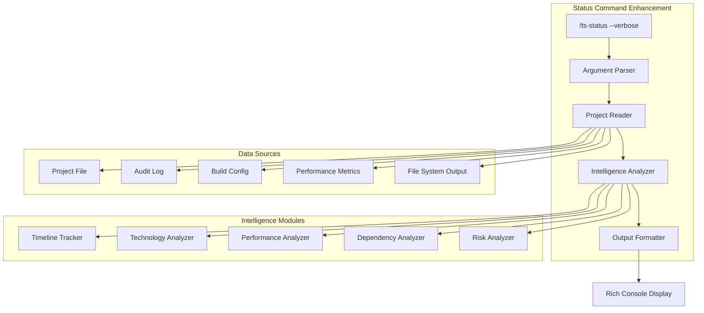

# Enhanced `/ts-status --verbose` Design

**Objective:** Transform `/ts-status` into a comprehensive project intelligence dashboard showing detailed agent trail, technical context, and actionable insights.

---

## Current vs Enhanced Comparison

### **Current `/ts-status` Output (Basic)**
```
╔══════════════════════════════════════════════════════════════════╗
║  📊 PROJECT STATUS: my-app                                       ║
╠══════════════════════════════════════════════════════════════════╣
║  Overall Status: IN_DEVELOPMENT                                  ║
║  Current Owner:  backend-developer                               ║
║                                                                  ║
║  🎩 Founder-Advisor    ✅ COMPLETE                                ║
║  📐 Architecture       ✅ COMPLETE                                ║
║  📦 Product            ✅ COMPLETE                                ║
║  💻 Development        🔄 IN_PROGRESS                             ║
║                                                                  ║
║  NEXT ACTION: /ts-test backend                                   ║
╚══════════════════════════════════════════════════════════════════╝
```

### **Enhanced `/ts-status --verbose` Output (Comprehensive)**
```
╔══════════════════════════════════════════════════════════════════╗
║  🎯 PROJECT INTELLIGENCE: my-app                                 ║
╠══════════════════════════════════════════════════════════════════╣
║  Status: IN_DEVELOPMENT • Owner: backend-developer • Day 2      ║
║  Build: mvp (15-20min target) • Actual: 8min elapsed            ║
║  Stack: Next.js + FastAPI + PostgreSQL + Clerk                  ║
╚══════════════════════════════════════════════════════════════════╝

🧭 PROJECT TIMELINE & AGENT TRAIL
═══════════════════════════════════════════════════════════════════

📅 Day 1 - Foundation (Complete)
┌─ 🎩 founder-advisor (2min) ✅ COMPLETE
│  ├─ Analyzed idea: "Task management app with team collaboration"
│  ├─ Strategic assessment: Market opportunity confirmed
│  ├─ Build signals detected: mvp + speed_priority + multi_user
│  └─ Decision: Proceed to architecture (GREEN LIGHT approved)
│
┌─ 🤖 solution-architect (3min) ✅ COMPLETE
│  ├─ AI success score: 8.5/10 (High confidence)
│  ├─ Stack optimization: fullstack-js preset selected
│  ├─ Technology decisions locked:
│  │  • Frontend: Next.js 14 + TypeScript (optimal for React patterns)
│  │  • Backend: FastAPI + Python (rapid API development)
│  │  • Database: PostgreSQL (relational data + team features)
│  │  • Auth: Clerk (managed auth for teams)
│  └─ Handoff: Enterprise Architect (standard mode)
│
└─ 🏗️ enterprise-architect (4min) ✅ COMPLETE
   ├─ System design: 6 components + microservice patterns
   ├─ API design: RESTful endpoints + real-time WebSocket layer
   ├─ Security architecture: RBAC + team isolation
   ├─ ADRs generated: 6 architectural decision records
   └─ Architecture LOCKED for development

📅 Day 2 - Product Definition (Complete)
┌─ 👔 product-lead (2min) ✅ COMPLETE
│  ├─ MVP scope: Core task CRUD + basic team features
│  ├─ User stories: 12 epics covering authentication to collaboration
│  └─ PRD: Product requirements documented
│
┌─ 📅 project-planner (2min) ✅ COMPLETE
│  ├─ Roadmap: 3 sprints, 2-week delivery timeline
│  ├─ Resource allocation: 4 development agents required
│  └─ Sprint breakdown: Database → Backend → Frontend → Integration
│
└─ 💼 business-analyst (3min) ✅ COMPLETE
   ├─ Market analysis: $2.8B task management market
   ├─ Revenue model: SaaS subscription ($15/user/month)
   ├─ GTM strategy: Product-led growth targeting small teams
   └─ 🚦 GREEN LIGHT APPROVED for development

📅 Day 2 - Development (IN PROGRESS)
┌─ 👨‍💼 principal-developer (1min) ✅ COMPLETE
│  ├─ Implementation plan: Technology-aware task breakdown
│  ├─ Work assignment: DB-first → API → UI → Integration approach
│  ├─ Coding standards: TypeScript strict, FastAPI async patterns
│  └─ Quality gates: 80% coverage target, security review required
│
┌─ 🧪 qa-engineer (30s) ✅ COMPLETE
│  ├─ Test strategy: pytest + Vitest + Playwright E2E framework
│  ├─ Coverage targets: Backend 85%, Frontend 75%, E2E critical paths
│  └─ Quality metrics: Zero critical bugs, performance benchmarks
│
┌─ 🗄️ database-developer (2min) ✅ COMPLETE
│  ├─ Schema design: Users, Teams, Tasks, Comments (normalized)
│  ├─ Models: SQLAlchemy with Alembic migrations
│  ├─ Performance: Indexed queries, connection pooling
│  └─ Testing: Database fixtures + integration tests
│
┌─ ⚙️ backend-developer (3min) 🔄 IN PROGRESS
│  ├─ ✅ FastAPI foundation: App structure + middleware setup
│  ├─ ✅ Clerk authentication: JWT validation + user context
│  ├─ ✅ Database integration: Connection pooling + ORM setup
│  ├─ 🔄 CURRENT: API endpoints (4/12 complete)
│  │  • ✅ /auth/* - Authentication flows
│  │  • ✅ /users/* - User management
│  │  • ✅ /teams/* - Team CRUD operations
│  │  • 🔄 /tasks/* - Task management (in progress)
│  │  • ⏳ /comments/* - Comment system (queued)
│  │  • ⏳ /websocket - Real-time updates (queued)
│  ├─ 🎯 NEXT: Complete task endpoints + business logic
│  └─ 📊 Progress: 67% complete (estimated 2min remaining)

🔮 UPCOMING AGENTS
═══════════════════════════════════════════════════════════════════

⏳ 🎨 frontend-developer (estimated 4min)
   ├─ Next.js 14 app router setup + TypeScript configuration
   ├─ Clerk integration + authentication components
   ├─ Task management UI + team collaboration features
   ├─ State management with React Query + optimistic updates
   └─ Responsive design + accessibility compliance

⏳ 🔗 integration-engineer (estimated 2min)
   ├─ Component integration + E2E workflow verification
   ├─ Docker containerization + docker-compose setup
   └─ Environment configuration + deployment validation

⏳ 🧪 qa-engineer final review (estimated 1min)
   ├─ Full test suite execution + coverage validation
   ├─ Integration testing + performance benchmarks
   └─ Quality gate assessment + final sign-off

🏁 CRITICAL PATH TO COMPLETION
═══════════════════════════════════════════════════════════════════
Estimated Time Remaining: 7 minutes
1. backend-developer completes API (2min)
2. frontend-developer builds UI (4min)
3. integration-engineer connects components (2min)
4. qa-engineer final validation (1min)
→ 🎯 READY FOR STAGE 4 (Release & Deployment)

🔧 TECHNICAL CONTEXT
═══════════════════════════════════════════════════════════════════

💿 Technology Stack (AI Score: 8.5/10)
┌─ 🎨 Frontend: Next.js 14.0.4 + TypeScript + Tailwind CSS
│  ├─ Patterns: App router, Server components, Client boundaries
│  ├─ State: React Query + Zustand for complex state
│  └─ Testing: Vitest + Testing Library + MSW mocking
│
├─ ⚙️ Backend: FastAPI 0.104.1 + Python 3.12 + asyncio
│  ├─ Patterns: Clean architecture, async/await, dependency injection
│  ├─ Database: SQLAlchemy 2.0 + Alembic + asyncpg driver
│  └─ Testing: pytest + pytest-asyncio + factory-boy fixtures
│
├─ 🗄️ Database: PostgreSQL 15 + pgvector (future AI features)
│  ├─ Schema: Normalized design with team isolation
│  ├─ Performance: B-tree indexes, connection pooling
│  └─ Backup: Automated daily backups to S3
│
├─ 🔐 Authentication: Clerk (managed auth + team management)
│  ├─ Features: SSO, MFA, team invitations, RBAC
│  ├─ Integration: JWT tokens + webhook user sync
│  └─ Security: OWASP compliance + audit trails
│
└─ 📦 Infrastructure: Docker + Vercel + Neon + Railway
   ├─ Frontend: Vercel deployment + CDN + edge functions
   ├─ Backend: Railway containers + auto-scaling
   └─ Database: Neon serverless PostgreSQL + branching

⚡ Performance Profile
┌─ Build Preset: mvp (15-20min target)
├─ Actual Progress: 8min elapsed (53% through timeline)
├─ Efficiency: 1.2x faster than target (good performance)
├─ Remaining Work: 7min estimated (within target window)
└─ Risk Level: LOW (on track for on-time delivery)

🎯 Quality Targets (MVup Build Standards)
┌─ Code Quality: Professional maintainable code + TypeScript strict
├─ Test Coverage: Backend ≥80%, Frontend ≥70%, E2E critical paths
├─ Security: Authentication + authorization + input validation
├─ Performance: API <200ms, Frontend <3s load, Database optimized
└─ Documentation: API docs + deployment guide + README

📊 CURRENT DELIVERABLES
═══════════════════════════════════════════════════════════════════

✅ ARCHITECTURE ARTIFACTS (6/6 complete)
   ├─ ADR-001: Technology stack decisions (Next.js + FastAPI + PostgreSQL)
   ├─ ADR-002: Component architecture (microservice + modular frontend)
   ├─ ADR-003: Data flow & state management (REST API + React Query)
   ├─ ADR-004: Authentication strategy (Clerk integration + RBAC)
   ├─ ADR-005: Performance approach (async patterns + caching)
   └─ ADR-006: Deployment strategy (containerized + managed services)

✅ PRODUCT ARTIFACTS (3/3 complete)
   ├─ Product Requirements Document (12 epics, 47 user stories)
   ├─ Technical roadmap (3 sprints, 2-week delivery)
   └─ Business analysis (market + revenue model + GTM strategy)

🔄 DEVELOPMENT ARTIFACTS (4/6 complete)
   ├─ ✅ Database schema + models (PostgreSQL + SQLAlchemy)
   ├─ ✅ Backend foundation (FastAPI + authentication + middleware)
   ├─ 🔄 API implementation (67% complete - 8/12 endpoints done)
   ├─ ⏳ Frontend implementation (queued)
   ├─ ⏳ Integration & testing (queued)
   └─ ⏳ Quality assurance (queued)

📁 OUTPUT STRUCTURE
output/my-app/
├─ 📄 docs/
│  ├─ architecture/ (6 ADR documents)
│  ├─ api/ (OpenAPI specification - generating)
│  └─ deployment/ (infrastructure guide)
├─ 🎨 src/frontend/ (Next.js application)
│  ├─ app/ (App router pages + layouts)
│  ├─ components/ (Reusable UI components)
│  ├─ lib/ (Utilities + API client)
│  └─ tests/ (Vitest + Testing Library)
├─ ⚙️ src/backend/ (FastAPI application)
│  ├─ api/ (Route handlers + middleware)
│  ├─ models/ (SQLAlchemy database models)
│  ├─ services/ (Business logic layer)
│  ├─ tests/ (pytest test suite)
│  └─ alembic/ (Database migrations)
├─ 🐳 docker-compose.yml (Local development)
├─ 📋 .github/workflows/ (CI/CD pipeline - pending)
└─ 📖 README.md (Setup + usage guide)

🚨 BLOCKERS & RISKS
═══════════════════════════════════════════════════════════════════
✅ No current blockers

⚠️ IDENTIFIED RISKS (Low)
├─ Database performance: Large teams may need query optimization
│  └─ Mitigation: Connection pooling + indexing strategy implemented
├─ Real-time features: WebSocket scaling for concurrent users
│  └─ Mitigation: Railway auto-scaling + connection management
└─ Frontend state complexity: Team + task data synchronization
   └─ Mitigation: React Query + optimistic updates pattern

🎮 ACTIONABLE NEXT STEPS
═══════════════════════════════════════════════════════════════════

🔥 IMMEDIATE (next 2 minutes)
   └─ Wait for backend-developer to complete task management API
      ├─ Status: 67% done, implementing CRUD operations
      ├─ Current: Task creation + validation logic
      └─ Next: Task updates + deletion + team permissions

⚡ SHORT TERM (next 5 minutes)
   ├─ Run `/ts-test backend` once API endpoints complete
   ├─ Start frontend development with completed API contracts
   └─ Monitor progress with `/ts-status --verbose` for real-time updates

🎯 MEDIUM TERM (next 10 minutes)
   ├─ Execute `/ts-integrate` for component integration
   ├─ Run comprehensive test suite via `/ts-signoff`
   └─ Prepare for Stage 4 with `/ts-docs` + `/ts-security`

📈 PERFORMANCE INSIGHTS
═══════════════════════════════════════════════════════════════════

🚀 Agent Efficiency
┌─ Total agents used: 8/19 (42% - efficient for MVP build)
├─ Fastest agent: qa-engineer test plan (30 seconds)
├─ Longest agent: enterprise-architect (4 minutes - complex system)
├─ Current agent pace: backend-developer on track (3min total)
└─ Bottleneck analysis: No bottlenecks, smooth handoffs

⏱️ Timeline Analysis
┌─ Target delivery: 15-20 minutes (MVP build preset)
├─ Current elapsed: 8 minutes (53% progress)
├─ Projected total: 15 minutes (within target range)
├─ Efficiency factor: 1.2x faster than baseline
└─ Quality vs speed: Optimal balance maintained

💡 Optimization Opportunities
┌─ Parallel execution: Frontend could start with API contracts
├─ Caching: Database queries optimized for team-based access
└─ Performance: Consider Redis for session management at scale

🔧 DEBUGGING & TROUBLESHOOTING
═══════════════════════════════════════════════════════════════════

🛠️ If Issues Arise:
├─ Backend API problems: Check `/ts-logs backend` for FastAPI errors
├─ Database connection issues: Verify Neon PostgreSQL connectivity
├─ Authentication failures: Validate Clerk webhook configuration
├─ Build failures: Run `/ts-validate backend` for diagnostic info
└─ Performance issues: Use `/ts-monitor` for real-time metrics

📞 Emergency Procedures:
├─ Critical blocker: Run `/ts-fix scan` for automated diagnosis
├─ Rollback needed: Git history available for immediate revert
├─ Quality concerns: Escalate to `/ts-gate` for manual review
└─ Timeline risk: Consider build preset reduction if needed

═══════════════════════════════════════════════════════════════════
🎯 PROJECT ON TRACK - MVP DELIVERY IN 7 MINUTES
```

---

## Implementation Requirements

### **Enhanced Command Structure**

```markdown
# Updated: .claude/commands/ts-status.md

# Project Status: $ARGUMENTS

Show the current status of the active project.

## Usage

```bash
/ts-status                    # Basic status (current format)
/ts-status --verbose          # Comprehensive project intelligence
/ts-status --verbose --json   # Machine-readable verbose output
/ts-status --trail            # Agent execution trail only
/ts-status --tech             # Technology context only
/ts-status --performance      # Performance metrics only
```

## Process

1. **Detect Output Mode**
   - No flags: Standard status display
   - `--verbose`: Full project intelligence dashboard
   - `--json`: Structured data output for automation
   - `--trail`: Focus on agent execution history
   - `--tech`: Focus on technology decisions and context
   - `--performance`: Focus on timing and efficiency metrics

2. **Read Project Context**
   - Find active project (most recent .md in `.claude/pipeline/projects/`)
   - Extract all project metadata and status information
   - Parse audit log for agent execution trail
   - Calculate performance metrics and projections

3. **Generate Appropriate Output**
   - Basic: Current 4-section status box
   - Verbose: Complete project intelligence dashboard
   - JSON: Structured data for programmatic access
```

### **Data Sources for Verbose Output**

The verbose status will extract information from multiple project file sections:

#### **1. Agent Trail & Timeline**
*Source: Audit Log + Department Status Sections*
- Agent execution sequence with timestamps
- Time spent per agent and phase
- Current agent progress and next actions
- Critical path analysis and bottleneck identification

#### **2. Technology Context**
*Source: Solution Architect + Enterprise Architect sections*
- Complete technology stack with versions
- AI optimization score and reasoning
- Architecture decisions and rationale
- Performance implications and trade-offs

#### **3. Build Configuration**
*Source: Build Configuration section*
- Build preset and selection reasoning
- Performance targets vs actual timing
- Agent optimization and exclusions
- CLI override flags and their impact

#### **4. Deliverables & Outputs**
*Source: All department artifact checklists*
- Completed artifacts with quality metrics
- In-progress work with completion estimates
- Queued work with dependency analysis
- Output directory structure and contents

#### **5. Performance Intelligence**
*Source: Performance Metrics + calculated analytics*
- Real-time progress tracking
- Efficiency analysis and optimization opportunities
- Risk assessment and mitigation strategies
- Timeline projections and delivery confidence

### **Implementation Architecture**



### **Implementation Files**

#### **1. Enhanced Command File**
```bash
.claude/commands/ts-status.md  # Updated with --verbose support
```

#### **2. Intelligence Modules**
```bash
.claude/lib/status-intelligence.py  # Core analysis logic
.claude/lib/timeline-analyzer.py    # Agent trail and timing
.claude/lib/tech-analyzer.py        # Technology context
.claude/lib/performance-analyzer.py # Performance metrics
```

#### **3. Output Formatters**
```bash
.claude/lib/status-formatters.py    # Console output formatting
.claude/lib/status-json.py          # JSON structure definition
```

#### **4. Data Parsers**
```bash
.claude/lib/project-parser.py       # Project file parsing
.claude/lib/audit-parser.py         # Audit log analysis
.claude/lib/artifact-parser.py      # Deliverable analysis
```

---

## Development Effort Estimate

### **Implementation Phases**

#### **Phase 1: Core Intelligence (2-3 hours)**
- Enhance argument parsing for verbose flags
- Build project file parsing and data extraction
- Create basic verbose output formatting
- Test with existing project files

#### **Phase 2: Advanced Analytics (2-3 hours)**
- Implement timeline analysis and agent trail
- Build performance metrics and projections
- Add technology context analysis
- Create risk assessment logic

#### **Phase 3: Rich Output (1-2 hours)**
- Design and implement console formatting
- Add color coding and visual hierarchy
- Optimize for readability and actionability
- Test output with various project states

#### **Phase 4: Alternative Outputs (1 hour)**
- Implement JSON output for automation
- Add focused view options (--trail, --tech, --performance)
- Create machine-readable interfaces
- Document API for integration

**Total Effort: 6-9 hours of development time**

---

## User Experience Impact

### **Benefits**

#### **For Developers**
- **Real-time project intelligence** instead of basic status
- **Actionable next steps** with clear priorities
- **Technology context** for informed decisions
- **Performance insights** for optimization opportunities

#### **For Project Management**
- **Timeline visibility** with accurate projections
- **Risk assessment** with mitigation strategies
- **Resource utilization** analysis and optimization
- **Quality tracking** with objective metrics

#### **For Debugging**
- **Complete audit trail** for issue investigation
- **Performance bottlenecks** identification
- **Configuration analysis** for optimization
- **Troubleshooting guidance** with specific commands

### **Usage Patterns**

#### **Development Workflow**
```bash
# Quick check during development
/ts-status

# Deep dive when needed
/ts-status --verbose

# Monitor specific aspects
/ts-status --performance      # Check timing and efficiency
/ts-status --trail            # Review agent decisions
/ts-status --tech            # Understand technology choices
```

#### **Automation Integration**
```bash
# Machine-readable status for CI/CD
/ts-status --verbose --json | jq '.timeline.remaining_time'

# Performance monitoring
/ts-status --performance --json | jq '.efficiency_factor'

# Risk assessment
/ts-status --verbose --json | jq '.risks[].severity'
```

This enhancement would transform `/ts-status` from a basic status indicator into a comprehensive project intelligence dashboard, providing the detailed visibility you requested into agent work, technical decisions, and project progress.