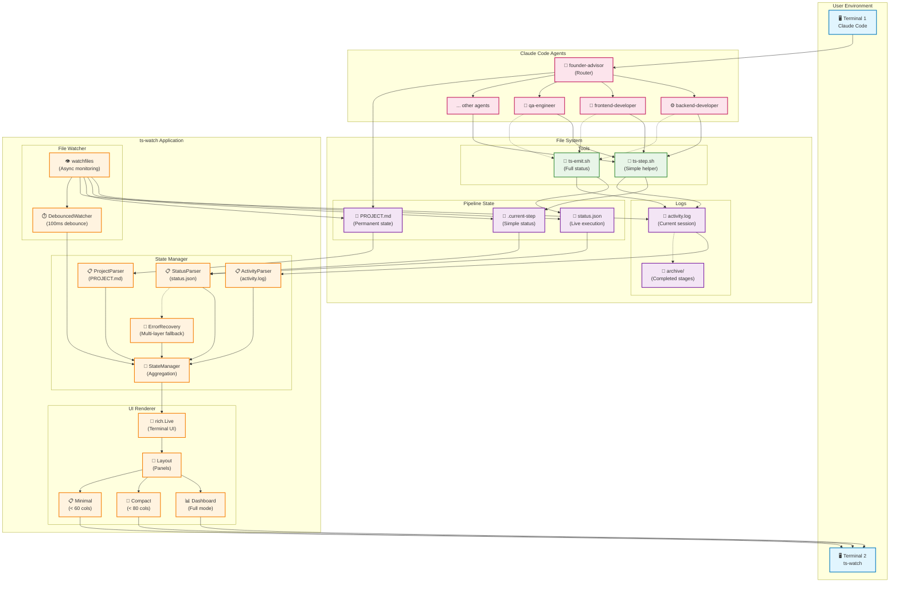
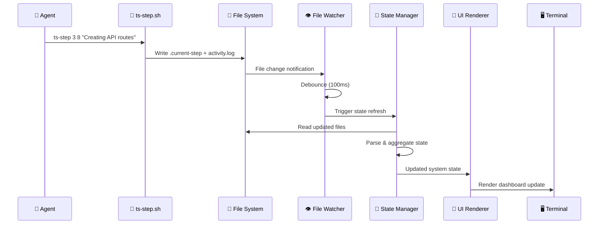
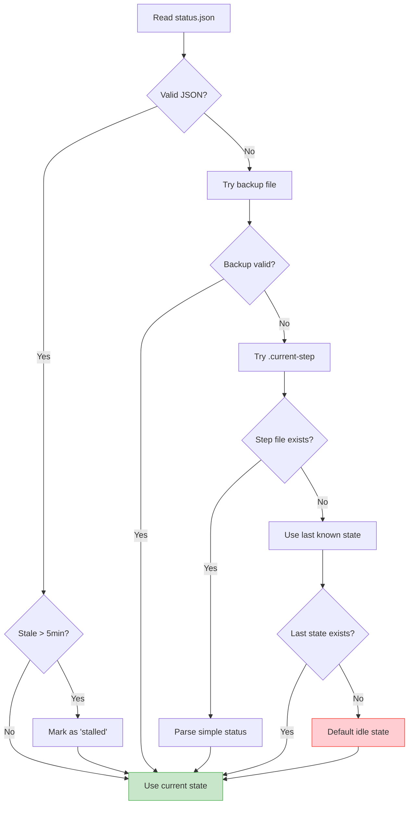
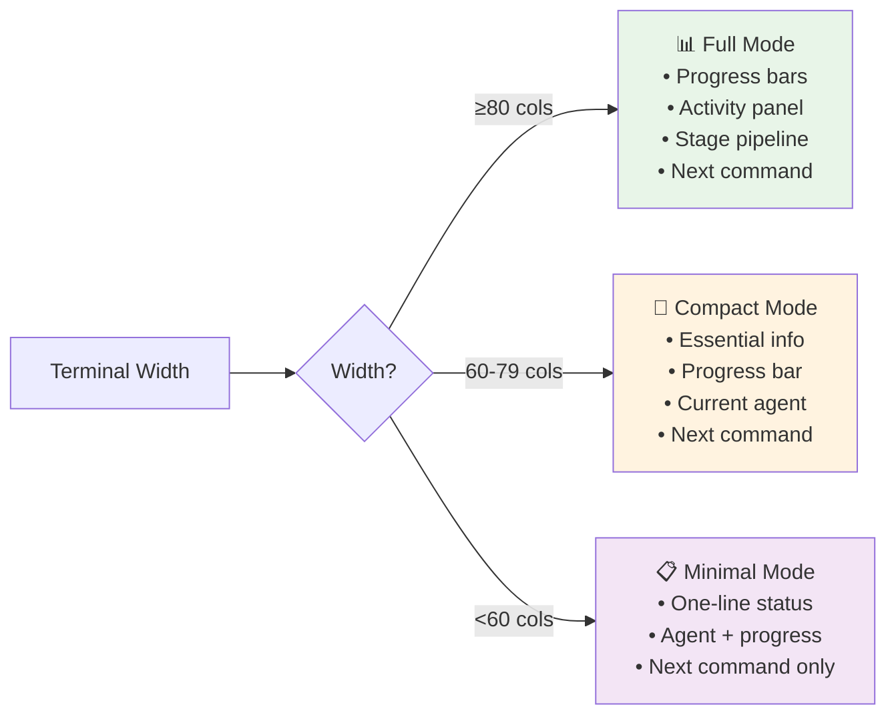

# Design Document: `/ts-watch` — Live Terminal Monitor

**Author:** Vedanta  
**Status:** Draft  
**Created:** 2025-01-01  
**Last Updated:** 2025-01-01  

---

## Table of Contents

1. [Overview](#1-overview)
2. [Goals & Non-Goals](#2-goals--non-goals)
3. [User Experience](#3-user-experience)
4. [Architecture](#4-architecture)
5. [Data Model](#5-data-model)
6. [Implementation](#6-implementation)
7. [Agent Integration](#7-agent-integration)
8. [Rollout Plan](#8-rollout-plan)
9. [Future Considerations](#9-future-considerations)
10. [Open Questions](#10-open-questions)

---

## 1. Overview

### 1.1 Problem Statement

The System has grown to 45+ commands across 19 agents and 5 stages. While powerful, users face significant UX challenges:

| Problem | Impact |
|---------|--------|
| No visibility during execution | Users stare at Claude Code output, unsure of progress |
| Hard to track overall progress | Must manually check PROJECT.md or run `/ts-status` |
| Approval gates are easy to miss | Builds stall waiting for forgotten approvals |
| Context switching is expensive | Checking status interrupts flow |
| No activity history | Can't see what happened while away |

### 1.2 Proposed Solution

`/ts-watch` is a **live terminal monitor** that runs in a separate terminal alongside Claude Code, providing real-time visibility into:

- Overall project progress
- Current stage and active agent
- Step-by-step execution updates
- Pending approvals
- Activity history
- Next suggested command

```
┌─────────────────────────────────┬─────────────────────────────────┐
│  Terminal 1: Claude Code        │  Terminal 2: /ts-watch          │
│                                 │                                 │
│  > /ts-build backend            │  ╔═════════════════════════════╗│
│                                 │  ║ 🚀 my-task-app    ● RUNNING ║│
│  ⚙️ Backend Developer            │  ║ ████████░░░░░░░░░░░░ 42%    ║│
│  Creating API routes...         │  ║                             ║│
│  > POST /api/v1/tasks           │  ║ 🤖 backend-developer  3/8   ║│
│                                 │  ║    Creating API routes...   ║│
│                                 │  ╚═════════════════════════════╝│
└─────────────────────────────────┴─────────────────────────────────┘
```

### 1.3 Key Insight

The System already uses **file-based state** (`PROJECT.md`) for persistence. By adding a lightweight **live status file** (`status.json`) that agents update during execution, we can provide real-time updates without changing the core architecture.

---

## 2. Goals & Non-Goals

### 2.1 Goals

| Goal | Description |
|------|-------------|
| **G1: Real-time visibility** | Show live progress during command execution |
| **G2: Zero-friction setup** | Single command to start, no configuration |
| **G3: Non-intrusive** | Doesn't interfere with main Claude Code session |
| **G4: Minimal agent changes** | Agents emit status with simple one-liners |
| **G5: Graceful degradation** | Works (with less detail) even if agents don't emit status |
| **G6: Resource efficient** | Low CPU/memory footprint, file-watch based |

### 2.2 Non-Goals

| Non-Goal | Rationale |
|----------|-----------|
| **Web interface** | Adds complexity; terminal-based is simpler and fits CLI workflow |
| **Command execution** | ts-watch is read-only; commands run in main terminal |
| **Multi-user support** | Single-user tool; collaboration features deferred |
| **Historical analytics** | Focus on live monitoring; analytics can come later |
| **Mobile/remote access** | Local terminal only for v1 |

### 2.3 Success Metrics

| Metric | Target | Improvement Strategy |
|--------|--------|---------------------|
| **Time to understand current state** | < 2 seconds (glance at terminal) | Visual progress bars, clear stage indicators |
| **Missed approval gates** | Reduce by 80% (visible in UI) | Prominent approval notifications |
| **User interruptions to check status** | Reduce by 90% | Live updates, activity feed |
| **Setup time** | < 10 seconds | Auto-detection, wrapper scripts |
| **Agent integration effort** | < 5 minutes per agent | Simplified `ts-step` approach |
| **System reliability** | 99%+ uptime | Error recovery, atomic writes |
| **Update latency** | < 500ms | File watching, debouncing |
| **Resource usage** | < 50MB RAM, < 5% CPU | Efficient Python, minimal polling |

---

## 3. User Experience

### 3.1 Starting the Monitor

**Option A: Shell script**
```bash
./ts-watch.sh [project-name]
```

**Option B: Python module**
```bash
python -m the_system.watch [project-name]
```

**Option C: Make target**
```bash
make watch PROJECT=my-app
```

If no project specified, watches the most recently modified project.

### 3.2 Display Modes

#### 3.2.1 Full Mode (default, 80+ columns)

```
╔══════════════════════════════════════════════════════════════════════════╗
║  🚀 THE SYSTEM                                              ● RUNNING    ║
║     my-task-app                                                          ║
╠══════════════════════════════════════════════════════════════════════════╣
║                                                                          ║
║     ARCH ✓ ──► PROD ✓ ──► DEV ● ──► REL ○ ──► OPS ○                     ║
║                                                                          ║
╠════════════════════════════════════╦═════════════════════════════════════╣
║  Progress                          ║  Activity Log                       ║
╠════════════════════════════════════╬═════════════════════════════════════╣
║                                    ║                                     ║
║  Overall                           ║  14:32:01 (10m ago) architect    ✓  ║
║  ████████████░░░░░░░░░░░░░░ 48%    ║  14:35:22 (7m ago)  product     ✓  ║
║                                    ║  14:38:15 (4m ago)  planner     ✓  ║
║  Stage 3: Development              ║  14:42:08 (now)     backend-dev ●  ║
║  ██████░░░░░░░░░░░░░░░░░░░░ 25%    ║    → Creating API routes           ║
║                                    ║    → Step 3/8                       ║
║  ─────────────────────────────     ║                                     ║
║                                    ║                                     ║
║  🤖 Active Agent                   ║                                     ║
║     backend-developer              ║                                     ║
║                                    ║                                     ║
║  📋 Current Task                   ║                                     ║
║     Building API layer             ║                                     ║
║     ▓▓▓▓▓▓░░░░░░░░░ 3/8           ║                                     ║
║     Creating TaskService...        ║                                     ║
║                                    ║                                     ║
╠════════════════════════════════════╩═════════════════════════════════════╣
║                                                                          ║
║  ▶ Next: /ts-build frontend                     Updated: 14:42:15       ║
║                                                                          ║
║  Press Ctrl+C to exit                                                    ║
╚══════════════════════════════════════════════════════════════════════════╝
```

**Timestamp display:** Both absolute (`14:32:01`) and relative (`10m ago`) for quick scanning while maintaining precision.

#### 3.2.2 Compact Mode (< 80 columns)

```
╔════════════════════════════════════════╗
║ 🚀 my-task-app           ● RUNNING     ║
╠════════════════════════════════════════╣
║ ████████████░░░░░░░░░░░░░░░░░░░░ 48%   ║
║ ARCH✓ → PROD✓ → DEV● → REL○ → OPS○    ║
╠════════════════════════════════════════╣
║ 🤖 backend-developer          3/8      ║
║    Creating TaskService...             ║
╠════════════════════════════════════════╣
║ ▶ Next: /ts-build frontend             ║
╚════════════════════════════════════════╝
```

#### 3.2.3 Minimal Mode (< 60 columns)

```
my-task-app ● 48% | DEV 3/8
backend-developer: Creating TaskService
▶ /ts-build frontend
```

### 3.3 Status Indicators

| Icon | Meaning |
|------|---------|
| `●` | Running (agent actively working) |
| `○` | Idle (waiting for command) |
| `◐` | Paused (awaiting approval) |
| `✓` | Complete |
| `✗` | Failed/Error |
| `⚠` | Warning (e.g., security issue found) |

### 3.4 Color Scheme

| Element | Color | ANSI Code |
|---------|-------|-----------|
| Active/Running | Yellow | `\033[33m` |
| Complete/Success | Green | `\033[32m` |
| Error/Failed | Red | `\033[31m` |
| Pending/Waiting | Cyan | `\033[36m` |
| Muted/Inactive | Gray | `\033[90m` |
| Headers/Titles | Blue | `\033[34m` |
| Progress bar filled | Green | `\033[32m` |
| Progress bar empty | Gray | `\033[90m` |

### 3.5 Keyboard Shortcuts (Future)

| Key | Action |
|-----|--------|
| `q` | Quit |
| `r` | Force refresh |
| `l` | Toggle log panel |
| `c` | Compact/expand mode |
| `p` | Switch project |
| `?` | Help |

---

## 4. Architecture

### 4.1 System Context

```
┌─────────────────────────────────────────────────────────────────────────┐
│                              User's Terminal                            │
│                                                                         │
│   ┌───────────────────────────┐     ┌───────────────────────────┐      │
│   │     Terminal 1            │     │     Terminal 2            │      │
│   │     Claude Code           │     │     ts-watch              │      │
│   │                           │     │                           │      │
│   │  > /ts-build backend      │     │  ╔═════════════════════╗  │      │
│   │                           │     │  ║  Live Dashboard     ║  │      │
│   │  Agent output...          │     │  ║  ...                ║  │      │
│   │                           │     │  ╚═════════════════════╝  │      │
│   └───────────────────────────┘     └─────────────┬─────────────┘      │
│                                                   │                     │
└───────────────────────────────────────────────────┼─────────────────────┘
                                                    │
                                                    │ watches
                                                    ▼
┌─────────────────────────────────────────────────────────────────────────┐
│                         the-system/  (File System)                      │
│                                                                         │
│   .claude/pipeline/                                                     │
│   ├── status.json          ◄── Live execution state (updated by agents)│
│   └── projects/                                                         │
│       └── my-app.md        ◄── Permanent state (checkboxes, artifacts) │
│                                                                         │
│   logs/                                                                 │
│   ├── activity.log         ◄── Event stream (appended by agents)       │
│   └── archive/             ◄── Archived logs (per-stage or turbo)      │
│                                                                         │
└─────────────────────────────────────────────────────────────────────────┘
```

### 4.2 Component Diagram

```
┌─────────────────────────────────────────────────────────────────────────┐
│                              ts-watch                                   │
│                                                                         │
│   ┌─────────────────┐    ┌─────────────────┐    ┌─────────────────┐    │
│   │   File Watcher  │    │  State Manager  │    │   UI Renderer   │    │
│   │                 │    │                 │    │                 │    │
│   │  - watchfiles   │───►│  - Aggregates   │───►│  - rich.Live    │    │
│   │  - status.json  │    │    all sources  │    │  - Layout       │    │
│   │  - activity.log │    │  - Parses MD    │    │  - Panels       │    │
│   │  - PROJECT.md   │    │  - Parses JSON  │    │  - Progress     │    │
│   │                 │    │  - Caches       │    │                 │    │
│   └─────────────────┘    └─────────────────┘    └─────────────────┘    │
│                                                                         │
└─────────────────────────────────────────────────────────────────────────┘
```

### 4.3 Data Flow

```
                                    ┌──────────────┐
                                    │   Agents     │
                                    │ (in Claude)  │
                                    └──────┬───────┘
                                           │
                          writes           │           writes
               ┌───────────────────────────┼───────────────────────────┐
               │                           │                           │
               ▼                           ▼                           ▼
        ┌─────────────┐           ┌─────────────────┐          ┌─────────────┐
        │   .claude/  │           │     logs/       │          │   .claude/  │
        │  pipeline/  │           │  activity.log   │          │  pipeline/  │
        │ status.json │           │                 │          │  projects/  │
        │             │           │    (append)     │          │  {name}.md  │
        │ (overwrite) │           │                 │          │  (update)   │
        └──────┬──────┘           └────────┬────────┘          └──────┬──────┘
               │                           │                          │
               │         file watch        │       file watch         │
               │    ┌──────────────────────┼──────────────────────────┘
               │    │                      │
               ▼    ▼                      ▼
        ┌───────────────────────────────────────────┐
        │              State Manager                │
        │                                           │
        │   ┌─────────────┐  ┌─────────────┐       │
        │   │ LiveStatus  │  │ProjectState │       │
        │   │             │  │             │       │
        │   │ - agent     │  │ - stage     │       │
        │   │ - step      │  │ - progress  │       │
        │   │ - message   │  │ - approvals │       │
        │   └─────────────┘  └─────────────┘       │
        │                                           │
        └─────────────────────┬─────────────────────┘
                              │
                              │ render
                              ▼
        ┌───────────────────────────────────────────┐
        │              UI Renderer                  │
        │                                           │
        │   ┌─────────────────────────────────────┐ │
        │   │         Terminal Display            │ │
        │   │                                     │ │
        │   │   rich.Live + Layout + Panels       │ │
        │   │                                     │ │
        │   └─────────────────────────────────────┘ │
        │                                           │
        └───────────────────────────────────────────┘
```

### 4.4 Update Triggers

| Trigger | Source | Latency |
|---------|--------|---------|
| Agent starts | status.json change | ~100ms |
| Agent step complete | status.json change | ~100ms |
| Log entry added | activity.log change | ~100ms |
| Command complete | PROJECT.md change | ~100ms |
| Periodic refresh | Timer | 1 second |

### 4.5 Architecture Diagrams

#### 4.5.1 System Overview



#### 4.5.2 Data Flow Sequence



#### 4.5.3 Error Recovery Flow



#### 4.5.4 Responsive Display Modes



---

## 5. Data Model

### 5.1 status.json (Live Execution State)

**Location:** `.claude/pipeline/status.json`

**Update frequency:** Every agent step (overwritten)

**Schema:**

```json
{
  "$schema": "http://json-schema.org/draft-07/schema#",
  "type": "object",
  "properties": {
    "timestamp": {
      "type": "string",
      "format": "date-time",
      "description": "ISO 8601 timestamp of last update"
    },
    "project": {
      "type": "string",
      "description": "Active project name"
    },
    "status": {
      "type": "string",
      "enum": ["idle", "running", "paused", "error"],
      "description": "Current execution status"
    },
    "command": {
      "type": "string",
      "description": "Currently executing command (e.g., 'ts-build backend')"
    },
    "agent": {
      "type": "string",
      "description": "Active agent name (e.g., 'backend-developer')"
    },
    "progress": {
      "type": "object",
      "properties": {
        "current": { "type": "integer", "minimum": 0 },
        "total": { "type": "integer", "minimum": 1 },
        "message": { "type": "string" }
      },
      "description": "Step progress within current command"
    },
    "error": {
      "type": "object",
      "properties": {
        "message": { "type": "string" },
        "recoverable": { "type": "boolean" }
      },
      "description": "Error details if status is 'error'"
    }
  },
  "required": ["timestamp", "status"]
}
```

**Examples:**

```json
// Idle state
{
  "timestamp": "2025-01-15T14:30:00Z",
  "status": "idle"
}

// Running state
{
  "timestamp": "2025-01-15T14:32:05Z",
  "project": "my-task-app",
  "status": "running",
  "command": "ts-build backend",
  "agent": "backend-developer",
  "progress": {
    "current": 3,
    "total": 8,
    "message": "Creating TaskService..."
  }
}

// Error state
{
  "timestamp": "2025-01-15T14:35:00Z",
  "project": "my-task-app",
  "status": "error",
  "command": "ts-build backend",
  "agent": "backend-developer",
  "error": {
    "message": "Failed to connect to database",
    "recoverable": true
  }
}
```

### 5.2 activity.log (Event Stream)

**Location:** `logs/activity.log` (at the-system root)

**Archive Location:** `logs/archive/` (completed stages)

**Update frequency:** Every agent event (appended)

**Rotation:** Per-stage in normal mode, on-completion in turbo mode

```
the-system/
├── .claude/
│   └── pipeline/
│       ├── status.json                      # Current execution state
│       └── projects/
│           └── my-app.md                    # Project state
├── logs/                                    # Logs at root level
│   ├── activity.log                         # Current session log
│   └── archive/                             # Archived logs
│       ├── my-app-stage-1-architecture.log  # Normal mode: per-stage
│       ├── my-app-stage-2-product.log
│       ├── my-app-turbo-2025-01-15-143200.log  # Turbo mode: full run
│       └── other-project-stage-1-architecture.log
└── output/
    └── my-app/                              # Generated code
```

**Archive naming:** 
- Normal mode: `{project}-stage-{N}-{stage-name}.log`
- Turbo mode: `{project}-turbo-{timestamp}.log`

**Rotation triggers (Normal Mode):** When `/ts-approve` advances to next stage:
- `architecture-lock` → Archive as stage-1, start fresh
- `green-light` → Archive as stage-2, start fresh
- `development` → Archive as stage-3, start fresh
- `release` → Archive as stage-4, start fresh
- `launch` → Archive as stage-5, project complete

**Rotation triggers (Turbo Mode):** Single rotation at turbo completion:
- `/ts-turbo` completion → Archive entire log as `{project}-turbo-{timestamp}.log`

### 5.2.1 Turbo Mode Logging

In turbo mode, the activity log grows continuously with stage markers:

```
[2025-01-15T14:30:00Z] [INFO] [system] === TURBO MODE STARTED: my-app ===
[2025-01-15T14:30:01Z] [INFO] [system] === STAGE 1: ARCHITECTURE ===
[2025-01-15T14:30:02Z] [START] [founder-advisor] Analyzing idea...
[2025-01-15T14:30:15Z] [START] [enterprise-architect] Designing system...
[2025-01-15T14:32:00Z] [DONE] [enterprise-architect] Architecture complete
[2025-01-15T14:32:01Z] [INFO] [system] === STAGE 2: PRODUCT ===
[2025-01-15T14:32:02Z] [START] [product-lead] Defining MVP...
...
[2025-01-15T14:45:00Z] [INFO] [system] === STAGE 4: RELEASE ===
...
[2025-01-15T14:50:00Z] [INFO] [system] === TURBO MODE COMPLETE ===
```

**Benefits:**
- Full context preserved in single file
- Easy to review entire turbo run
- Stage boundaries clearly marked
- Searchable/greppable

**ts-watch display during turbo:**
- Shows current stage based on last `=== STAGE N ===` marker
- Progress calculated from stage markers
- All activity visible in log panel

**Format:** Structured log lines (easily parseable)

```
[TIMESTAMP] [LEVEL] [AGENT] MESSAGE
```

**Levels:**
- `START` — Command/agent starting
- `STEP` — Step completed
- `INFO` — Informational message
- `WARN` — Warning (non-blocking)
- `ERROR` — Error occurred
- `DONE` — Command/agent completed

**Examples:**

```
[2025-01-15T14:32:01] [START] [backend-developer] Starting ts-build backend
[2025-01-15T14:32:03] [STEP] [backend-developer] 1/8 Analyzing architecture
[2025-01-15T14:32:05] [STEP] [backend-developer] 2/8 Creating API routes
[2025-01-15T14:32:05] [INFO] [backend-developer] POST /api/v1/tasks
[2025-01-15T14:32:06] [INFO] [backend-developer] GET /api/v1/tasks/{id}
[2025-01-15T14:32:08] [STEP] [backend-developer] 3/8 Adding auth middleware
[2025-01-15T14:32:15] [WARN] [backend-developer] No rate limiting configured
[2025-01-15T14:35:00] [DONE] [backend-developer] Backend complete
```

### 5.3 PROJECT.md (Permanent State)

**Location:** `.claude/pipeline/projects/{project-name}.md`

**Update frequency:** Command completion, approvals

**Key sections parsed by ts-watch:**

| Section | Purpose | Parsing Method |
|---------|---------|----------------|
| Status field | Current project status | Regex: `Status:\s*\`?(\w+)\`?` |
| Checkboxes | Task completion | Count `[x]` vs `[ ]` |
| Audit Log | History | Parse table rows |
| Approvals | Pending gates | Check unchecked approval items |

---

## 6. Implementation

### 6.1 Technology Stack

| Component | Technology | Rationale |
|-----------|------------|-----------|
| Language | Python 3.10+ | Matches existing tooling |
| TUI Framework | `rich` | Beautiful output, Layout system, Live updates |
| File Watching | `watchfiles` | Async, efficient, cross-platform |
| Async Runtime | `asyncio` | Non-blocking file watching |
| Config Parsing | `pyyaml` | For preferences if needed |

### 6.2 Dependencies

```txt
# requirements.txt
rich>=13.0.0
watchfiles>=0.21.0
```

### 6.3 Module Structure

```
the-system/
├── .claude/
│   ├── commands/
│   ├── agents/
│   ├── tools/
│   │   ├── ts_watch/
│   │   │   ├── __init__.py
│   │   │   ├── __main__.py          # Entry point: python -m ts_watch
│   │   │   ├── cli.py                # Argument parsing
│   │   │   ├── watcher.py            # File watching logic
│   │   │   ├── state.py              # State management
│   │   │   ├── parsers/
│   │   │   │   ├── __init__.py
│   │   │   │   ├── status.py         # Parse status.json
│   │   │   │   ├── activity.py       # Parse activity.log
│   │   │   │   └── project.py        # Parse PROJECT.md
│   │   │   ├── ui/
│   │   │   │   ├── __init__.py
│   │   │   │   ├── dashboard.py      # Main dashboard layout
│   │   │   │   ├── panels.py         # Individual panels
│   │   │   │   ├── progress.py       # Progress bars
│   │   │   │   └── styles.py         # Colors and themes
│   │   │   └── utils/
│   │   │       ├── __init__.py
│   │   │       ├── paths.py          # Path constants
│   │   │       └── time.py           # Timestamp formatting (absolute + relative)
│   │   ├── ts-watch.sh               # Shell wrapper
│   │   ├── ts-emit.sh                # Status emission helper
│   │   └── ts-rotate-log.sh          # Log rotation helper
│   └── pipeline/
│       ├── status.json               # Current execution state
│       └── projects/
│           └── my-app.md             # Project state
├── logs/                             # Activity logs (at root)
│   ├── activity.log                  # Current session log
│   └── archive/                      # Archived logs
│       ├── my-app-stage-1-architecture.log
│       ├── my-app-turbo-2025-01-15-143200.log
│       └── ...
└── output/
    └── my-app/                       # Generated project code
```

### 6.4 Key Classes

```python
# state.py
@dataclass
class LiveStatus:
    """Current execution state from status.json"""
    timestamp: datetime
    status: str  # idle, running, paused, error
    project: str | None = None
    command: str | None = None
    agent: str | None = None
    step_current: int = 0
    step_total: int = 0
    step_message: str = ""
    error_message: str | None = None

@dataclass
class ProjectState:
    """Permanent state from PROJECT.md"""
    name: str
    stage: int  # 1-5
    status: str
    overall_progress: float  # 0-100
    completed_tasks: int
    total_tasks: int
    pending_approvals: list[str]
    recent_audit: list[tuple[str, str]]  # (timestamp, message)

@dataclass  
class ActivityEntry:
    """Single log entry from activity.log"""
    timestamp: datetime
    level: str  # START, STEP, INFO, WARN, ERROR, DONE
    agent: str
    message: str

class SystemState:
    """Aggregated state from all sources"""
    live: LiveStatus
    project: ProjectState
    activity: list[ActivityEntry]
    
    def refresh(self) -> None:
        """Reload all state from files"""
        ...
    
    @property
    def is_active(self) -> bool:
        return self.live.status == "running"
    
    @property
    def display_status(self) -> str:
        """Human-readable status"""
        ...
```

### 6.5 Main Loop

```python
# __main__.py
async def main(project_name: str | None = None):
    console = Console()
    state = SystemState(project_name)
    
    # Initial render
    dashboard = create_dashboard(state)
    
    with Live(dashboard, console=console, refresh_per_second=2) as live:
        async for changes in watch_pipeline_files():
            state.refresh()
            live.update(create_dashboard(state))

if __name__ == "__main__":
    import sys
    project = sys.argv[1] if len(sys.argv) > 1 else None
    asyncio.run(main(project))
```

### 6.6 Log Rotation Helper

**File:** `.claude/tools/ts-rotate-log.sh`

Called by `/ts-approve` (normal mode) or `/ts-turbo` (turbo mode).

```bash
#!/bin/bash
# Usage: 
#   Normal mode: ts-rotate-log.sh <project> <stage-number> <stage-name>
#   Turbo mode:  ts-rotate-log.sh <project> turbo
#
# Examples:
#   ts-rotate-log.sh my-app 1 architecture
#   ts-rotate-log.sh my-app turbo

PROJECT="$1"
MODE="$2"
STAGE_NAME="$3"

LOG_DIR="logs/archive"
CURRENT_LOG="logs/activity.log"

# Create logs directory if needed
mkdir -p "$LOG_DIR"

# Determine archive name
if [ "$MODE" = "turbo" ]; then
    TIMESTAMP=$(date +"%Y-%m-%d-%H%M%S")
    ARCHIVE_NAME="${PROJECT}-turbo-${TIMESTAMP}.log"
else
    ARCHIVE_NAME="${PROJECT}-stage-${MODE}-${STAGE_NAME}.log"
fi

# Archive current log if it exists and has content
if [ -s "$CURRENT_LOG" ]; then
    mv "$CURRENT_LOG" "$LOG_DIR/$ARCHIVE_NAME"
    echo "Archived: $LOG_DIR/$ARCHIVE_NAME"
fi

# Start fresh log (unless turbo completion)
if [ "$MODE" != "turbo" ]; then
    NEXT_STAGE=$((MODE + 1))
    echo "[$(date -u +"%Y-%m-%dT%H:%M:%SZ")] [INFO] [system] Stage ${NEXT_STAGE} started" > "$CURRENT_LOG"
fi
```

**Integration with /ts-approve (Normal Mode):**

```markdown
# In .claude/commands/ts-approve.md

## After Approval Logic

After checking the approval box, rotate the activity log:

- `architecture-lock` → `bash .claude/tools/ts-rotate-log.sh $PROJECT 1 architecture`
- `green-light` → `bash .claude/tools/ts-rotate-log.sh $PROJECT 2 product`
- `development` → `bash .claude/tools/ts-rotate-log.sh $PROJECT 3 development`
- `release` → `bash .claude/tools/ts-rotate-log.sh $PROJECT 4 release`
- `launch` → `bash .claude/tools/ts-rotate-log.sh $PROJECT 5 operations`
```

**Integration with /ts-turbo (Turbo Mode):**

```markdown
# In .claude/commands/ts-turbo.md

## Stage Markers

At each stage transition, emit a marker (but don't rotate):

```bash
echo "[$(date -u +"%Y-%m-%dT%H:%M:%SZ")] [INFO] [system] === STAGE N: NAME ===" >> logs/activity.log
```

## On Completion

After turbo completes, archive the full log:

```bash
bash .claude/tools/ts-rotate-log.sh $PROJECT turbo
```
```

### 6.7 Turbo Mode Stage Markers

Helper for emitting stage markers during turbo runs:

```bash
#!/bin/bash
# .claude/tools/ts-stage-marker.sh
# Usage: ts-stage-marker.sh <stage-number> <stage-name>
# Example: ts-stage-marker.sh 2 "PRODUCT"

STAGE_NUM="$1"
STAGE_NAME="$2"

echo "[$(date -u +"%Y-%m-%dT%H:%M:%SZ")] [INFO] [system] === STAGE ${STAGE_NUM}: ${STAGE_NAME} ===" >> logs/activity.log
```

### 6.9 Testing Strategy

Given the file-watching nature of ts-watch, testing requires special consideration:

#### 6.9.1 Unit Testing

```python
# tests/test_state_manager.py
import pytest
import tempfile
import json
from pathlib import Path
from ts_watch.state import StateManager, LiveStatus

@pytest.fixture
def temp_pipeline():
    """Create temporary pipeline directory"""
    with tempfile.TemporaryDirectory() as tmpdir:
        pipeline_dir = Path(tmpdir) / ".claude" / "pipeline"
        pipeline_dir.mkdir(parents=True)
        yield pipeline_dir

def test_status_recovery_from_corruption(temp_pipeline):
    """Test recovery from corrupted status.json"""
    status_file = temp_pipeline / "status.json"
    status_file.write_text("invalid json {")

    state_manager = StateManager()
    status = state_manager.load_status()

    assert status.status == "idle"  # Fallback state

def test_atomic_write_prevents_corruption(temp_pipeline):
    """Test that atomic writes prevent partial file states"""
    # Simulate concurrent writes
    import threading
    import time

    results = []

    def write_status(value):
        # Simulate the atomic write process
        state_manager = StateManager()
        state_manager.emit_status("test-agent", 1, 10, f"Message {value}")
        time.sleep(0.01)  # Small delay
        results.append(value)

    # Start multiple concurrent writes
    threads = [threading.Thread(target=write_status, args=[i]) for i in range(10)]
    for t in threads:
        t.start()
    for t in threads:
        t.join()

    # Verify final state is valid JSON
    status_file = temp_pipeline / "status.json"
    data = json.loads(status_file.read_text())
    assert "timestamp" in data
    assert "status" in data

def test_stale_status_detection(temp_pipeline):
    """Test detection of stale status files"""
    from datetime import datetime, timedelta

    # Create old status
    old_time = datetime.utcnow() - timedelta(minutes=10)
    status_data = {
        "timestamp": old_time.isoformat() + "Z",
        "status": "running"
    }

    status_file = temp_pipeline / "status.json"
    status_file.write_text(json.dumps(status_data))

    state_manager = StateManager()
    status = state_manager.load_status()

    assert status.status == "stalled"
```

#### 6.9.2 Integration Testing

```python
# tests/test_file_watching.py
import pytest
import asyncio
import tempfile
from pathlib import Path
from ts_watch.watcher import DebouncedWatcher

@pytest.mark.asyncio
async def test_file_watch_debouncing():
    """Test that rapid file changes are debounced"""
    update_count = 0

    async def mock_update(file_path):
        nonlocal update_count
        update_count += 1

    watcher = DebouncedWatcher(mock_update, debounce_ms=50)

    # Simulate rapid file changes
    test_file = Path("test.json")
    for i in range(5):
        await watcher.on_file_changed(test_file)
        await asyncio.sleep(0.01)  # 10ms intervals

    # Wait for debounce period
    await asyncio.sleep(0.1)

    # Should only have 1 update (debounced)
    assert update_count == 1

@pytest.mark.asyncio
async def test_multiple_file_watching():
    """Test watching multiple files simultaneously"""
    updates = []

    async def track_update(file_path):
        updates.append(str(file_path))

    watcher = DebouncedWatcher(track_update, debounce_ms=20)

    # Update different files
    await watcher.on_file_changed(Path("status.json"))
    await watcher.on_file_changed(Path("project.md"))

    await asyncio.sleep(0.05)  # Wait for debounce

    assert len(updates) == 2
    assert "status.json" in updates
    assert "project.md" in updates
```

#### 6.9.3 End-to-End Testing

```bash
#!/bin/bash
# tests/e2e/test_ts_watch.sh
# End-to-end test for ts-watch functionality

set -e

PROJECT_NAME="test-e2e-project"
TEST_DIR=$(mktemp -d)
cd "$TEST_DIR"

# Setup: Create minimal framework structure
mkdir -p .claude/pipeline logs
echo "$PROJECT_NAME" > .claude/pipeline/.current-project

# Start ts-watch in background
python -m ts_watch "$PROJECT_NAME" &
TS_WATCH_PID=$!

# Give ts-watch time to start
sleep 2

# Test 1: Emit status and verify display updates
echo "1/3 Testing step 1" > .claude/pipeline/.current-step
sleep 1

echo "2/3 Testing step 2" > .claude/pipeline/.current-step
sleep 1

echo "complete" > .claude/pipeline/.current-step
sleep 1

# Test 2: Simulate PROJECT.md update
cat > .claude/pipeline/projects/${PROJECT_NAME}.md << EOF
# Project: $PROJECT_NAME
Status: DEVELOPMENT
Stage: 3

## Stage Checklist
- [x] Stage 1: Architecture
- [x] Stage 2: Product
- [ ] Stage 3: Development
- [ ] Stage 4: Release
EOF

sleep 1

# Cleanup
kill $TS_WATCH_PID
rm -rf "$TEST_DIR"

echo "E2E test passed!"
```

#### 6.9.4 Performance Testing

```python
# tests/test_performance.py
import pytest
import time
import tempfile
from pathlib import Path
from ts_watch.state import StateManager

def test_status_file_write_performance():
    """Test that status writes are fast enough"""
    with tempfile.TemporaryDirectory() as tmpdir:
        # Setup
        pipeline_dir = Path(tmpdir) / ".claude" / "pipeline"
        pipeline_dir.mkdir(parents=True)

        state_manager = StateManager()

        # Test rapid writes
        start_time = time.time()
        for i in range(100):
            state_manager.emit_status("test-agent", i, 100, f"Step {i}")
        end_time = time.time()

        # Should complete 100 writes in < 1 second
        assert (end_time - start_time) < 1.0

def test_log_file_append_performance():
    """Test activity log append performance"""
    with tempfile.TemporaryDirectory() as tmpdir:
        log_file = Path(tmpdir) / "activity.log"

        start_time = time.time()
        for i in range(1000):
            with log_file.open("a") as f:
                f.write(f"[2025-01-01T12:00:00Z] [STEP] [agent] {i}/1000 Step {i}\n")
        end_time = time.time()

        # Should handle 1000 log entries in < 2 seconds
        assert (end_time - start_time) < 2.0
```

#### 6.9.5 Installation Verification Script

```bash
#!/bin/bash
# .claude/tools/verify-ts-watch.sh
# Verification script for ts-watch installation

echo "🔍 Verifying ts-watch installation..."

# Check Python version
PYTHON_VERSION=$(python3 --version 2>&1 | grep -o '[0-9]\+\.[0-9]\+')
PYTHON_MAJOR=$(echo "$PYTHON_VERSION" | cut -d. -f1)
PYTHON_MINOR=$(echo "$PYTHON_VERSION" | cut -d. -f2)

if [[ $PYTHON_MAJOR -lt 3 ]] || [[ $PYTHON_MAJOR -eq 3 && $PYTHON_MINOR -lt 10 ]]; then
    echo "❌ Python 3.10+ required, found $PYTHON_VERSION"
    exit 1
fi
echo "✅ Python version: $PYTHON_VERSION"

# Check dependencies
if ! python3 -c "import rich" 2>/dev/null; then
    echo "❌ Missing dependency: rich"
    echo "   Install with: pip install rich>=13.0.0"
    exit 1
fi
echo "✅ Rich library available"

if ! python3 -c "import watchfiles" 2>/dev/null; then
    echo "❌ Missing dependency: watchfiles"
    echo "   Install with: pip install watchfiles>=0.21.0"
    exit 1
fi
echo "✅ Watchfiles library available"

# Check helper scripts
if [[ ! -f ".claude/tools/ts-step.sh" ]]; then
    echo "❌ Missing helper script: ts-step.sh"
    exit 1
fi
echo "✅ Helper scripts present"

# Test basic functionality
echo "🧪 Testing basic functionality..."
if python3 -c "from ts_watch.state import StateManager; StateManager()" 2>/dev/null; then
    echo "✅ State manager loads correctly"
else
    echo "❌ State manager failed to load"
    exit 1
fi

echo "🎉 ts-watch installation verified successfully!"
echo ""
echo "Usage:"
echo "  python3 -m ts_watch [project-name]"
echo "  ./ts-watch.sh [project-name]"
```

### 6.8 Error Handling & Recovery

| Scenario | Handling | Recovery Strategy |
|----------|----------|------------------|
| **status.json missing** | Show "idle" state | Auto-create with default state |
| **status.json invalid JSON** | Parse error recovery | Use backup, regenerate from .current-step |
| **status.json corrupted** | Detect partial writes | Atomic write prevention |
| **PROJECT.md missing** | Show "No project" message | Scan for available projects |
| **activity.log missing** | Show empty activity panel | Auto-create logs directory |
| **File permission error** | Display error, continue watching | Fallback to read-only mode |
| **Watch interrupted** | Graceful shutdown, cleanup | Auto-restart with backoff |
| **Rapid status updates** | Performance degradation | Debounce updates (100ms) |
| **Stale status (>5min)** | Show "possibly stalled" warning | Highlight in UI |
| **Multiple ts-watch instances** | File lock conflicts | PID-based instance detection |

### 6.8.1 Robust State Recovery

```python
# state.py - Enhanced error handling
import json
from pathlib import Path
from datetime import datetime, timedelta

class StateManager:
    def __init__(self):
        self._last_known_state = None
        self._state_backup_file = Path(".claude/pipeline/.status-backup.json")

    def load_status(self) -> LiveStatus:
        status_file = Path(".claude/pipeline/status.json")

        try:
            # Primary: Read status.json
            if status_file.exists():
                content = status_file.read_text()
                data = json.loads(content)
                state = LiveStatus.from_dict(data)

                # Check if stale (>5 minutes)
                if self._is_stale(state.timestamp):
                    state.status = "stalled"

                # Backup valid state
                self._backup_state(state)
                return state

        except (json.JSONDecodeError, KeyError) as e:
            # Corrupted JSON - try to recover
            return self._recover_from_corruption()
        except Exception as e:
            # Other errors - use fallback
            return self._fallback_recovery()

        # No status file - check for simple step file
        return self._load_from_simple_step()

    def _recover_from_corruption(self) -> LiveStatus:
        """Try multiple recovery strategies"""

        # Strategy 1: Use backup file
        if self._state_backup_file.exists():
            try:
                backup_data = json.loads(self._state_backup_file.read_text())
                return LiveStatus.from_dict(backup_data)
            except:
                pass

        # Strategy 2: Reconstruct from .current-step
        step_file = Path(".claude/pipeline/.current-step")
        if step_file.exists():
            return self._parse_simple_step(step_file.read_text().strip())

        # Strategy 3: Use last known state
        if self._last_known_state:
            return self._last_known_state

        # Strategy 4: Default idle state
        return LiveStatus(
            timestamp=datetime.utcnow(),
            status="idle"
        )

    def _is_stale(self, timestamp: datetime) -> bool:
        """Check if status is older than 5 minutes"""
        now = datetime.utcnow()
        return (now - timestamp) > timedelta(minutes=5)
```

### 6.8.2 Performance Optimization

```python
# watcher.py - Debounced updates
import asyncio
from collections import defaultdict

class DebouncedWatcher:
    def __init__(self, update_callback, debounce_ms=100):
        self.update_callback = update_callback
        self.debounce_delay = debounce_ms / 1000
        self._pending_updates = defaultdict(asyncio.Event)

    async def on_file_changed(self, file_path: Path):
        """Handle file change with debouncing"""
        file_key = str(file_path)

        # Cancel any pending update for this file
        if file_key in self._pending_updates:
            self._pending_updates[file_key].set()

        # Create new event for this update
        event = asyncio.Event()
        self._pending_updates[file_key] = event

        try:
            # Wait for debounce period
            await asyncio.wait_for(event.wait(), timeout=self.debounce_delay)
            # Event was set - another update came in, ignore this one
            return
        except asyncio.TimeoutError:
            # No newer update - process this one
            await self.update_callback(file_path)
        finally:
            # Clean up
            self._pending_updates.pop(file_key, None)
```

---

## 7. Agent Integration

### 7.1 Status Emission Methods

Agents need to emit status updates. Four approaches, in order of preference:

#### Method 1: Simple Step Helper (Recommended)

**File:** `.claude/tools/ts-step.sh`

```bash
#!/bin/bash
# Usage: ts-step <step> <total> "<message>"
# Auto-detects agent from calling context

STEP="$1"
TOTAL="$2"
MESSAGE="$3"

# Auto-detect agent name from call stack or environment
AGENT="${TS_AGENT:-$(basename "$0" .md 2>/dev/null || echo 'unknown-agent')}"
PROJECT="${TS_PROJECT:-$(cat .claude/pipeline/.current-project 2>/dev/null || echo 'unknown')}"

# Simple status update - just write current step
echo "$STEP/$TOTAL $MESSAGE" > ".claude/pipeline/.current-step"
echo "[$(date -u +"%Y-%m-%dT%H:%M:%SZ")] [STEP] [$AGENT] $STEP/$TOTAL $MESSAGE" >> logs/activity.log
```

**Agent usage (simplified):**
```markdown
## Workflow Step 3: Create API Routes

1. Design the routes
2. **Emit status:** `ts-step 3 8 "Creating API routes"`
3. Generate the code
```

#### Method 2: Atomic Status Helper (Full Status)

**File:** `.claude/tools/ts-emit.sh`

```bash
#!/bin/bash
# Usage: ts-emit <agent> <step> <total> "<message>"
# Atomic write pattern prevents race conditions

AGENT="$1"
STEP="$2"
TOTAL="$3"
MESSAGE="$4"
PROJECT="${5:-$(cat .claude/pipeline/.current-project 2>/dev/null || echo 'unknown')}"

TIMESTAMP=$(date -u +"%Y-%m-%dT%H:%M:%SZ")

# Ensure logs directory exists
mkdir -p logs

# Create temporary file for atomic write
TEMP_STATUS=$(mktemp)
trap "rm -f $TEMP_STATUS" EXIT

# Write status to temporary file
cat > "$TEMP_STATUS" << EOF
{
  "timestamp": "$TIMESTAMP",
  "project": "$PROJECT",
  "status": "running",
  "agent": "$AGENT",
  "progress": {
    "current": $STEP,
    "total": $TOTAL,
    "message": "$MESSAGE"
  }
}
EOF

# Atomic move to final location (prevents corruption)
mv "$TEMP_STATUS" .claude/pipeline/status.json

# Append to activity.log (at root level)
echo "[$TIMESTAMP] [STEP] [$AGENT] $STEP/$TOTAL $MESSAGE" >> logs/activity.log
```

**Agent usage:**
```markdown
## Workflow Step 3: Create API Routes

1. Design the routes
2. **Emit status:**
   ```bash
   bash .claude/tools/ts-emit.sh "backend-developer" 3 8 "Creating API routes"
   ```
3. Generate the code
```

#### Method 3: Inline Echo (Minimal - Use Atomic Pattern)

No helper script needed, but use atomic writes:

```bash
# In agent workflow - atomic write pattern
TEMP_STATUS=$(mktemp)
echo '{"timestamp":"'$(date -Iseconds)'","status":"running","agent":"backend-developer","progress":{"current":3,"total":8,"message":"Creating routes"}}' > "$TEMP_STATUS"
mv "$TEMP_STATUS" .claude/pipeline/status.json
echo "[$(date -Iseconds)] [STEP] [backend-developer] 3/8 Creating routes" >> logs/activity.log
```

#### Method 4: Python Helper (For Complex Agents)

```python
# .claude/tools/status.py
import tempfile
import os
from datetime import datetime
from pathlib import Path
import json

def emit(agent: str, step: int, total: int, message: str, project: str = None):
    status_file = Path(".claude/pipeline/status.json")
    log_file = Path("logs/activity.log")

    # Ensure logs directory exists
    log_file.parent.mkdir(exist_ok=True)

    timestamp = datetime.utcnow().isoformat() + "Z"

    status_data = {
        "timestamp": timestamp,
        "project": project,
        "status": "running",
        "agent": agent,
        "progress": {"current": step, "total": total, "message": message}
    }

    # Atomic write using temporary file
    with tempfile.NamedTemporaryFile(mode='w', delete=False, dir=status_file.parent) as f:
        json.dump(status_data, f, indent=2)
        temp_path = f.name

    # Atomic move to final location
    os.rename(temp_path, status_file)

    # Append log (with error handling)
    try:
        with log_file.open("a") as f:
            f.write(f"[{timestamp}] [STEP] [{agent}] {step}/{total} {message}\n")
    except IOError as e:
        # Log to stderr if main log fails
        print(f"Warning: Could not write to activity log: {e}", file=sys.stderr)
```

### 7.19 agent Modification Template (Simplified)

Add to each agent's markdown file:

```markdown
## Status Reporting

This agent emits status updates for live monitoring using the simplified ts-step approach.

### Setup (Once per agent execution)
```bash
export TS_AGENT="[AGENT_NAME]"  # e.g., "backend-developer"
export TS_PROJECT="$(cat .claude/pipeline/.current-project 2>/dev/null || echo 'current')"
```

### After Each Step (Minimal syntax)
```bash
ts-step [STEP_NUM] [TOTAL_STEPS] "[STEP_DESCRIPTION]"
```

**Examples:**
```bash
ts-step 1 8 "Analyzing architecture"
ts-step 2 8 "Creating API routes"
ts-step 3 8 "Adding authentication"
```

### On Complete
```bash
echo 'complete' > .claude/pipeline/.current-step
echo "[$(date -u +"%Y-%m-%dT%H:%M:%SZ")] [DONE] [$TS_AGENT] Complete" >> logs/activity.log
```

### On Error (Optional - for better error tracking)
```bash
echo 'error' > .claude/pipeline/.current-step
echo "[$(date -u +"%Y-%m-%dT%H:%M:%SZ")] [ERROR] [$TS_AGENT] [ERROR_MESSAGE]" >> logs/activity.log
```

### Legacy Support (For agents requiring full status.json)
```bash
bash .claude/tools/ts-emit.sh "$TS_AGENT" [STEP] [TOTAL] "[MESSAGE]"
```
```

### 7.3 Router Integration

The **founder-advisor** (router agent) should emit status when:

1. **Spawning an agent:**
```bash
ts-emit "founder-advisor" 0 1 "Spawning backend-developer..."
```

2. **Between commands:**
```bash
echo '{"status":"idle"}' > .claude/pipeline/status.json
```

### 7.4 Graceful Degradation

If agents don't emit status:

| Scenario | ts-watch Behavior |
|----------|-------------------|
| No status.json | Shows "Idle" with last PROJECT.md state |
| Stale timestamp (> 5 min) | Shows "Possibly stalled" warning |
| No progress field | Shows agent name without step count |
| No activity.log | Empty activity panel |

---

## 8. Rollout Plan

### Phase 1: Core Watcher (MVP)

**Timeline:** 1-2 days

**Scope:**
- [x] Design document (this file)
- [ ] Basic file watcher for PROJECT.md only
- [ ] Simple progress display
- [ ] Stage pipeline visualization
- [ ] Pending approvals highlight
- [ ] Next command suggestion

**No agent changes required** — works with existing PROJECT.md updates.

### Phase 2: Simple Status Integration

**Timeline:** 1 day

**Scope:**
- [ ] `.current-step` file parsing (fallback to status.json)
- [ ] activity.log streaming with error handling
- [ ] `ts-step.sh` simplified helper script
- [ ] Atomic write patterns for race condition prevention
- [ ] Error recovery and state backup system

**Agent changes:** Add `ts-step` calls to 3-5 key agents (minimal integration burden).

### Phase 3: Enhanced Status & Full Integration

**Timeline:** 1-2 days

**Scope:**
- [ ] Full `status.json` support with atomic writes
- [ ] All agents use simplified `ts-step` approach
- [ ] Robust error state handling and recovery
- [ ] Multiple display modes (full/compact/minimal)
- [ ] Log panel with filtering and search
- [ ] Performance optimizations (debouncing, caching)

### Phase 4: Developer Experience & Polish

**Timeline:** 1-2 days

**Scope:**
- [ ] Installation verification script
- [ ] Auto-detection of Python environment
- [ ] Development mode with debug logging
- [ ] Keyboard shortcuts and interaction
- [ ] Multi-project switching
- [ ] Testing strategy for file watching behavior
- [ ] Color-blind friendly design patterns

---

## 9. Future Considerations

### 9.1 Potential Enhancements

| Feature | Description | Priority |
|---------|-------------|----------|
| **View archived logs** | Browse/search logs from previous stages | High |
| **Notifications** | Desktop notifications on completion/error | Medium |
| **Sound alerts** | Beep on approval needed | Low |
| **Log search** | Filter/search activity log | Medium |
| **Artifact preview** | Show generated files | Low |
| **Multi-project** | Watch all projects simultaneously | Medium |
| **Remote access** | SSH-friendly / tmux integration | Low |
| **Metrics** | Track time per stage/agent | Low |
| **Webhooks** | POST to URL on events | Low |

### 9.2 Web Dashboard Migration Path

If a web dashboard is eventually needed, ts-watch can evolve:

1. **Extract state management** into a shared library
2. **Add REST API** layer serving the same state
3. **Build React frontend** consuming the API
4. **ts-watch becomes a client** of the API (or runs standalone)

### 9.3 Integration with Other Tools

| Tool | Integration |
|------|-------------|
| **tmux** | Auto-split and run ts-watch |
| **VS Code** | Terminal panel with watch |
| **Raycast/Alfred** | Quick status lookup |
| **GitHub Actions** | Emit status in CI mode |

---

## 10. Resolved Decisions

| # | Question | Decision | Rationale |
|---|----------|----------|-----------|
| 1 | Should ts-watch auto-start when Claude Code starts? | **Manual start** | User control, avoid clutter if not needed |
| 2 | Log rotation strategy? | **Per-stage rotation** | Logical grouping, manageable file sizes |
| 3 | Should agents emit status by default or opt-in? | **All agents emit** | Consistent experience, full visibility |
| 4 | Include timestamps in display or just relative time? | **Both** | Absolute for precision, relative for quick scanning |
| 5 | Agent integration complexity? | **Simplified ts-step approach** | Reduce integration burden from 5 parameters to 3 |
| 6 | Race condition prevention? | **Atomic write pattern** | Use temp file + mv for status.json writes |
| 7 | Error recovery strategy? | **Multi-layer fallback** | Backup file → .current-step → last known → default |
| 8 | Performance optimization? | **100ms debouncing** | Balance responsiveness with CPU usage |
| 9 | Testing approach? | **Comprehensive test suite** | Unit, integration, E2E, and performance tests |
| 10 | Installation verification? | **Automated verification script** | Reduce setup friction and troubleshooting |

### Open Questions (Remaining)

| # | Question | Options | Decision |
|---|----------|---------|----------|
| 11 | How to handle very long agent messages? | a) Truncate at 80 chars, b) Wrap text, c) Horizontal scroll | **a) Truncate with ellipsis** |
| 12 | Color-blind friendly palette? | a) Use patterns + colors, b) Rely on icons only | **a) Patterns + high contrast** |
| 13 | Multiple ts-watch instances? | a) Allow multiple, b) PID-based locking, c) Auto-kill previous | **b) PID-based detection with warning** |

---

## Appendix A: Alternatives Considered

### A.1 Web Dashboard

**Pros:** Rich UI, accessible from anywhere, multiple users  
**Cons:** Complex setup, additional dependencies, overkill for single user

**Decision:** Defer to future. Terminal-based is simpler and fits current workflow.

### A.2 Claude Code Extension

**Pros:** Integrated, no separate terminal  
**Cons:** Claude Code doesn't support plugins/extensions

**Decision:** Not feasible with current Claude Code architecture.

### A.3 Polling vs File Watching

**Pros of polling:** Simpler implementation  
**Cons of polling:** Higher CPU usage, slower updates

**Decision:** Use file watching (watchfiles) for efficiency and responsiveness.

### A.4 SQLite vs JSON Files

**Pros of SQLite:** Better queries, atomic writes  
**Cons of SQLite:** Overkill, adds dependency, harder to debug

**Decision:** JSON files are simpler and human-readable.

---

## Appendix B: Reference Implementation

See: `.claude/tools/ts_watch/` (to be created)

---

## Changelog

| Date | Version | Changes |
|------|---------|---------|
| 2025-01-01 | 0.1 | Initial draft |
| 2025-01-01 | 0.2 | Resolved key decisions: manual start, per-stage log rotation, all agents emit, dual timestamps |
| 2025-01-01 | 0.3 | Moved logs to the-system root (`logs/`), added turbo mode behavior (single log with stage markers, archive on completion) |
| 2025-01-01 | 0.4 | **Major improvements based on technical analysis:** |
| | | • **Simplified integration:** New `ts-step` helper reduces agent burden from 5 to 3 parameters |
| | | • **Atomic writes:** Prevent race conditions with temp-file + mv pattern |
| | | • **Robust error recovery:** Multi-layer fallback strategy for corrupted state |
| | | • **Performance optimization:** 100ms debouncing, state caching, efficient file watching |
| | | • **Comprehensive testing:** Unit, integration, E2E, and performance test suites |
| | | • **Developer experience:** Auto-detection, verification scripts, simplified setup |
| | | • **Enhanced success metrics:** Added reliability, performance, and integration metrics |
| | | • **Updated rollout plan:** Faster timeline with reduced risk through simplified approach |

