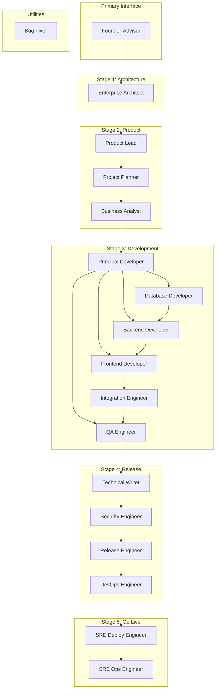
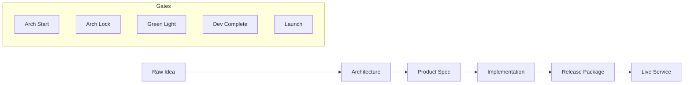

# The System Architecture

> An Autonomous Software Development Organization (ASDO) that simulates a complete software company

## Overview

The System is a sophisticated agent framework that orchestrates 17 specialized AI agents across 5 development stages to transform ideas into production-ready software. It replicates the structure and processes of a real software company, complete with departments, roles, and approval workflows.

## Core Architecture

### Organizational Structure

```
👤 Human Founder (You)
     │
     ▼
🎩 Founder-Advisor (PRIMARY INTERFACE)
     │
     ├──────────────┬──────────────┬──────────────┬──────────────┬──────────────
     ▼              ▼              ▼              ▼              ▼
📐 Stage 1:      📦 Stage 2:    💻 Stage 3:    🚀 Stage 4:    🌐 Stage 5:
   Architecture     Product        Development     Release        Go Live
   (18 agents)       (18 agents)     (18 agents)      (18 agents)     (18 agents)
```

### The 5 Stages

| Stage | Purpose | Agents | Duration | Output |
|-------|---------|--------|----------|--------|
| **Stage 1: Architecture** | System design & tech decisions | 2 | Days | Technical architecture |
| **Stage 2: Product** | MVP definition & planning | 3 | Days | Product requirements |
| **Stage 3: Development** | Code implementation | 6 | Weeks | Working software |
| **Stage 4: Release** | Documentation & deployment | 4 | Days | Production artifacts |
| **Stage 5: Go Live** | Quick deploy & monitoring | 2 | Hours | Live services |

### Agent Distribution



## Human-in-the-Loop Gates

The System includes **10 critical approval gates** where human judgment is required:

| Gate | Command | Stage | Purpose |
|------|---------|-------|---------|
| Architecture Start | `/ts-approve architecture-start` | 1 | Begin system design |
| Architecture Lock | `/ts-approve architecture-lock` | 1 | Lock technical decisions |
| **Green Light 🚦** | `/ts-approve green-light` | 2 | **Critical: Approve for development** |
| Development Complete | `/ts-approve development` | 3 | Code complete |
| Release Package | `/ts-approve release` | 4 | Release artifacts ready |
| Staging Deploy | `/ts-approve staging` | 4 | Staging verified |
| Production Deploy | `/ts-approve production` | 4 | Production ready |
| **Launch 🚀** | `/ts-approve launch` | 4 | **Go live!** |
| Security Blocks | `/ts-security` | 4 | Auto-blocks on critical findings |
| QA Blocks | `/ts-signoff` | 3 | Auto-blocks on build failures |

## Project Lifecycle

### 1. Project Initialization

```bash
/ts-new-project my-app
```

Creates a comprehensive project file at `.claude/pipeline/projects/my-app.md` with sections for each stage.

### 2. Idea Refinement

The **Founder-Advisor** acts as your chief of staff:
- Refines raw ideas into actionable requirements
- Analyzes market opportunity and risks
- Routes work to appropriate departments
- Maintains quality gates between stages

### 3. Stage Progression

Each stage builds on the previous:



### 4. Two Deployment Paths

**Path A: Full Infrastructure (Stage 4)**
- Complete Terraform infrastructure
- Full CI/CD pipelines
- Production-grade deployment
- Suitable for: Enterprise, complex applications

**Path B: Quick Deploy (Stage 5)**
- Deploy to managed platforms (Vercel, Railway, Neon)
- Minutes to live service
- Suitable for: MVPs, demos, rapid prototyping

## Configuration System

### Global Configuration

The System is driven by two key configuration files:

#### `.claude/config/preferences.yaml` (290+ lines)
Controls all technical decisions:
- **Cloud**: AWS/GCP/Azure, regions, environments
- **Database**: PostgreSQL/MySQL/MongoDB + cache/search/queue
- **Backend**: Python/TypeScript/Go + FastAPI/Django/Express
- **Frontend**: Next.js/React/Vue + TypeScript + Tailwind CSS
- **Testing**: pytest, Jest, Playwright
- **Conventions**: Naming patterns, git workflows
- **Security**: Password policies, rate limiting
- **Monitoring**: Sentry, Datadog integration
- **Go Live**: Platform preferences (Vercel, Railway, etc.)

#### `.claude/config/integrations.yaml`
Configures third-party services:
- Monitoring services (Sentry, Datadog)
- Communication (Slack, PagerDuty)
- Deployment platforms
- API integrations

### Project State Management

Each project maintains state in `.claude/pipeline/projects/[PROJECT].md`:

```markdown
## Project Status
- Stage: 3 (Development)
- Current Owner: principal-developer
- Status: IN_PROGRESS

## Completion Tracking
- [x] Architecture Department: COMPLETE
- [x] Product Department: COMPLETE
- [x] Development Department: Database (COMPLETE)
- [x] Development Department: Backend (COMPLETE)
- [ ] Development Department: Frontend (IN_PROGRESS)
- [ ] Development Department: Integration (PENDING)

## Audit Log
2024-01-15 14:30 - Founder-Advisor: Project initiated
2024-01-15 15:45 - Enterprise Architect: Architecture complete
2024-01-16 09:15 - Product Lead: MVP defined
...
```

## Command System

### Command Structure

All commands follow the pattern `/ts-[action]` with 43 total commands:

- **Core Commands** (8): Project lifecycle management
- **Stage 1** (1): Architecture design
- **Stage 2** (3): Product definition
- **Stage 3** (9): Development workflow
- **Stage 4** (8): Release & deployment
- **Stage 5** (12): Go live & operations
- **Meta** (2): Autonomous modes

### Autonomous Modes

#### Turbo Mode (`/ts-turbo`)
- Runs Stages 1-4 completely autonomously
- No human approval gates (dangerous!)
- Use only for demos or learning
- Full feature implementation

#### Turbo Quick Mode (`/ts-turbo-quick`)
- Rapid autonomous development
- Minimal viable implementation
- Faster than full turbo

## Data Architecture

### Project Files Structure

```
.claude/pipeline/projects/[PROJECT].md
├── Meta (status, timestamps, owner)
├── Founder Input (raw idea, goals)
├── Founder-Advisor Analysis (strategic assessment)
├── Stage 1: Architecture Department
│   ├── Enterprise Architect analysis
│   ├── System design & ADRs
│   └── Technology decisions
├── Stage 2: Product Department
│   ├── MVP Definition (Product Lead)
│   ├── Project Plan (Project Planner)
│   └── Business Analysis (Business Analyst)
├── Stage 3: Development Department
│   ├── Implementation Plan (Principal Developer)
│   ├── Database Layer (Database Developer)
│   ├── Backend Layer (Backend Developer)
│   ├── Frontend Layer (Frontend Developer)
│   ├── Integration (Integration Engineer)
│   └── Quality Assurance (QA Engineer)
├── Stage 4: Release & Deployment
│   ├── Documentation (Technical Writer)
│   ├── Security Scan (Security Engineer)
│   ├── Release Package (Release Engineer)
│   └── Infrastructure (DevOps Engineer)
├── Stage 5: Go Live (Optional)
│   ├── Platform Deployments (SRE Deploy Engineer)
│   └── Monitoring & SLOs (SRE Ops Engineer)
└── Audit Log (complete history)
```

### Output Structure

Generated code and artifacts:

```
output/[project]/
├── src/
│   ├── database/        # Schema, models, migrations
│   ├── backend/         # APIs, services, business logic
│   └── frontend/        # Components, pages, state management
├── tests/               # Unit, integration, E2E tests
├── docs/                # Technical documentation
├── infra/               # Terraform infrastructure
├── .github/workflows/   # CI/CD pipelines
├── security/            # Security scan results
├── release/             # Release artifacts & manifest
└── ops/                 # Monitoring & operations config
```

## Agent Interaction Patterns

### Sequential Handoffs
Most work flows sequentially through stages with clean handoffs:

```
Founder-Advisor → Enterprise Architect → Product Lead → Principal Developer → ...
```

### Parallel Execution
Some stages support parallel work:

```
Database Developer ─┐
Backend Developer  ─┼─→ Integration Engineer
Frontend Developer ─┘
```

### Quality Gates
Multiple quality checkpoints ensure high standards:

1. **Architecture Review**: Founder-Advisor reviews system design
2. **Product Review**: Founder-Advisor approves MVP scope
3. **Code Review**: Principal Developer reviews all implementation
4. **QA Sign-off**: QA Engineer validates build & tests
5. **Security Scan**: Security Engineer blocks on critical issues
6. **Release Review**: Founder-Advisor approves release package

## Technology Defaults

### Backend Stack
- **Language**: Python 3.11
- **Framework**: FastAPI
- **Database**: PostgreSQL 15 + Redis
- **ORM**: SQLAlchemy 2.x
- **Auth**: JWT tokens
- **Testing**: pytest + coverage

### Frontend Stack
- **Framework**: Next.js 14 + TypeScript 5.x
- **Styling**: Tailwind CSS 3.x
- **State**: Zustand (lightweight Redux alternative)
- **Data**: TanStack Query (React Query)
- **Testing**: Jest + Testing Library + Playwright

### Infrastructure Stack
- **Cloud**: AWS (configurable)
- **IaC**: Terraform
- **Containers**: Docker + Docker Compose
- **CI/CD**: GitHub Actions
- **Monitoring**: Datadog + Sentry
- **Deployment**: ECS or managed platforms

### Go Live Platforms

#### Frontend Options
- **Vercel** (preferred): Next.js native, great DX
- **Netlify**: Universal frontend hosting
- **Cloudflare Pages**: Global edge deployment

#### Backend Options
- **Railway**: Full-stack platform, great for demos
- **Fly.io**: Global app platform, Docker-based
- **Render**: Simple cloud platform

#### Database Options
- **Neon**: Serverless PostgreSQL, generous free tier
- **Supabase**: PostgreSQL + Auth + APIs
- **PlanetScale**: MySQL-compatible, branching
- **Turso**: SQLite at the edge

## Security & Compliance

### Built-in Security
- **Dependency Scanning**: Automated vulnerability detection
- **SAST**: Static application security testing
- **Secrets Detection**: Prevent credential leaks
- **Container Scanning**: Docker image vulnerabilities
- **OWASP Compliance**: Top 10 security checklist

### Security Gates
- **CRITICAL/HIGH** vulnerabilities block deployment
- **MEDIUM** issues require acknowledgment
- **LOW** issues documented only

### Secrets Management
- Environment variables for all secrets
- `.env.example` templates provided
- Never commit actual secrets
- Platform-specific secret management

## Monitoring & Observability

### Error Tracking
- **Sentry**: Exception tracking and performance
- Real user monitoring (RUM)
- Release tracking and deploy notifications

### Application Performance
- **Datadog**: Full-stack observability
- Custom dashboards and alerts
- Log aggregation and analysis

### Infrastructure Monitoring
- Resource utilization tracking
- Health checks and uptime monitoring
- Automated alerting (Slack, PagerDuty)

### SLO Framework
- **Availability**: 99.9% uptime target
- **Latency**: p95 < 500ms, p99 < 1000ms
- **Error Rate**: < 1% error budget
- Automatic burn rate alerting

## Extensibility

### Adding New Agents
1. Create agent file in `.claude/agents/[name].md`
2. Define role, expertise, workflow
3. Add to preferences.yaml if needed
4. Update command routing

### Adding New Commands
1. Create command file in `.claude/commands/ts-[name].md`
2. Define usage, workflow, outputs
3. Add to appropriate stage
4. Test with real projects

### Custom Integrations
- Third-party service integration via APIs
- Custom deployment targets
- Organization-specific workflows
- Custom quality gates

## Best Practices

### For Users
1. **Start Small**: Begin with simple projects to understand the flow
2. **Use Gates**: Don't skip approval gates - they catch issues early
3. **Review Outputs**: Always review generated code and infrastructure
4. **Configure Properly**: Set up preferences.yaml for your stack
5. **Monitor Progress**: Use `/ts-status` regularly to track progress

### For Contributors
1. **Follow Patterns**: Maintain consistency with existing agents
2. **Document Everything**: Clear workflows and examples
3. **Test Thoroughly**: Validate on real projects
4. **Security First**: Never compromise on security practices
5. **User Experience**: Make the system easy and delightful to use

## Technical Implementation

The System is implemented as Claude Code skills that orchestrate specialized AI agents. Each agent:

- Has specific domain expertise and tools
- Maintains conversation context and project state
- Follows consistent patterns for quality
- Can invoke other agents when needed
- Produces structured, documented outputs

This architecture enables complex software development workflows while maintaining human oversight and control at critical decision points.